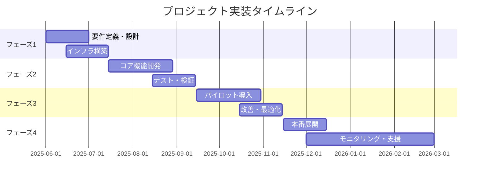

<!-- 
_backgroundColor: #0a1929
_color: white
_class: title dark
-->

# 3-shake テンプレート タイトル入力

### サブタイトルを入力

2025/5/10 イベント名@nwiizo  

---

<!-- _backgroundColor: white -->

## アジェンダ

このプレゼンテーションでは、DX推進のための具体的な提案と実行計画について説明します。

* **プロジェクト背景と課題** - 現状分析と改善ポイント
* **提案内容** - ソリューションと技術的アプローチ
* **期待される効果** - KPIと成功指標
* **実装計画** - タイムラインとリソース計画
* **まとめ** - 次のステップと推奨アクション

---

<!-- _backgroundColor: white -->

## nwiizo

株式会社スリーシェイクで ソフトウェアエンジニアをやっています。 
システムの開発、運用、最適化 
読書、グラビア、格闘技が好きです。

---

<!-- _backgroundColor: white -->

## プロジェクト背景と課題

### 現状分析

* 従来の業務プロセスによる非効率性
* 部門間のデータ連携不足
* リアルタイム分析の欠如
* カスタマーエクスペリエンスの改善余地

### 解決すべき課題

* ✅ プロセス自動化による効率化
* ✅ 統合データプラットフォームの構築
* ✅ リアルタイム分析基盤の導入
* ✅ カスタマージャーニーの最適化

---

<!-- _backgroundColor: white -->

## 提案内容: ソリューション概要

1. **クラウドネイティブアーキテクチャ**
   * スケーラブルで柔軟なインフラストラクチャ
   * マイクロサービスベースの設計$^{[1]}$

2. **データ統合プラットフォーム**
   * リアルタイムデータ処理/高度な分析・予測機能
   * 業務プロセスの自動化

  

  

> [1] https://example.com

---

<!-- _backgroundColor: white -->

## 提案内容: バックエンド技術スタック

### インフラストラクチャ & バックエンド技術

* **クラウド基盤**: AWS / GCP
* **コンテナ化**: Kubernetes / Docker
* **サーバレス**: AWS Lambda / Cloud Functions
* **データベース**: Amazon Aurora / Cloud Spanner
* **キャッシュ**: Redis / Memcached
* **メッセージング**: Kafka / RabbitMQ
* **API管理**: Kong / Apigee

クラウドネイティブ技術を活用し、スケーラブルかつ堅牢なバックエンド基盤を構築します。

---

<!-- _backgroundColor: white -->

## 提案内容: フロントエンド/分析技術

### ユーザーインターフェース & 分析技術

* **UI/UX フレームワーク**: React / Vue.js
* **モバイルアプリ**: React Native / Flutter 
* **データ可視化**: D3.js / Tableau
* **データ分析基盤**: BigQuery / Redshift
* **レポーティング**: Looker / Power BI
* **リアルタイム分析**: Apache Spark / Flink

直感的なユーザーインターフェースと高度なデータ分析機能を組み合わせ、最適なユーザー体験を提供します。

---

<!-- _backgroundColor: white -->

## 提案内容: AI・モニタリング技術

### AI & モニタリング技術

* **AI/ML**: TensorFlow / PyTorch$^{[2]}$
* **予測分析**: Prophet / Auto ML
* **システム監視**: Prometheus / Grafana$^{[3]}$
* **ログ分析**: ELK Stack / Splunk
* **アラート**: PagerDuty / OpsGenie
* **自動修復**: Kubernetes Operators

AIを活用した予測分析と堅牢なモニタリング体制により、システムの安定性と先進性を両立します。

> [1] https://www.tensorflow.org/  
> [2] https://grafana.com/

---

<!-- _backgroundColor: white -->

## 期待される効果: KPI目標

| KPI指標 | 現状値 | 目標値 | 改善幅 | 達成期間 |
|:-----|:----:|:----:|:----:|:----:|
| 業務効率化 | 67% | 95% | **+28%** | 3ヶ月 |
| 処理時間短縮 | 24分 | 3分 | **-21分** | 6ヶ月 |
| エラー率削減 | 5.2% | 0.5% | **-4.7%** | 6ヶ月 |
| 顧客満足度 | 72% | 92% | **+20%** | 12ヶ月 |
| ROI | - | 320% | - | 24ヶ月 |

投資回収期間（ROI）は約8ヶ月を想定し、2年間で約320%のROI達成を見込んでいます。

---

<!-- _backgroundColor: white -->

## 実装計画: タイムライン

---

<!-- _backgroundColor: white -->

## 実装計画: リソース配分

### 人的リソース

* プロジェクトマネージャー (1名)
* ソリューションアーキテクト (2名)
* バックエンドエンジニア (3名)
* フロントエンドエンジニア (2名)
* データサイエンティスト (1名)
* QAエンジニア (2名)

---
## 実装計画: リソース配分
### 主要マイルストーン

* **M1**: 要件定義完了 (2025年6月末)
* **M2**: システム基盤構築 (2025年7月末)
* **M3**: コア機能実装 (2025年9月初)
* **M4**: パイロット開始 (2025年9月末)
* **M5**: 本番リリース (2025年11月末)
* **M6**: 安定運用開始 (2026年2月末)

---

<!-- _backgroundColor: white -->

## まとめ: 期待される事業インパクト

### 💼 ビジネス効率化

* プロセス自動化による業務効率向上
* 人的リソースの最適な再配置

### 📊 データ活用

* リアルタイムインサイト獲得
* データドリブン意思決定

### 🚀 顧客体験向上

* パーソナライズされた体験提供
* 顧客満足度・ロイヤリティ向上

このプロジェクトは単なるシステム導入ではなく、組織全体のデジタル変革を実現する戦略的取り組みです。

---

<!-- 
_backgroundColor: #0a1929
_color: white
_class: title dark
-->

<!-- タイトルページ左上に大きなロゴを表示 -->

  

# ありがとうございました

### ご質問・ご相談はお気軽にお問い合わせください

@3shake | https://3-shake.com

