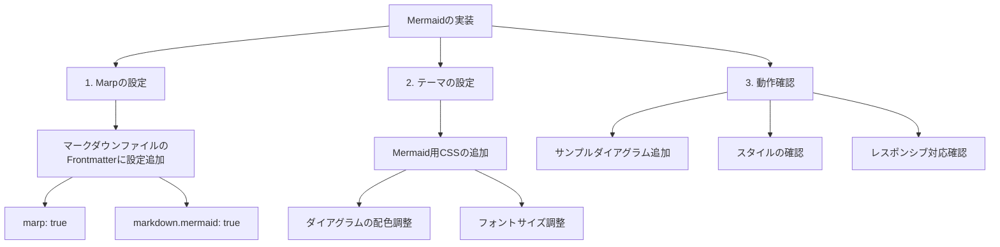

# Mermaid実装計画

## 概要
3-SHAKEのMarpテンプレートにMermaidダイアグラム機能を追加する実装計画です。

## 実装手順

## 詳細な実装手順

### 1. Marpの設定変更
- マークダウンファイルのFrontmatterにMermaid関連の設定を追加
- `markdown.mermaid: true`を追加して有効化

### 2. テーマの設定
- `themes/3shake-theme.css`にMermaid用のスタイルを追加
- 3-SHAKEのカラースキームに合わせた配色調整
  - 主要な色: #4AADDD（青）, #5FB878（緑）, #ECBE30（黄）
- ダイアグラムのフォントサイズとスペーシングの調整

### 3. 動作確認
- サンプルダイアグラムの追加と確認
  - フローチャート
  - シーケンス図
  - ガントチャート
- レスポンシブ対応の確認
- 各種ブラウザでの表示確認

## 期待される結果
- Marpスライド内でMermaidダイアグラムが正常に表示される
- 3-SHAKEのブランドカラーに合わせたダイアグラムデザイン
- 読みやすく、プレゼンテーションに適したサイズ設定