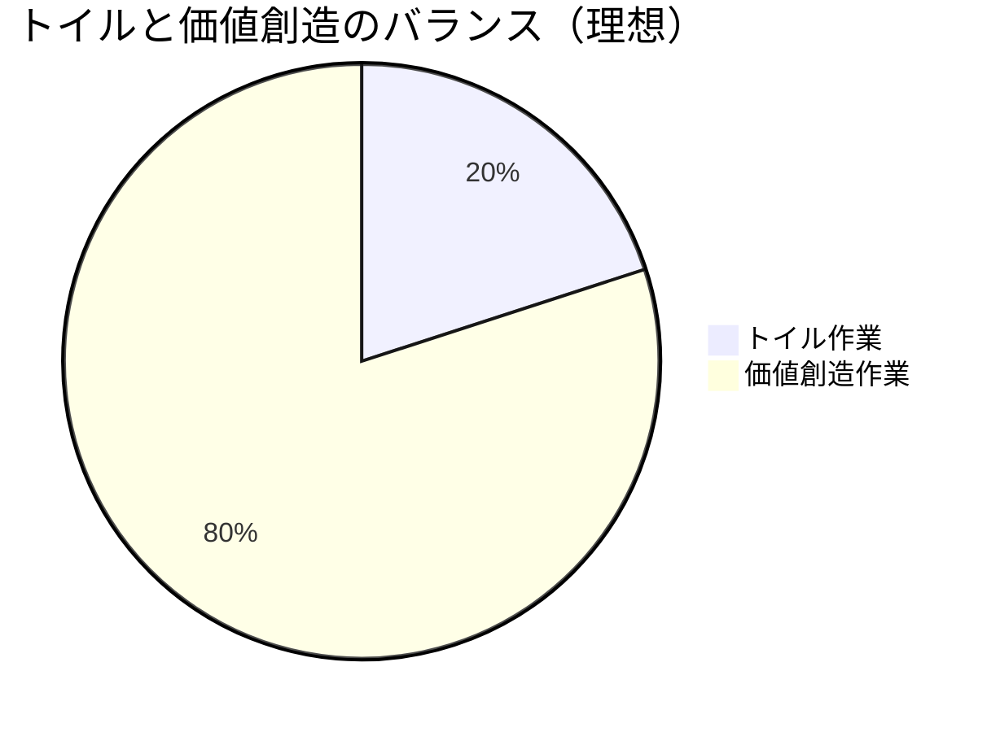
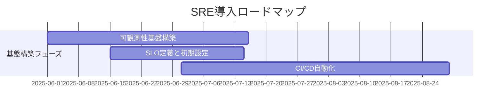
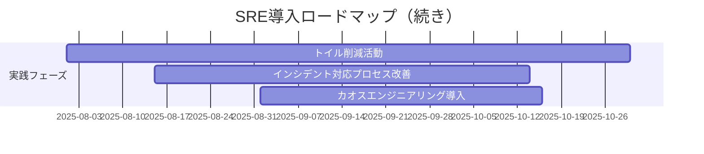
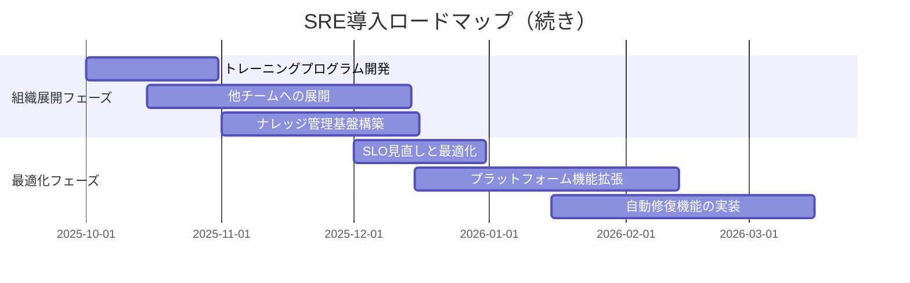

<!-- 
_backgroundColor: #0a1929
_color: white
_class: title dark
-->

# 3-shake テンプレート タイトル入力

### サブタイトルを入力

2025/5/10 ハッピーバースデー@nwiizo  

---

<!-- _backgroundColor: white -->

## nwiizo

株式会社スリーシェイクでソフトウェアエンジニアとして活動しています。 
趣味：読書、格闘技、グラビアディガー

### ブログ・オンライン活動

* ブログ    : [syu-m-5151.hatenablog.com](https://syu-m-5151.hatenablog.com/)
* 発表資料  : [speakerdeck.com/nwiizo](https://speakerdeck.com/nwiizo)
* GitHub    : [github.com/nwiizo](https://github.com/nwiizo)
* X         : [@nwiizo](https://twitter.com/nwiizo)

---

<!-- _backgroundColor: white -->

## アジェンダ

このプレゼンテーションでは、SREの組織導入と実践についての具体的な提案と実行計画について説明します。

* **プロジェクト背景と課題** - 現状分析と改善ポイント
* **SRE導入アプローチ** - 方法論と実装戦略
* **可観測性とSLOの構築** - 具体的実装例
* **組織変革と文化の醸成** - チームと協働
* **期待される効果** - メトリクスと成功指標
* **まとめ** - 次のステップと推奨アクション

---

<!-- _backgroundColor: white -->

## プロジェクト背景と課題

### 現状分析

* システム障害による事業影響の増加
* インフラストラクチャの管理複雑化
* 複数環境におけるデプロイの一貫性不足
* オンコール負担と運用疲れの拡大

---

<!-- _backgroundColor: white -->

## プロジェクト背景と課題

### 解決すべき課題

* ✅ SREプラクティスによる運用効率化
* ✅ 信頼性設計とSLO管理の導入
* ✅ インフラのコード化と自動化
* ✅ 高度な可観測性基盤の構築

---

<!-- _backgroundColor: white -->

## SREの主要概念

### Site Reliability Engineeringの全体像

<pre class="mermaid mermaid-auto-lg">
flowchart TD
    A((SRE)) --> B[信頼性]
    A --> C[自動化]
    A --> D[測定]
    A --> E[文化]
    
    B --> B1(SLO/SLI)
    B --> B2(エラーバジェット)
    B --> B3(リスク管理)
    
    C --> C1(トイル削減)
    C --> C2(障害対応自動化)
    C --> C3(継続的デリバリー)
    
    D --> D1(モニタリング)
    D --> D2(可観測性)
    D --> D3(アラート)
    
    E --> E1(ポストモーテム)
    E --> E2(心理的安全性)
    E --> E3(DevOps協働)
    
    %% スタイル設定
    classDef default fill:#f4f4f4,stroke:#333,stroke-width:1px
    classDef main fill:#4AADDD,stroke:#0a1929,stroke-width:2px,color:white
    classDef pillar fill:#0a1929,stroke:#333,stroke-width:1px,color:white
    classDef reliability fill:#ECBE30,stroke:#333,stroke-width:1px,color:white
    classDef automation fill:#5FB878,stroke:#333,stroke-width:1px,color:white
    classDef measurement fill:#4AADDD,stroke:#333,stroke-width:1px,color:white
    classDef culture fill:#9370DB,stroke:#333,stroke-width:1px,color:white
    
    %% クラス適用
    class A main
    class B,C,D,E pillar
    class B1,B2,B3 reliability
    class C1,C2,C3 automation
    class D1,D2,D3 measurement
    class E1,E2,E3 culture
</pre>

SREは信頼性、自動化、測定、文化という4つの柱から成り、これらが相互に連携してサービスの安定性と俊敏性を実現します。
各要素が組織に根付くことで、エンジニアリングと運用の境界を超えた効率的なサービス提供が可能になります。

---

<!-- _backgroundColor: white -->

## なぜいまSREが必要なのか

### ビジネスインパクト

* **ダウンタイムのコスト増大**
  * 平均ダウンタイムコスト: 数千万円/時間
  * 信頼性低下による顧客離脱
  
* **複雑性の限界**
  * システム間の依存関係の爆発的増加
  * 従来の運用手法では対応困難

---

<!-- _backgroundColor: white -->

## なぜいまSREが必要なのか

### エンジニアリング課題

* **アドホックな対応の限界**
  * 場当たり的な修正の積み重ね
  * ナレッジの属人化と技術的負債
  
* **開発と運用の分断**
  * 「壁を越えて投げる」文化
  * 共通目標と責任共有の欠如

SREは単なる運用改善ではなく、ビジネス継続性と技術的持続可能性を両立させるための戦略的アプローチです。

---

<!-- _backgroundColor: white -->

## 提案内容: SREアプローチ

1. **SREプラクティスの導入**
   * エラーバジェットと適切なSLOの設計
   * トイルの削減と自動化の推進$^{[1]}$

---

<!-- _backgroundColor: white -->

## 提案内容: SREアプローチ

2. **プラットフォームエンジニアリング**
   * セルフサービス基盤の構築
   * 開発者体験（DevEx）の向上

> [1] https://sre.google/sre-book/eliminating-toil/

---

<!-- _backgroundColor: white -->

## SREの核心: SLIとSLO

### SLI (Service Level Indicator)

* ユーザー体験を反映した測定可能な指標
  * **可用性**: 成功応答率
  * **レイテンシ**: リクエスト処理時間
  * **スループット**: 単位時間あたりの処理量
  * **飽和度**: リソース使用率
  * **エラー率**: 失敗リクエスト割合

---

<!-- _backgroundColor: white -->

## SREの核心: SLIとSLO

### SLO (Service Level Objective)

* SLIに対する目標値と期間の設定
  * **例**: 「30日間の99.9%のリクエストが200ms以内に応答する」
  * エラーバジェットの設定
  * 目標未達時のアクション定義
  * 改善サイクルの基準点

SLIとSLOは感覚的な信頼性議論を客観的かつ数値的な議論に変換する核心的なフレームワークです。

---

<!-- _backgroundColor: white -->

## エラーバジェットの考え方

### エラーバジェット = 100% - SLO目標値

#### 例: 月間99.9%のSLOの場合

* 43.2分/月 のダウンタイムが許容される
* この範囲内であれば警報ではない
* バジェットの消費率をモニタリング
* バジェット消費が速い場合は早期対応

---

<!-- _backgroundColor: white -->

## エラーバジェットの考え方

#### エラーバジェット活用のメリット

* 完璧主義からの脱却
* リスクと革新のバランス確保
* 障害対応の優先度決定
* 開発速度と信頼性のトレードオフ可視化

---

<!-- _backgroundColor: white -->

## SREライフサイクル

### SREの継続的改善プロセス

SREのライフサイクルは単なる障害対応ではなく、継続的なサービス改善のフィードバックループを形成します。
各フェーズが連携することで、システムの信頼性と開発速度の両立を実現します。

---

<!-- _backgroundColor: white -->

## SREライフサイクル

<pre class="mermaid mermaid-auto-xs">
flowchart TD
    A([サービス設計]) --> B[SLIの特定]
    B --> C[SLOの設定]
    C --> D{モニタリング}
    D -->|SLO違反| E[インシデント対応]
    D -->|バジェット消費| F[プロアクティブ対応]
    E --> G[ポストモーテム]
    F --> G
    G --> H[自動化の実装]
    H --> I[トイル削減]
    I --> J[サービス改善]
    J --> B
    
    %% 3shake カラースキームを適用
    style A fill:#4AADDD,stroke:#0a1929,stroke-width:2px,color:white
    style B fill:#f4f4f4,stroke:#333,stroke-width:1px
    style C fill:#f4f4f4,stroke:#333,stroke-width:1px
    style D fill:#ECBE30,stroke:#333,stroke-width:2px,color:white
    style E fill:#f4f4f4,stroke:#333,stroke-width:1px
    style F fill:#f4f4f4,stroke:#333,stroke-width:1px
    style G fill:#f4f4f4,stroke:#333,stroke-width:1px
    style H fill:#f4f4f4,stroke:#333,stroke-width:1px
    style I fill:#f4f4f4,stroke:#333,stroke-width:1px
    style J fill:#5FB878,stroke:#333,stroke-width:2px,color:white
    
    %% エッジスタイル
    linkStyle default stroke:#999,stroke-width:2px
</pre>

---

<!-- _backgroundColor: white -->

## 提案内容: 信頼性基盤

### インフラストラクチャ & 運用自動化

* **コンテナオーケストレーション**: Kubernetes / GKE / EKS
* **IaC基盤**: Terraform / Pulumi
* **CI/CD**: GitHub Actions / ArgoCD
* **サービスメッシュ**: Istio / Linkerd

---

<!-- _backgroundColor: white -->

## 提案内容: 信頼性基盤

### インフラストラクチャ & 運用自動化（続き）

* **セキュリティ**: OPA / Trivy / Falco
* **構成管理**: Helm / Kustomize
* **障害対応**: Rundeck / Runbook自動化

クラウドネイティブ技術を活用し、柔軟かつ堅牢なプラットフォーム基盤を構築します。

---

<!-- _backgroundColor: white -->

## SREプラットフォーム構成

<pre class="mermaid mermaid-auto-xs">
erDiagram
    %% エンティティ定義
    SERVICE {
        string name
        string version
        string owner
    }
    METRICS {
        string type
        int retention
    }
    LOGS {
        string level
        int retention
    }
    TRACES {
        string spanID
        string traceID
    }
    
    %% リレーションシップ
    SERVICE ||--o{ METRICS : produces
    SERVICE ||--o{ LOGS : generates
    SERVICE ||--o{ TRACES : creates
    
    METRICS }|--|| PROMETHEUS : collects
    LOGS }|--|| LOKI : aggregates
    TRACES }|--|| JAEGER : stores
    
    PROMETHEUS ||--o{ ALERT : triggers
    LOKI ||--o{ ALERT : triggers
    JAEGER ||--o{ ANALYSIS : enables
    
    ALERT }|--|| PAGERDUTY : notifies
    ALERT ||--o{ RUNBOOK : references
    
    PAGERDUTY ||--o{ ONCALL : dispatches
    RUNBOOK ||--o{ AUTOMATION : implements
    
    AUTOMATION ||--o{ SERVICE : improves
</pre>

SREプラットフォームは相互に連携するコンポーネントで構成され、サービスのモニタリングから改善までの一貫したフローを実現します。
各コンポーネントが明確な責務を持ち、データの収集から分析、アラート、自動化までをシームレスに連携させます。

---

<!-- _backgroundColor: white -->

## 提案内容: 可観測性スタック

### モニタリング & アラート基盤

* **メトリクス**: Prometheus / VictoriaMetrics
* **ログ管理**: Loki / Elasticsearch
* **トレーシング**: Jaeger / Tempo
* **可視化**: Grafana / Kibana

---

<!-- _backgroundColor: white -->

## 提案内容: 可観測性スタック

### モニタリング & アラート基盤（続き）

* **イベント管理**: PagerDuty / OpsGenie
* **SLO管理**: OpenSLO / Sloth
* **障害分析**: Litmus Chaos / Chaos Toolkit

包括的な可観測性基盤により、システムの健全性を可視化し、問題の早期発見と迅速な対応を実現します。

---

<!-- _backgroundColor: white -->

## 可観測性: 三本柱アプローチ (1/3)

### メトリクス

* 数値データの時系列収集
* リソース使用率の推移
* SLI指標の測定基盤
* アラートの主要トリガー

メトリクスは、システムの「今」の状態を数値化し、異常を素早く検知するための基盤です。

---

<!-- _backgroundColor: white -->

## 可観測性: 三本柱アプローチ (2/3)

### ログ

* 構造化されたイベント記録
* エラー原因の特定
* 監査証跡の保持
* 障害時の調査基盤

ログは、システム内で「何が」起きたかの詳細な記録を提供し、問題解決の糸口となります。

---

<!-- _backgroundColor: white -->

## 可観測性: 三本柱アプローチ (3/3)

### トレーシング

* リクエストの分散追跡
* ボトルネックの特定
* マイクロサービス間依存性
* エンドツーエンドの可視化

トレーシングは、複雑なシステム間で「どこで」問題が発生しているかを特定するための道しるべです。

---

<!-- _backgroundColor: white -->

## SLO設計: 実践アプローチ

### SLO設計プロセス (1/2)

1. **ユーザージャーニーの特定**: 重要なユーザーパスの洗い出し
2. **クリティカルパスの特定**: 核となるサービスと依存関係のマッピング
3. **SLIの選択**: ユーザー体験に直結する指標の選定
4. **測定方法の確立**: 信頼できるデータソースと集計方法の決定

---

<!-- _backgroundColor: white -->

## SLO設計: 実践アプローチ

### SLO設計プロセス (2/2)

5. **適切なSLO設定**: ビジネス要件とのバランスを考慮した目標値
6. **エラーバジェットの設計**: 追跡とアクションプランの設定
7. **段階的改善**: 運用実績に基づく目標の見直し

「完璧」を目指すのではなく、「十分に良い」レベルを定義し、継続的改善を行うことがSLO設計の鍵です。

---

<!-- _backgroundColor: white -->

## 提案内容: 運用効率化

### 自動化 & 効率化技術 (1/2)

* **運用自動化**: Ansible / SaltStack
* **サーバレス**: AWS Lambda / Cloud Run
* **GitOps**: Flux / ArgoCD
* **コンテナセキュリティ**: Aqua / Sysdig Secure

---

<!-- _backgroundColor: white -->

## 提案内容: 運用効率化

### 自動化 & 効率化技術 (2/2)

* **障害シミュレーション**: Gremlin / Chaos Monkey
* **インシデント管理**: FireHydrant / Rootly
* **リソース最適化**: Kubecost / Densify

自動化とSREプラクティスの導入により、運用負荷を軽減し、エンジニアが価値創造に集中できる環境を構築します。

---

<!-- _backgroundColor: white -->

## インシデント管理フロー

### 効率的なインシデント対応プロセス

<pre class="mermaid mermaid-auto-md">
sequenceDiagram
    participant M as モニタリング
    participant SRE as SREチーム
    participant Dev as 開発チーム
    participant Ops as 運用チーム
    participant Mgmt as マネジメント

    %% スタイル設定
    rect rgb(240, 196, 60, 0.2)
    Note over M,SRE: 検知フェーズ
    end
    rect rgb(74, 173, 221, 0.2)
    Note over SRE,Mgmt: 対応フェーズ
    end
    rect rgb(95, 184, 120, 0.2)
    Note over SRE,Dev: 復旧・改善フェーズ
    end

    M->>+SRE: アラート検知
    Note over SRE: インシデント宣言
    SRE->>SRE: 重要度評価
    alt 重大インシデント
        SRE->>Dev: 開発者招集
        SRE->>Ops: 運用担当招集
        SRE->>Mgmt: 経営層通知
    else 軽微インシデント
        SRE->>Dev: 担当者アサイン
    end
    SRE->>SRE: 対応責任者設定
    Note over SRE,Dev: 原因調査
    Dev->>SRE: 修正案提案
    SRE->>Dev: レビュー・確認
    Dev->>Ops: 修正デプロイ
    Ops->>SRE: 復旧確認
    SRE->>-Mgmt: 状況報告
    Note over SRE: インシデントクローズ
    SRE->>SRE: ポストモーテム作成
    SRE-->>Dev: 恒久対策実施
</pre>

明確に定義されたインシデント管理フローにより、迅速かつ効率的な障害対応と学習サイクルを実現します。
フェーズごとの責任と連携を明確にすることで、混乱を最小限に抑え、復旧時間を短縮します。

---

<!-- _backgroundColor: white -->

## トイル削減: 価値への集中

### トイルの特徴

* **手動**: 人間の直接介入が必要
* **反復的**: 何度も同じ作業を繰り返す
* **自動化可能**: スクリプトや自動化が可能
* **戦術的**: 長期的価値を生まない
* **線形スケール**: 規模に比例して作業量増加

---

<!-- _backgroundColor: white -->

## トイル削減: 価値への集中

### 自動化の優先順位付け

1. **頻度 × 工数**: 高頻度かつ時間のかかる作業を優先
2. **エラー発生率**: 人的ミスが発生しやすい作業を優先
3. **チーム全体影響**: 多くのメンバーに影響する作業を優先
4. **実現容易性**: 投資対効果の高い自動化から着手

  

    低優先度
    中優先度
    高優先度
  

---

<!-- _backgroundColor: white -->

## 組織変革: SRE導入のステップ

### 段階的アプローチ

1. **現状評価**
   * 運用負荷の可視化
   * 主要障害パターンの洗い出し

2. **小規模導入**
   * 単一サービスでのSLO設定
   * オンコール体制の整備

---

<!-- _backgroundColor: white -->

## 組織変革: SRE導入のステップ

### 組織変革のポイント

3. **成功事例構築**
   * メトリクスによる効果測定
   * 水平展開のためのドキュメント化

4. **組織横断展開**
   * 他チームへの適用支援
   * ナレッジ共有の仕組み化

---

<!-- _backgroundColor: white -->

## 期待される効果: KPI目標

| KPI指標 | 現状値 | 目標値 | 改善幅 | 達成期間 |
|:-----|:----:|:----:|:----:|:----:|
| MTTR（平均復旧時間） | 120分 | 30分 | **-75%** | 6ヶ月 |
| 障害対応工数 | 月80時間 | 月20時間 | **-75%** | 6ヶ月 |
| サービス可用性 | 99.5% | 99.95% | **+0.45%** | 12ヶ月 |

---

<!-- _backgroundColor: white -->

## 期待される効果: KPI目標

| KPI指標 | 現状値 | 目標値 | 改善幅 | 達成期間 |
|:-----|:----:|:----:|:----:|:----:|
| リリース頻度 | 週1回 | 日3回 | **+1500%** | 9ヶ月 |
| オンコール対応件数 | 月25件 | 月5件 | **-80%** | 12ヶ月 |

これらのKPIは、単なる技術指標ではなく、ビジネス継続性と開発速度の両立を示す指標として定期的に評価します。

---

<!-- _backgroundColor: white -->

## 導入事例: Before

### 従来の運用

* **手動デプロイによる人的ミス**
  * デプロイ成功率: 78%
  * 平均デプロイ時間: 2時間

* **事後対応型の障害管理**
  * 深夜の緊急呼び出し: 月12回
  * 障害発見から復旧まで: 平均3.5時間

---

<!-- _backgroundColor: white -->

## 導入事例: After

### SRE導入後

* **自動化されたCI/CD**
  * デプロイ成功率: 99.5%
  * 平均デプロイ時間: 10分

* **予防的な問題検出**
  * 深夜の緊急呼び出し: 月1回以下
  * 障害発見から復旧まで: 平均30分

* **データドリブンな意思決定**
  * SLOに基づく客観的優先付け
  * 明確な責任分担と協力体制

---

<!-- _backgroundColor: white -->

## 実装ロードマップ

---

<!-- _backgroundColor: white -->

## 実装ロードマップ

---

<!-- _backgroundColor: white -->

## 実装ロードマップ

段階的な導入により、早期の成果を示しながら、組織全体へのSRE文化の浸透を図ります。

---

<!-- _backgroundColor: white -->

## プロジェクト体制

### 役割と責任

* **SREリーダー**
  * 全体戦略の策定
  * 経営層との連携
  * 成果測定と報告

* **プラットフォームエンジニア**
  * 基盤技術の実装
  * 自動化パイプライン構築
  * ツールチェーン整備

---

<!-- _backgroundColor: white -->

## プロジェクト体制

### 開発チーム連携

* **開発チーム連携担当**
  * デベロッパーとの橋渡し
  * 開発者体験の向上
  * トレーニング実施

---

<!-- _backgroundColor: white -->

## プロジェクト体制

### リソース配分

* **フェーズ1 (3ヶ月)**
  * SREエンジニア 2名 (専任)
  * プラットフォームエンジニア 3名
  * アーキテクト 1名 (部分参加)

* **フェーズ2 (6ヶ月)**
  * SREエンジニア 4名
  * プラットフォームエンジニア 4名
  * 各開発チームからの代表者

* **長期体制**
  * 全開発チームにSRE担当を配置
  * 中央SREチームによる標準化推進

---

<!-- _backgroundColor: white -->

## まとめ: SRE導入がもたらす変革

### ビジネス価値

* 安定したサービス提供
* 障害による機会損失の最小化
* 市場での信頼性評価向上
* リソースの最適配分

---

<!-- _backgroundColor: white -->

## まとめ: SRE導入がもたらす変革

### 技術的価値

* 運用作業からの解放
* データに基づく改善サイクル
* リスクを測定可能に
* イノベーションの加速

---

<!-- _backgroundColor: white -->

## まとめ: SRE導入がもたらす変革

### 組織文化の価値

* エンジニア間の信頼構築
* 共通言語による連携強化
* 健全なオンコール文化
* 継続的学習環境の醸成

SREは単なる技術導入ではなく、技術とビジネスと組織文化が交差する戦略的な変革です。
段階的に進めながらも、最終的には組織DNAに組み込まれる文化の変革を目指します。

---

<!-- 
_backgroundColor: #0a1929
_color: white
_class: title dark
-->

<!-- タイトルページ左上に大きなロゴを表示 -->

# 3-shake テンプレート タイトル入力

### サブタイトルを入力

2025/5/10 ハッピーバースデー@nwiizo  

---

<!-- _backgroundColor: white -->

## nwiizo

株式会社スリーシェイクでソフトウェアエンジニアとして活動しています。 
趣味：読書、格闘技、グラビアディガー

### ブログ・オンライン活動

* ブログ    : [syu-m-5151.hatenablog.com](https://syu-m-5151.hatenablog.com/)
* 発表資料  : [speakerdeck.com/nwiizo](https://speakerdeck.com/nwiizo)
* GitHub    : [github.com/nwiizo](https://github.com/nwiizo)
* X         : [@nwiizo](https://twitter.com/nwiizo)

---

<!-- _backgroundColor: white -->

## アジェンダ

このプレゼンテーションでは、SREの組織導入と実践についての具体的な提案と実行計画について説明します。

* **プロジェクト背景と課題** - 現状分析と改善ポイント
* **SRE導入アプローチ** - 方法論と実装戦略
* **可観測性とSLOの構築** - 具体的実装例
* **組織変革と文化の醸成** - チームと協働
* **期待される効果** - メトリクスと成功指標
* **まとめ** - 次のステップと推奨アクション

---

<!-- _backgroundColor: white -->

## プロジェクト背景と課題

### 現状分析

* システム障害による事業影響の増加
* インフラストラクチャの管理複雑化
* 複数環境におけるデプロイの一貫性不足
* オンコール負担と運用疲れの拡大

---

<!-- _backgroundColor: white -->

## プロジェクト背景と課題

### 解決すべき課題

* ✅ SREプラクティスによる運用効率化
* ✅ 信頼性設計とSLO管理の導入
* ✅ インフラのコード化と自動化
* ✅ 高度な可観測性基盤の構築

---

<!-- _backgroundColor: white -->

## SREの主要概念

### Site Reliability Engineeringの全体像

<pre class="mermaid mermaid-auto-lg">
flowchart TD
    A((SRE)) --> B[信頼性]
    A --> C[自動化]
    A --> D[測定]
    A --> E[文化]
    
    B --> B1(SLO/SLI)
    B --> B2(エラーバジェット)
    B --> B3(リスク管理)
    
    C --> C1(トイル削減)
    C --> C2(障害対応自動化)
    C --> C3(継続的デリバリー)
    
    D --> D1(モニタリング)
    D --> D2(可観測性)
    D --> D3(アラート)
    
    E --> E1(ポストモーテム)
    E --> E2(心理的安全性)
    E --> E3(DevOps協働)
    
    %% スタイル設定
    classDef default fill:#f4f4f4,stroke:#333,stroke-width:1px
    classDef main fill:#4AADDD,stroke:#0a1929,stroke-width:2px,color:white
    classDef pillar fill:#0a1929,stroke:#333,stroke-width:1px,color:white
    classDef reliability fill:#ECBE30,stroke:#333,stroke-width:1px,color:white
    classDef automation fill:#5FB878,stroke:#333,stroke-width:1px,color:white
    classDef measurement fill:#4AADDD,stroke:#333,stroke-width:1px,color:white
    classDef culture fill:#9370DB,stroke:#333,stroke-width:1px,color:white
    
    %% クラス適用
    class A main
    class B,C,D,E pillar
    class B1,B2,B3 reliability
    class C1,C2,C3 automation
    class D1,D2,D3 measurement
    class E1,E2,E3 culture
</pre>

SREは信頼性、自動化、測定、文化という4つの柱から成り、これらが相互に連携してサービスの安定性と俊敏性を実現します。
各要素が組織に根付くことで、エンジニアリングと運用の境界を超えた効率的なサービス提供が可能になります。

---

<!-- _backgroundColor: white -->

## なぜいまSREが必要なのか

### ビジネスインパクト

* **ダウンタイムのコスト増大**
  * 平均ダウンタイムコスト: 数千万円/時間
  * 信頼性低下による顧客離脱
  
* **複雑性の限界**
  * システム間の依存関係の爆発的増加
  * 従来の運用手法では対応困難

---

<!-- _backgroundColor: white -->

## なぜいまSREが必要なのか

### エンジニアリング課題

* **アドホックな対応の限界**
  * 場当たり的な修正の積み重ね
  * ナレッジの属人化と技術的負債
  
* **開発と運用の分断**
  * 「壁を越えて投げる」文化
  * 共通目標と責任共有の欠如

SREは単なる運用改善ではなく、ビジネス継続性と技術的持続可能性を両立させるための戦略的アプローチです。

---

<!-- _backgroundColor: white -->

## 提案内容: SREアプローチ

1. **SREプラクティスの導入**
   * エラーバジェットと適切なSLOの設計
   * トイルの削減と自動化の推進$^{[1]}$

---

<!-- _backgroundColor: white -->

## 提案内容: SREアプローチ

2. **プラットフォームエンジニアリング**
   * セルフサービス基盤の構築
   * 開発者体験（DevEx）の向上

> [1] https://sre.google/sre-book/eliminating-toil/

---

<!-- _backgroundColor: white -->

## SREの核心: SLIとSLO

### SLI (Service Level Indicator)

* ユーザー体験を反映した測定可能な指標
  * **可用性**: 成功応答率
  * **レイテンシ**: リクエスト処理時間
  * **スループット**: 単位時間あたりの処理量
  * **飽和度**: リソース使用率
  * **エラー率**: 失敗リクエスト割合

---

<!-- _backgroundColor: white -->

## SREの核心: SLIとSLO

### SLO (Service Level Objective)

* SLIに対する目標値と期間の設定
  * **例**: 「30日間の99.9%のリクエストが200ms以内に応答する」
  * エラーバジェットの設定
  * 目標未達時のアクション定義
  * 改善サイクルの基準点

SLIとSLOは感覚的な信頼性議論を客観的かつ数値的な議論に変換する核心的なフレームワークです。

---

<!-- _backgroundColor: white -->

## エラーバジェットの考え方

### エラーバジェット = 100% - SLO目標値

#### 例: 月間99.9%のSLOの場合

* 43.2分/月 のダウンタイムが許容される
* この範囲内であれば警報ではない
* バジェットの消費率をモニタリング
* バジェット消費が速い場合は早期対応

---

<!-- _backgroundColor: white -->

## エラーバジェットの考え方

#### エラーバジェット活用のメリット

* 完璧主義からの脱却
* リスクと革新のバランス確保
* 障害対応の優先度決定
* 開発速度と信頼性のトレードオフ可視化

---

<!-- _backgroundColor: white -->

## SREライフサイクル

### SREの継続的改善プロセス

SREのライフサイクルは単なる障害対応ではなく、継続的なサービス改善のフィードバックループを形成します。
各フェーズが連携することで、システムの信頼性と開発速度の両立を実現します。

---

<!-- _backgroundColor: white -->

## SREライフサイクル

<pre class="mermaid mermaid-auto-xs">
flowchart TD
    A([サービス設計]) --> B[SLIの特定]
    B --> C[SLOの設定]
    C --> D{モニタリング}
    D -->|SLO違反| E[インシデント対応]
    D -->|バジェット消費| F[プロアクティブ対応]
    E --> G[ポストモーテム]
    F --> G
    G --> H[自動化の実装]
    H --> I[トイル削減]
    I --> J[サービス改善]
    J --> B
    
    %% 3shake カラースキームを適用
    style A fill:#4AADDD,stroke:#0a1929,stroke-width:2px,color:white
    style B fill:#f4f4f4,stroke:#333,stroke-width:1px
    style C fill:#f4f4f4,stroke:#333,stroke-width:1px
    style D fill:#ECBE30,stroke:#333,stroke-width:2px,color:white
    style E fill:#f4f4f4,stroke:#333,stroke-width:1px
    style F fill:#f4f4f4,stroke:#333,stroke-width:1px
    style G fill:#f4f4f4,stroke:#333,stroke-width:1px
    style H fill:#f4f4f4,stroke:#333,stroke-width:1px
    style I fill:#f4f4f4,stroke:#333,stroke-width:1px
    style J fill:#5FB878,stroke:#333,stroke-width:2px,color:white
    
    %% エッジスタイル
    linkStyle default stroke:#999,stroke-width:2px
</pre>

---

<!-- _backgroundColor: white -->

## 提案内容: 信頼性基盤

### インフラストラクチャ & 運用自動化

* **コンテナオーケストレーション**: Kubernetes / GKE / EKS
* **IaC基盤**: Terraform / Pulumi
* **CI/CD**: GitHub Actions / ArgoCD
* **サービスメッシュ**: Istio / Linkerd

---

<!-- _backgroundColor: white -->

## 提案内容: 信頼性基盤

### インフラストラクチャ & 運用自動化（続き）

* **セキュリティ**: OPA / Trivy / Falco
* **構成管理**: Helm / Kustomize
* **障害対応**: Rundeck / Runbook自動化

クラウドネイティブ技術を活用し、柔軟かつ堅牢なプラットフォーム基盤を構築します。

---

<!-- _backgroundColor: white -->

## SREプラットフォーム構成

<pre class="mermaid mermaid-auto-xs">
erDiagram
    %% エンティティ定義
    SERVICE {
        string name
        string version
        string owner
    }
    METRICS {
        string type
        int retention
    }
    LOGS {
        string level
        int retention
    }
    TRACES {
        string spanID
        string traceID
    }
    
    %% リレーションシップ
    SERVICE ||--o{ METRICS : produces
    SERVICE ||--o{ LOGS : generates
    SERVICE ||--o{ TRACES : creates
    
    METRICS }|--|| PROMETHEUS : collects
    LOGS }|--|| LOKI : aggregates
    TRACES }|--|| JAEGER : stores
    
    PROMETHEUS ||--o{ ALERT : triggers
    LOKI ||--o{ ALERT : triggers
    JAEGER ||--o{ ANALYSIS : enables
    
    ALERT }|--|| PAGERDUTY : notifies
    ALERT ||--o{ RUNBOOK : references
    
    PAGERDUTY ||--o{ ONCALL : dispatches
    RUNBOOK ||--o{ AUTOMATION : implements
    
    AUTOMATION ||--o{ SERVICE : improves
</pre>

SREプラットフォームは相互に連携するコンポーネントで構成され、サービスのモニタリングから改善までの一貫したフローを実現します。
各コンポーネントが明確な責務を持ち、データの収集から分析、アラート、自動化までをシームレスに連携させます。

---

<!-- _backgroundColor: white -->

## 提案内容: 可観測性スタック

### モニタリング & アラート基盤

* **メトリクス**: Prometheus / VictoriaMetrics
* **ログ管理**: Loki / Elasticsearch
* **トレーシング**: Jaeger / Tempo
* **可視化**: Grafana / Kibana

---

<!-- _backgroundColor: white -->

## 提案内容: 可観測性スタック

### モニタリング & アラート基盤（続き）

* **イベント管理**: PagerDuty / OpsGenie
* **SLO管理**: OpenSLO / Sloth
* **障害分析**: Litmus Chaos / Chaos Toolkit

包括的な可観測性基盤により、システムの健全性を可視化し、問題の早期発見と迅速な対応を実現します。

---

<!-- _backgroundColor: white -->

## 可観測性: 三本柱アプローチ (1/3)

### メトリクス

* 数値データの時系列収集
* リソース使用率の推移
* SLI指標の測定基盤
* アラートの主要トリガー

メトリクスは、システムの「今」の状態を数値化し、異常を素早く検知するための基盤です。

---

<!-- _backgroundColor: white -->

## 可観測性: 三本柱アプローチ (2/3)

### ログ

* 構造化されたイベント記録
* エラー原因の特定
* 監査証跡の保持
* 障害時の調査基盤

ログは、システム内で「何が」起きたかの詳細な記録を提供し、問題解決の糸口となります。

---

<!-- _backgroundColor: white -->

## 可観測性: 三本柱アプローチ (3/3)

### トレーシング

* リクエストの分散追跡
* ボトルネックの特定
* マイクロサービス間依存性
* エンドツーエンドの可視化

トレーシングは、複雑なシステム間で「どこで」問題が発生しているかを特定するための道しるべです。

---

<!-- _backgroundColor: white -->

## SLO設計: 実践アプローチ

### SLO設計プロセス (1/2)

1. **ユーザージャーニーの特定**: 重要なユーザーパスの洗い出し
2. **クリティカルパスの特定**: 核となるサービスと依存関係のマッピング
3. **SLIの選択**: ユーザー体験に直結する指標の選定
4. **測定方法の確立**: 信頼できるデータソースと集計方法の決定

---

<!-- _backgroundColor: white -->

## SLO設計: 実践アプローチ

### SLO設計プロセス (2/2)

5. **適切なSLO設定**: ビジネス要件とのバランスを考慮した目標値
6. **エラーバジェットの設計**: 追跡とアクションプランの設定
7. **段階的改善**: 運用実績に基づく目標の見直し

「完璧」を目指すのではなく、「十分に良い」レベルを定義し、継続的改善を行うことがSLO設計の鍵です。

---

<!-- _backgroundColor: white -->

## 提案内容: 運用効率化

### 自動化 & 効率化技術 (1/2)

* **運用自動化**: Ansible / SaltStack
* **サーバレス**: AWS Lambda / Cloud Run
* **GitOps**: Flux / ArgoCD
* **コンテナセキュリティ**: Aqua / Sysdig Secure

---

<!-- _backgroundColor: white -->

## 提案内容: 運用効率化

### 自動化 & 効率化技術 (2/2)

* **障害シミュレーション**: Gremlin / Chaos Monkey
* **インシデント管理**: FireHydrant / Rootly
* **リソース最適化**: Kubecost / Densify

自動化とSREプラクティスの導入により、運用負荷を軽減し、エンジニアが価値創造に集中できる環境を構築します。

---

<!-- _backgroundColor: white -->

## インシデント管理フロー

### 効率的なインシデント対応プロセス

<pre class="mermaid mermaid-auto-md">
sequenceDiagram
    participant M as モニタリング
    participant SRE as SREチーム
    participant Dev as 開発チーム
    participant Ops as 運用チーム
    participant Mgmt as マネジメント

    %% スタイル設定
    rect rgb(240, 196, 60, 0.2)
    Note over M,SRE: 検知フェーズ
    end
    rect rgb(74, 173, 221, 0.2)
    Note over SRE,Mgmt: 対応フェーズ
    end
    rect rgb(95, 184, 120, 0.2)
    Note over SRE,Dev: 復旧・改善フェーズ
    end

    M->>+SRE: アラート検知
    Note over SRE: インシデント宣言
    SRE->>SRE: 重要度評価
    alt 重大インシデント
        SRE->>Dev: 開発者招集
        SRE->>Ops: 運用担当招集
        SRE->>Mgmt: 経営層通知
    else 軽微インシデント
        SRE->>Dev: 担当者アサイン
    end
    SRE->>SRE: 対応責任者設定
    Note over SRE,Dev: 原因調査
    Dev->>SRE: 修正案提案
    SRE->>Dev: レビュー・確認
    Dev->>Ops: 修正デプロイ
    Ops->>SRE: 復旧確認
    SRE->>-Mgmt: 状況報告
    Note over SRE: インシデントクローズ
    SRE->>SRE: ポストモーテム作成
    SRE-->>Dev: 恒久対策実施
</pre>

明確に定義されたインシデント管理フローにより、迅速かつ効率的な障害対応と学習サイクルを実現します。
フェーズごとの責任と連携を明確にすることで、混乱を最小限に抑え、復旧時間を短縮します。

---

<!-- _backgroundColor: white -->

## トイル削減: 価値への集中

### トイルの特徴

* **手動**: 人間の直接介入が必要
* **反復的**: 何度も同じ作業を繰り返す
* **自動化可能**: スクリプトや自動化が可能
* **戦術的**: 長期的価値を生まない
* **線形スケール**: 規模に比例して作業量増加

---

<!-- _backgroundColor: white -->

## トイル削減: 価値への集中

### 自動化の優先順位付け

1. **頻度 × 工数**: 高頻度かつ時間のかかる作業を優先
2. **エラー発生率**: 人的ミスが発生しやすい作業を優先
3. **チーム全体影響**: 多くのメンバーに影響する作業を優先
4. **実現容易性**: 投資対効果の高い自動化から着手

  

    低優先度
    中優先度
    高優先度
  

---

<!-- _backgroundColor: white -->

## 組織変革: SRE導入のステップ

### 段階的アプローチ

1. **現状評価**
   * 運用負荷の可視化
   * 主要障害パターンの洗い出し

2. **小規模導入**
   * 単一サービスでのSLO設定
   * オンコール体制の整備

---

<!-- _backgroundColor: white -->

## 組織変革: SRE導入のステップ

### 組織変革のポイント

3. **成功事例構築**
   * メトリクスによる効果測定
   * 水平展開のためのドキュメント化

4. **組織横断展開**
   * 他チームへの適用支援
   * ナレッジ共有の仕組み化

---

<!-- _backgroundColor: white -->

## 期待される効果: KPI目標

| KPI指標 | 現状値 | 目標値 | 改善幅 | 達成期間 |
|:-----|:----:|:----:|:----:|:----:|
| MTTR（平均復旧時間） | 120分 | 30分 | **-75%** | 6ヶ月 |
| 障害対応工数 | 月80時間 | 月20時間 | **-75%** | 6ヶ月 |
| サービス可用性 | 99.5% | 99.95% | **+0.45%** | 12ヶ月 |

---

<!-- _backgroundColor: white -->

## 期待される効果: KPI目標

| KPI指標 | 現状値 | 目標値 | 改善幅 | 達成期間 |
|:-----|:----:|:----:|:----:|:----:|
| リリース頻度 | 週1回 | 日3回 | **+1500%** | 9ヶ月 |
| オンコール対応件数 | 月25件 | 月5件 | **-80%** | 12ヶ月 |

これらのKPIは、単なる技術指標ではなく、ビジネス継続性と開発速度の両立を示す指標として定期的に評価します。

---

<!-- _backgroundColor: white -->

## 導入事例: Before

### 従来の運用

* **手動デプロイによる人的ミス**
  * デプロイ成功率: 78%
  * 平均デプロイ時間: 2時間

* **事後対応型の障害管理**
  * 深夜の緊急呼び出し: 月12回
  * 障害発見から復旧まで: 平均3.5時間

---

<!-- _backgroundColor: white -->

## 導入事例: After

### SRE導入後

* **自動化されたCI/CD**
  * デプロイ成功率: 99.5%
  * 平均デプロイ時間: 10分

* **予防的な問題検出**
  * 深夜の緊急呼び出し: 月1回以下
  * 障害発見から復旧まで: 平均30分

* **データドリブンな意思決定**
  * SLOに基づく客観的優先付け
  * 明確な責任分担と協力体制

---

<!-- _backgroundColor: white -->

## 実装ロードマップ

---

<!-- _backgroundColor: white -->

## 実装ロードマップ

---

<!-- _backgroundColor: white -->

## 実装ロードマップ

段階的な導入により、早期の成果を示しながら、組織全体へのSRE文化の浸透を図ります。

---

<!-- _backgroundColor: white -->

## プロジェクト体制

### 役割と責任

* **SREリーダー**
  * 全体戦略の策定
  * 経営層との連携
  * 成果測定と報告

* **プラットフォームエンジニア**
  * 基盤技術の実装
  * 自動化パイプライン構築
  * ツールチェーン整備

---

<!-- _backgroundColor: white -->

## プロジェクト体制

### 開発チーム連携

* **開発チーム連携担当**
  * デベロッパーとの橋渡し
  * 開発者体験の向上
  * トレーニング実施

---

<!-- _backgroundColor: white -->

## プロジェクト体制

### リソース配分

* **フェーズ1 (3ヶ月)**
  * SREエンジニア 2名 (専任)
  * プラットフォームエンジニア 3名
  * アーキテクト 1名 (部分参加)

* **フェーズ2 (6ヶ月)**
  * SREエンジニア 4名
  * プラットフォームエンジニア 4名
  * 各開発チームからの代表者

* **長期体制**
  * 全開発チームにSRE担当を配置
  * 中央SREチームによる標準化推進

---

<!-- _backgroundColor: white -->

## まとめ: SRE導入がもたらす変革

### ビジネス価値

* 安定したサービス提供
* 障害による機会損失の最小化
* 市場での信頼性評価向上
* リソースの最適配分

---

<!-- _backgroundColor: white -->

## まとめ: SRE導入がもたらす変革

### 技術的価値

* 運用作業からの解放
* データに基づく改善サイクル
* リスクを測定可能に
* イノベーションの加速

---

<!-- _backgroundColor: white -->

## まとめ: SRE導入がもたらす変革

### 組織文化の価値

* エンジニア間の信頼構築
* 共通言語による連携強化
* 健全なオンコール文化
* 継続的学習環境の醸成

SREは単なる技術導入ではなく、技術とビジネスと組織文化が交差する戦略的な変革です。
段階的に進めながらも、最終的には組織DNAに組み込まれる文化の変革を目指します。

---

<!-- 
_backgroundColor: #0a1929
_color: white
_class: title dark
-->

<!-- タイトルページ左上に大きなロゴを表示 -->

# 3-shake テンプレート タイトル入力

### サブタイトルを入力

2025/5/10 ハッピーバースデー@nwiizo  

---

<!-- _backgroundColor: white -->

## nwiizo

株式会社スリーシェイクでソフトウェアエンジニアとして活動しています。 
趣味：読書、格闘技、グラビアディガー

### ブログ・オンライン活動

* ブログ    : [syu-m-5151.hatenablog.com](https://syu-m-5151.hatenablog.com/)
* 発表資料  : [speakerdeck.com/nwiizo](https://speakerdeck.com/nwiizo)
* GitHub    : [github.com/nwiizo](https://github.com/nwiizo)
* X         : [@nwiizo](https://twitter.com/nwiizo)

---

<!-- _backgroundColor: white -->

## アジェンダ

このプレゼンテーションでは、SREの組織導入と実践についての具体的な提案と実行計画について説明します。

* **プロジェクト背景と課題** - 現状分析と改善ポイント
* **SRE導入アプローチ** - 方法論と実装戦略
* **可観測性とSLOの構築** - 具体的実装例
* **組織変革と文化の醸成** - チームと協働
* **期待される効果** - メトリクスと成功指標
* **まとめ** - 次のステップと推奨アクション

---

<!-- _backgroundColor: white -->

## プロジェクト背景と課題

### 現状分析

* システム障害による事業影響の増加
* インフラストラクチャの管理複雑化
* 複数環境におけるデプロイの一貫性不足
* オンコール負担と運用疲れの拡大

---

<!-- _backgroundColor: white -->

## プロジェクト背景と課題

### 解決すべき課題

* ✅ SREプラクティスによる運用効率化
* ✅ 信頼性設計とSLO管理の導入
* ✅ インフラのコード化と自動化
* ✅ 高度な可観測性基盤の構築

---

<!-- _backgroundColor: white -->

## SREの主要概念

### Site Reliability Engineeringの全体像

<pre class="mermaid mermaid-auto-lg">
flowchart TD
    A((SRE)) --> B[信頼性]
    A --> C[自動化]
    A --> D[測定]
    A --> E[文化]
    
    B --> B1(SLO/SLI)
    B --> B2(エラーバジェット)
    B --> B3(リスク管理)
    
    C --> C1(トイル削減)
    C --> C2(障害対応自動化)
    C --> C3(継続的デリバリー)
    
    D --> D1(モニタリング)
    D --> D2(可観測性)
    D --> D3(アラート)
    
    E --> E1(ポストモーテム)
    E --> E2(心理的安全性)
    E --> E3(DevOps協働)
    
    %% スタイル設定
    classDef default fill:#f4f4f4,stroke:#333,stroke-width:1px
    classDef main fill:#4AADDD,stroke:#0a1929,stroke-width:2px,color:white
    classDef pillar fill:#0a1929,stroke:#333,stroke-width:1px,color:white
    classDef reliability fill:#ECBE30,stroke:#333,stroke-width:1px,color:white
    classDef automation fill:#5FB878,stroke:#333,stroke-width:1px,color:white
    classDef measurement fill:#4AADDD,stroke:#333,stroke-width:1px,color:white
    classDef culture fill:#9370DB,stroke:#333,stroke-width:1px,color:white
    
    %% クラス適用
    class A main
    class B,C,D,E pillar
    class B1,B2,B3 reliability
    class C1,C2,C3 automation
    class D1,D2,D3 measurement
    class E1,E2,E3 culture
</pre>

SREは信頼性、自動化、測定、文化という4つの柱から成り、これらが相互に連携してサービスの安定性と俊敏性を実現します。
各要素が組織に根付くことで、エンジニアリングと運用の境界を超えた効率的なサービス提供が可能になります。

---

<!-- _backgroundColor: white -->

## なぜいまSREが必要なのか

### ビジネスインパクト

* **ダウンタイムのコスト増大**
  * 平均ダウンタイムコスト: 数千万円/時間
  * 信頼性低下による顧客離脱
  
* **複雑性の限界**
  * システム間の依存関係の爆発的増加
  * 従来の運用手法では対応困難

---

<!-- _backgroundColor: white -->

## なぜいまSREが必要なのか

### エンジニアリング課題

* **アドホックな対応の限界**
  * 場当たり的な修正の積み重ね
  * ナレッジの属人化と技術的負債
  
* **開発と運用の分断**
  * 「壁を越えて投げる」文化
  * 共通目標と責任共有の欠如

SREは単なる運用改善ではなく、ビジネス継続性と技術的持続可能性を両立させるための戦略的アプローチです。

---

<!-- _backgroundColor: white -->

## 提案内容: SREアプローチ

1. **SREプラクティスの導入**
   * エラーバジェットと適切なSLOの設計
   * トイルの削減と自動化の推進$^{[1]}$

---

<!-- _backgroundColor: white -->

## 提案内容: SREアプローチ

2. **プラットフォームエンジニアリング**
   * セルフサービス基盤の構築
   * 開発者体験（DevEx）の向上

> [1] https://sre.google/sre-book/eliminating-toil/

---

<!-- _backgroundColor: white -->

## SREの核心: SLIとSLO

### SLI (Service Level Indicator)

* ユーザー体験を反映した測定可能な指標
  * **可用性**: 成功応答率
  * **レイテンシ**: リクエスト処理時間
  * **スループット**: 単位時間あたりの処理量
  * **飽和度**: リソース使用率
  * **エラー率**: 失敗リクエスト割合

---

<!-- _backgroundColor: white -->

## SREの核心: SLIとSLO

### SLO (Service Level Objective)

* SLIに対する目標値と期間の設定
  * **例**: 「30日間の99.9%のリクエストが200ms以内に応答する」
  * エラーバジェットの設定
  * 目標未達時のアクション定義
  * 改善サイクルの基準点

SLIとSLOは感覚的な信頼性議論を客観的かつ数値的な議論に変換する核心的なフレームワークです。

---

<!-- _backgroundColor: white -->

## エラーバジェットの考え方

### エラーバジェット = 100% - SLO目標値

#### 例: 月間99.9%のSLOの場合

* 43.2分/月 のダウンタイムが許容される
* この範囲内であれば警報ではない
* バジェットの消費率をモニタリング
* バジェット消費が速い場合は早期対応

---

<!-- _backgroundColor: white -->

## エラーバジェットの考え方

#### エラーバジェット活用のメリット

* 完璧主義からの脱却
* リスクと革新のバランス確保
* 障害対応の優先度決定
* 開発速度と信頼性のトレードオフ可視化

---

<!-- _backgroundColor: white -->

## SREライフサイクル

### SREの継続的改善プロセス

SREのライフサイクルは単なる障害対応ではなく、継続的なサービス改善のフィードバックループを形成します。
各フェーズが連携することで、システムの信頼性と開発速度の両立を実現します。

---

<!-- _backgroundColor: white -->

## SREライフサイクル

<pre class="mermaid mermaid-auto-xs">
flowchart TD
    A([サービス設計]) --> B[SLIの特定]
    B --> C[SLOの設定]
    C --> D{モニタリング}
    D -->|SLO違反| E[インシデント対応]
    D -->|バジェット消費| F[プロアクティブ対応]
    E --> G[ポストモーテム]
    F --> G
    G --> H[自動化の実装]
    H --> I[トイル削減]
    I --> J[サービス改善]
    J --> B
    
    %% 3shake カラースキームを適用
    style A fill:#4AADDD,stroke:#0a1929,stroke-width:2px,color:white
    style B fill:#f4f4f4,stroke:#333,stroke-width:1px
    style C fill:#f4f4f4,stroke:#333,stroke-width:1px
    style D fill:#ECBE30,stroke:#333,stroke-width:2px,color:white
    style E fill:#f4f4f4,stroke:#333,stroke-width:1px
    style F fill:#f4f4f4,stroke:#333,stroke-width:1px
    style G fill:#f4f4f4,stroke:#333,stroke-width:1px
    style H fill:#f4f4f4,stroke:#333,stroke-width:1px
    style I fill:#f4f4f4,stroke:#333,stroke-width:1px
    style J fill:#5FB878,stroke:#333,stroke-width:2px,color:white
    
    %% エッジスタイル
    linkStyle default stroke:#999,stroke-width:2px
</pre>

---

<!-- _backgroundColor: white -->

## 提案内容: 信頼性基盤

### インフラストラクチャ & 運用自動化

* **コンテナオーケストレーション**: Kubernetes / GKE / EKS
* **IaC基盤**: Terraform / Pulumi
* **CI/CD**: GitHub Actions / ArgoCD
* **サービスメッシュ**: Istio / Linkerd

---

<!-- _backgroundColor: white -->

## 提案内容: 信頼性基盤

### インフラストラクチャ & 運用自動化（続き）

* **セキュリティ**: OPA / Trivy / Falco
* **構成管理**: Helm / Kustomize
* **障害対応**: Rundeck / Runbook自動化

クラウドネイティブ技術を活用し、柔軟かつ堅牢なプラットフォーム基盤を構築します。

---

<!-- _backgroundColor: white -->

## SREプラットフォーム構成

<pre class="mermaid mermaid-auto-xs">
erDiagram
    %% エンティティ定義
    SERVICE {
        string name
        string version
        string owner
    }
    METRICS {
        string type
        int retention
    }
    LOGS {
        string level
        int retention
    }
    TRACES {
        string spanID
        string traceID
    }
    
    %% リレーションシップ
    SERVICE ||--o{ METRICS : produces
    SERVICE ||--o{ LOGS : generates
    SERVICE ||--o{ TRACES : creates
    
    METRICS }|--|| PROMETHEUS : collects
    LOGS }|--|| LOKI : aggregates
    TRACES }|--|| JAEGER : stores
    
    PROMETHEUS ||--o{ ALERT : triggers
    LOKI ||--o{ ALERT : triggers
    JAEGER ||--o{ ANALYSIS : enables
    
    ALERT }|--|| PAGERDUTY : notifies
    ALERT ||--o{ RUNBOOK : references
    
    PAGERDUTY ||--o{ ONCALL : dispatches
    RUNBOOK ||--o{ AUTOMATION : implements
    
    AUTOMATION ||--o{ SERVICE : improves
</pre>

SREプラットフォームは相互に連携するコンポーネントで構成され、サービスのモニタリングから改善までの一貫したフローを実現します。
各コンポーネントが明確な責務を持ち、データの収集から分析、アラート、自動化までをシームレスに連携させます。

---

<!-- _backgroundColor: white -->

## 提案内容: 可観測性スタック

### モニタリング & アラート基盤

* **メトリクス**: Prometheus / VictoriaMetrics
* **ログ管理**: Loki / Elasticsearch
* **トレーシング**: Jaeger / Tempo
* **可視化**: Grafana / Kibana

---

<!-- _backgroundColor: white -->

## 提案内容: 可観測性スタック

### モニタリング & アラート基盤（続き）

* **イベント管理**: PagerDuty / OpsGenie
* **SLO管理**: OpenSLO / Sloth
* **障害分析**: Litmus Chaos / Chaos Toolkit

包括的な可観測性基盤により、システムの健全性を可視化し、問題の早期発見と迅速な対応を実現します。

---

<!-- _backgroundColor: white -->

## 可観測性: 三本柱アプローチ (1/3)

### メトリクス

* 数値データの時系列収集
* リソース使用率の推移
* SLI指標の測定基盤
* アラートの主要トリガー

メトリクスは、システムの「今」の状態を数値化し、異常を素早く検知するための基盤です。

---

<!-- _backgroundColor: white -->

## 可観測性: 三本柱アプローチ (2/3)

### ログ

* 構造化されたイベント記録
* エラー原因の特定
* 監査証跡の保持
* 障害時の調査基盤

ログは、システム内で「何が」起きたかの詳細な記録を提供し、問題解決の糸口となります。

---

<!-- _backgroundColor: white -->

## 可観測性: 三本柱アプローチ (3/3)

### トレーシング

* リクエストの分散追跡
* ボトルネックの特定
* マイクロサービス間依存性
* エンドツーエンドの可視化

トレーシングは、複雑なシステム間で「どこで」問題が発生しているかを特定するための道しるべです。

---

<!-- _backgroundColor: white -->

## SLO設計: 実践アプローチ

### SLO設計プロセス (1/2)

1. **ユーザージャーニーの特定**: 重要なユーザーパスの洗い出し
2. **クリティカルパスの特定**: 核となるサービスと依存関係のマッピング
3. **SLIの選択**: ユーザー体験に直結する指標の選定
4. **測定方法の確立**: 信頼できるデータソースと集計方法の決定

---

<!-- _backgroundColor: white -->

## SLO設計: 実践アプローチ

### SLO設計プロセス (2/2)

5. **適切なSLO設定**: ビジネス要件とのバランスを考慮した目標値
6. **エラーバジェットの設計**: 追跡とアクションプランの設定
7. **段階的改善**: 運用実績に基づく目標の見直し

「完璧」を目指すのではなく、「十分に良い」レベルを定義し、継続的改善を行うことがSLO設計の鍵です。

---

<!-- _backgroundColor: white -->

## 提案内容: 運用効率化

### 自動化 & 効率化技術 (1/2)

* **運用自動化**: Ansible / SaltStack
* **サーバレス**: AWS Lambda / Cloud Run
* **GitOps**: Flux / ArgoCD
* **コンテナセキュリティ**: Aqua / Sysdig Secure

---

<!-- _backgroundColor: white -->

## 提案内容: 運用効率化

### 自動化 & 効率化技術 (2/2)

* **障害シミュレーション**: Gremlin / Chaos Monkey
* **インシデント管理**: FireHydrant / Rootly
* **リソース最適化**: Kubecost / Densify

自動化とSREプラクティスの導入により、運用負荷を軽減し、エンジニアが価値創造に集中できる環境を構築します。

---

<!-- _backgroundColor: white -->

## インシデント管理フロー

### 効率的なインシデント対応プロセス

<pre class="mermaid mermaid-auto-md">
sequenceDiagram
    participant M as モニタリング
    participant SRE as SREチーム
    participant Dev as 開発チーム
    participant Ops as 運用チーム
    participant Mgmt as マネジメント

    %% スタイル設定
    rect rgb(240, 196, 60, 0.2)
    Note over M,SRE: 検知フェーズ
    end
    rect rgb(74, 173, 221, 0.2)
    Note over SRE,Mgmt: 対応フェーズ
    end
    rect rgb(95, 184, 120, 0.2)
    Note over SRE,Dev: 復旧・改善フェーズ
    end

    M->>+SRE: アラート検知
    Note over SRE: インシデント宣言
    SRE->>SRE: 重要度評価
    alt 重大インシデント
        SRE->>Dev: 開発者招集
        SRE->>Ops: 運用担当招集
        SRE->>Mgmt: 経営層通知
    else 軽微インシデント
        SRE->>Dev: 担当者アサイン
    end
    SRE->>SRE: 対応責任者設定
    Note over SRE,Dev: 原因調査
    Dev->>SRE: 修正案提案
    SRE->>Dev: レビュー・確認
    Dev->>Ops: 修正デプロイ
    Ops->>SRE: 復旧確認
    SRE->>-Mgmt: 状況報告
    Note over SRE: インシデントクローズ
    SRE->>SRE: ポストモーテム作成
    SRE-->>Dev: 恒久対策実施
</pre>

明確に定義されたインシデント管理フローにより、迅速かつ効率的な障害対応と学習サイクルを実現します。
フェーズごとの責任と連携を明確にすることで、混乱を最小限に抑え、復旧時間を短縮します。

---

<!-- _backgroundColor: white -->

## トイル削減: 価値への集中

### トイルの特徴

* **手動**: 人間の直接介入が必要
* **反復的**: 何度も同じ作業を繰り返す
* **自動化可能**: スクリプトや自動化が可能
* **戦術的**: 長期的価値を生まない
* **線形スケール**: 規模に比例して作業量増加

---

<!-- _backgroundColor: white -->

## トイル削減: 価値への集中

### 自動化の優先順位付け

1. **頻度 × 工数**: 高頻度かつ時間のかかる作業を優先
2. **エラー発生率**: 人的ミスが発生しやすい作業を優先
3. **チーム全体影響**: 多くのメンバーに影響する作業を優先
4. **実現容易性**: 投資対効果の高い自動化から着手

  

    低優先度
    中優先度
    高優先度
  

---

<!-- _backgroundColor: white -->

## 組織変革: SRE導入のステップ

### 段階的アプローチ

1. **現状評価**
   * 運用負荷の可視化
   * 主要障害パターンの洗い出し

2. **小規模導入**
   * 単一サービスでのSLO設定
   * オンコール体制の整備

---

<!-- _backgroundColor: white -->

## 組織変革: SRE導入のステップ

### 組織変革のポイント

3. **成功事例構築**
   * メトリクスによる効果測定
   * 水平展開のためのドキュメント化

4. **組織横断展開**
   * 他チームへの適用支援
   * ナレッジ共有の仕組み化

---

<!-- _backgroundColor: white -->

## 期待される効果: KPI目標

| KPI指標 | 現状値 | 目標値 | 改善幅 | 達成期間 |
|:-----|:----:|:----:|:----:|:----:|
| MTTR（平均復旧時間） | 120分 | 30分 | **-75%** | 6ヶ月 |
| 障害対応工数 | 月80時間 | 月20時間 | **-75%** | 6ヶ月 |
| サービス可用性 | 99.5% | 99.95% | **+0.45%** | 12ヶ月 |

---

<!-- _backgroundColor: white -->

## 期待される効果: KPI目標

| KPI指標 | 現状値 | 目標値 | 改善幅 | 達成期間 |
|:-----|:----:|:----:|:----:|:----:|
| リリース頻度 | 週1回 | 日3回 | **+1500%** | 9ヶ月 |
| オンコール対応件数 | 月25件 | 月5件 | **-80%** | 12ヶ月 |

これらのKPIは、単なる技術指標ではなく、ビジネス継続性と開発速度の両立を示す指標として定期的に評価します。

---

<!-- _backgroundColor: white -->

## 導入事例: Before

### 従来の運用

* **手動デプロイによる人的ミス**
  * デプロイ成功率: 78%
  * 平均デプロイ時間: 2時間

* **事後対応型の障害管理**
  * 深夜の緊急呼び出し: 月12回
  * 障害発見から復旧まで: 平均3.5時間

---

<!-- _backgroundColor: white -->

## 導入事例: After

### SRE導入後

* **自動化されたCI/CD**
  * デプロイ成功率: 99.5%
  * 平均デプロイ時間: 10分

* **予防的な問題検出**
  * 深夜の緊急呼び出し: 月1回以下
  * 障害発見から復旧まで: 平均30分

* **データドリブンな意思決定**
  * SLOに基づく客観的優先付け
  * 明確な責任分担と協力体制

---

<!-- _backgroundColor: white -->

## 実装ロードマップ

---

<!-- _backgroundColor: white -->

## 実装ロードマップ

---

<!-- _backgroundColor: white -->

## 実装ロードマップ

段階的な導入により、早期の成果を示しながら、組織全体へのSRE文化の浸透を図ります。

---

<!-- _backgroundColor: white -->

## プロジェクト体制

### 役割と責任

* **SREリーダー**
  * 全体戦略の策定
  * 経営層との連携
  * 成果測定と報告

* **プラットフォームエンジニア**
  * 基盤技術の実装
  * 自動化パイプライン構築
  * ツールチェーン整備

---

<!-- _backgroundColor: white -->

## プロジェクト体制

### 開発チーム連携

* **開発チーム連携担当**
  * デベロッパーとの橋渡し
  * 開発者体験の向上
  * トレーニング実施

---

<!-- _backgroundColor: white -->

## プロジェクト体制

### リソース配分

* **フェーズ1 (3ヶ月)**
  * SREエンジニア 2名 (専任)
  * プラットフォームエンジニア 3名
  * アーキテクト 1名 (部分参加)

* **フェーズ2 (6ヶ月)**
  * SREエンジニア 4名
  * プラットフォームエンジニア 4名
  * 各開発チームからの代表者

* **長期体制**
  * 全開発チームにSRE担当を配置
  * 中央SREチームによる標準化推進

---

<!-- _backgroundColor: white -->

## まとめ: SRE導入がもたらす変革

### ビジネス価値

* 安定したサービス提供
* 障害による機会損失の最小化
* 市場での信頼性評価向上
* リソースの最適配分

---

<!-- _backgroundColor: white -->

## まとめ: SRE導入がもたらす変革

### 技術的価値

* 運用作業からの解放
* データに基づく改善サイクル
* リスクを測定可能に
* イノベーションの加速

---

<!-- _backgroundColor: white -->

## まとめ: SRE導入がもたらす変革

### 組織文化の価値

* エンジニア間の信頼構築
* 共通言語による連携強化
* 健全なオンコール文化
* 継続的学習環境の醸成

SREは単なる技術導入ではなく、技術とビジネスと組織文化が交差する戦略的な変革です。
段階的に進めながらも、最終的には組織DNAに組み込まれる文化の変革を目指します。

---

<!-- 
_backgroundColor: #0a1929
_color: white
_class: title dark
-->

<!-- タイトルページ左上に大きなロゴを表示 -->

# 3-shake テンプレート タイトル入力

### サブタイトルを入力

2025/5/10 ハッピーバースデー@nwiizo  

---

<!-- _backgroundColor: white -->

## nwiizo

株式会社スリーシェイクでソフトウェアエンジニアとして活動しています。 
趣味：読書、格闘技、グラビアディガー

### ブログ・オンライン活動

* ブログ    : [syu-m-5151.hatenablog.com](https://syu-m-5151.hatenablog.com/)
* 発表資料  : [speakerdeck.com/nwiizo](https://speakerdeck.com/nwiizo)
* GitHub    : [github.com/nwiizo](https://github.com/nwiizo)
* X         : [@nwiizo](https://twitter.com/nwiizo)

---

<!-- _backgroundColor: white -->

## アジェンダ

このプレゼンテーションでは、SREの組織導入と実践についての具体的な提案と実行計画について説明します。

* **プロジェクト背景と課題** - 現状分析と改善ポイント
* **SRE導入アプローチ** - 方法論と実装戦略
* **可観測性とSLOの構築** - 具体的実装例
* **組織変革と文化の醸成** - チームと協働
* **期待される効果** - メトリクスと成功指標
* **まとめ** - 次のステップと推奨アクション

---

<!-- _backgroundColor: white -->

## プロジェクト背景と課題

### 現状分析

* システム障害による事業影響の増加
* インフラストラクチャの管理複雑化
* 複数環境におけるデプロイの一貫性不足
* オンコール負担と運用疲れの拡大

---

<!-- _backgroundColor: white -->

## プロジェクト背景と課題

### 解決すべき課題

* ✅ SREプラクティスによる運用効率化
* ✅ 信頼性設計とSLO管理の導入
* ✅ インフラのコード化と自動化
* ✅ 高度な可観測性基盤の構築

---

<!-- _backgroundColor: white -->

## SREの主要概念

### Site Reliability Engineeringの全体像

<pre class="mermaid mermaid-auto-lg">
flowchart TD
    A((SRE)) --> B[信頼性]
    A --> C[自動化]
    A --> D[測定]
    A --> E[文化]
    
    B --> B1(SLO/SLI)
    B --> B2(エラーバジェット)
    B --> B3(リスク管理)
    
    C --> C1(トイル削減)
    C --> C2(障害対応自動化)
    C --> C3(継続的デリバリー)
    
    D --> D1(モニタリング)
    D --> D2(可観測性)
    D --> D3(アラート)
    
    E --> E1(ポストモーテム)
    E --> E2(心理的安全性)
    E --> E3(DevOps協働)
    
    %% スタイル設定
    classDef default fill:#f4f4f4,stroke:#333,stroke-width:1px
    classDef main fill:#4AADDD,stroke:#0a1929,stroke-width:2px,color:white
    classDef pillar fill:#0a1929,stroke:#333,stroke-width:1px,color:white
    classDef reliability fill:#ECBE30,stroke:#333,stroke-width:1px,color:white
    classDef automation fill:#5FB878,stroke:#333,stroke-width:1px,color:white
    classDef measurement fill:#4AADDD,stroke:#333,stroke-width:1px,color:white
    classDef culture fill:#9370DB,stroke:#333,stroke-width:1px,color:white
    
    %% クラス適用
    class A main
    class B,C,D,E pillar
    class B1,B2,B3 reliability
    class C1,C2,C3 automation
    class D1,D2,D3 measurement
    class E1,E2,E3 culture
</pre>

SREは信頼性、自動化、測定、文化という4つの柱から成り、これらが相互に連携してサービスの安定性と俊敏性を実現します。
各要素が組織に根付くことで、エンジニアリングと運用の境界を超えた効率的なサービス提供が可能になります。

---

<!-- _backgroundColor: white -->

## なぜいまSREが必要なのか

### ビジネスインパクト

* **ダウンタイムのコスト増大**
  * 平均ダウンタイムコスト: 数千万円/時間
  * 信頼性低下による顧客離脱
  
* **複雑性の限界**
  * システム間の依存関係の爆発的増加
  * 従来の運用手法では対応困難

---

<!-- _backgroundColor: white -->

## なぜいまSREが必要なのか

### エンジニアリング課題

* **アドホックな対応の限界**
  * 場当たり的な修正の積み重ね
  * ナレッジの属人化と技術的負債
  
* **開発と運用の分断**
  * 「壁を越えて投げる」文化
  * 共通目標と責任共有の欠如

SREは単なる運用改善ではなく、ビジネス継続性と技術的持続可能性を両立させるための戦略的アプローチです。

---

<!-- _backgroundColor: white -->

## 提案内容: SREアプローチ

1. **SREプラクティスの導入**
   * エラーバジェットと適切なSLOの設計
   * トイルの削減と自動化の推進$^{[1]}$

---

<!-- _backgroundColor: white -->

## 提案内容: SREアプローチ

2. **プラットフォームエンジニアリング**
   * セルフサービス基盤の構築
   * 開発者体験（DevEx）の向上

> [1] https://sre.google/sre-book/eliminating-toil/

---

<!-- _backgroundColor: white -->

## SREの核心: SLIとSLO

### SLI (Service Level Indicator)

* ユーザー体験を反映した測定可能な指標
  * **可用性**: 成功応答率
  * **レイテンシ**: リクエスト処理時間
  * **スループット**: 単位時間あたりの処理量
  * **飽和度**: リソース使用率
  * **エラー率**: 失敗リクエスト割合

---

<!-- _backgroundColor: white -->

## SREの核心: SLIとSLO

### SLO (Service Level Objective)

* SLIに対する目標値と期間の設定
  * **例**: 「30日間の99.9%のリクエストが200ms以内に応答する」
  * エラーバジェットの設定
  * 目標未達時のアクション定義
  * 改善サイクルの基準点

SLIとSLOは感覚的な信頼性議論を客観的かつ数値的な議論に変換する核心的なフレームワークです。

---

<!-- _backgroundColor: white -->

## エラーバジェットの考え方

### エラーバジェット = 100% - SLO目標値

#### 例: 月間99.9%のSLOの場合

* 43.2分/月 のダウンタイムが許容される
* この範囲内であれば警報ではない
* バジェットの消費率をモニタリング
* バジェット消費が速い場合は早期対応

---

<!-- _backgroundColor: white -->

## エラーバジェットの考え方

#### エラーバジェット活用のメリット

* 完璧主義からの脱却
* リスクと革新のバランス確保
* 障害対応の優先度決定
* 開発速度と信頼性のトレードオフ可視化

---

<!-- _backgroundColor: white -->

## SREライフサイクル

### SREの継続的改善プロセス

SREのライフサイクルは単なる障害対応ではなく、継続的なサービス改善のフィードバックループを形成します。
各フェーズが連携することで、システムの信頼性と開発速度の両立を実現します。

---

<!-- _backgroundColor: white -->

## SREライフサイクル

<pre class="mermaid mermaid-auto-xs">
flowchart TD
    A([サービス設計]) --> B[SLIの特定]
    B --> C[SLOの設定]
    C --> D{モニタリング}
    D -->|SLO違反| E[インシデント対応]
    D -->|バジェット消費| F[プロアクティブ対応]
    E --> G[ポストモーテム]
    F --> G
    G --> H[自動化の実装]
    H --> I[トイル削減]
    I --> J[サービス改善]
    J --> B
    
    %% 3shake カラースキームを適用
    style A fill:#4AADDD,stroke:#0a1929,stroke-width:2px,color:white
    style B fill:#f4f4f4,stroke:#333,stroke-width:1px
    style C fill:#f4f4f4,stroke:#333,stroke-width:1px
    style D fill:#ECBE30,stroke:#333,stroke-width:2px,color:white
    style E fill:#f4f4f4,stroke:#333,stroke-width:1px
    style F fill:#f4f4f4,stroke:#333,stroke-width:1px
    style G fill:#f4f4f4,stroke:#333,stroke-width:1px
    style H fill:#f4f4f4,stroke:#333,stroke-width:1px
    style I fill:#f4f4f4,stroke:#333,stroke-width:1px
    style J fill:#5FB878,stroke:#333,stroke-width:2px,color:white
    
    %% エッジスタイル
    linkStyle default stroke:#999,stroke-width:2px
</pre>

---

<!-- _backgroundColor: white -->

## 提案内容: 信頼性基盤

### インフラストラクチャ & 運用自動化

* **コンテナオーケストレーション**: Kubernetes / GKE / EKS
* **IaC基盤**: Terraform / Pulumi
* **CI/CD**: GitHub Actions / ArgoCD
* **サービスメッシュ**: Istio / Linkerd

---

<!-- _backgroundColor: white -->

## 提案内容: 信頼性基盤

### インフラストラクチャ & 運用自動化（続き）

* **セキュリティ**: OPA / Trivy / Falco
* **構成管理**: Helm / Kustomize
* **障害対応**: Rundeck / Runbook自動化

クラウドネイティブ技術を活用し、柔軟かつ堅牢なプラットフォーム基盤を構築します。

---

<!-- _backgroundColor: white -->

## SREプラットフォーム構成

<pre class="mermaid mermaid-auto-xs">
erDiagram
    %% エンティティ定義
    SERVICE {
        string name
        string version
        string owner
    }
    METRICS {
        string type
        int retention
    }
    LOGS {
        string level
        int retention
    }
    TRACES {
        string spanID
        string traceID
    }
    
    %% リレーションシップ
    SERVICE ||--o{ METRICS : produces
    SERVICE ||--o{ LOGS : generates
    SERVICE ||--o{ TRACES : creates
    
    METRICS }|--|| PROMETHEUS : collects
    LOGS }|--|| LOKI : aggregates
    TRACES }|--|| JAEGER : stores
    
    PROMETHEUS ||--o{ ALERT : triggers
    LOKI ||--o{ ALERT : triggers
    JAEGER ||--o{ ANALYSIS : enables
    
    ALERT }|--|| PAGERDUTY : notifies
    ALERT ||--o{ RUNBOOK : references
    
    PAGERDUTY ||--o{ ONCALL : dispatches
    RUNBOOK ||--o{ AUTOMATION : implements
    
    AUTOMATION ||--o{ SERVICE : improves
</pre>

SREプラットフォームは相互に連携するコンポーネントで構成され、サービスのモニタリングから改善までの一貫したフローを実現します。
各コンポーネントが明確な責務を持ち、データの収集から分析、アラート、自動化までをシームレスに連携させます。

---

<!-- _backgroundColor: white -->

## 提案内容: 可観測性スタック

### モニタリング & アラート基盤

* **メトリクス**: Prometheus / VictoriaMetrics
* **ログ管理**: Loki / Elasticsearch
* **トレーシング**: Jaeger / Tempo
* **可視化**: Grafana / Kibana

---

<!-- _backgroundColor: white -->

## 提案内容: 可観測性スタック

### モニタリング & アラート基盤（続き）

* **イベント管理**: PagerDuty / OpsGenie
* **SLO管理**: OpenSLO / Sloth
* **障害分析**: Litmus Chaos / Chaos Toolkit

包括的な可観測性基盤により、システムの健全性を可視化し、問題の早期発見と迅速な対応を実現します。

---

<!-- _backgroundColor: white -->

## 可観測性: 三本柱アプローチ (1/3)

### メトリクス

* 数値データの時系列収集
* リソース使用率の推移
* SLI指標の測定基盤
* アラートの主要トリガー

メトリクスは、システムの「今」の状態を数値化し、異常を素早く検知するための基盤です。

---

<!-- _backgroundColor: white -->

## 可観測性: 三本柱アプローチ (2/3)

### ログ

* 構造化されたイベント記録
* エラー原因の特定
* 監査証跡の保持
* 障害時の調査基盤

ログは、システム内で「何が」起きたかの詳細な記録を提供し、問題解決の糸口となります。

---

<!-- _backgroundColor: white -->

## 可観測性: 三本柱アプローチ (3/3)

### トレーシング

* リクエストの分散追跡
* ボトルネックの特定
* マイクロサービス間依存性
* エンドツーエンドの可視化

トレーシングは、複雑なシステム間で「どこで」問題が発生しているかを特定するための道しるべです。

---

<!-- _backgroundColor: white -->

## SLO設計: 実践アプローチ

### SLO設計プロセス (1/2)

1. **ユーザージャーニーの特定**: 重要なユーザーパスの洗い出し
2. **クリティカルパスの特定**: 核となるサービスと依存関係のマッピング
3. **SLIの選択**: ユーザー体験に直結する指標の選定
4. **測定方法の確立**: 信頼できるデータソースと集計方法の決定

---

<!-- _backgroundColor: white -->

## SLO設計: 実践アプローチ

### SLO設計プロセス (2/2)

5. **適切なSLO設定**: ビジネス要件とのバランスを考慮した目標値
6. **エラーバジェットの設計**: 追跡とアクションプランの設定
7. **段階的改善**: 運用実績に基づく目標の見直し

「完璧」を目指すのではなく、「十分に良い」レベルを定義し、継続的改善を行うことがSLO設計の鍵です。

---

<!-- _backgroundColor: white -->

## 提案内容: 運用効率化

### 自動化 & 効率化技術 (1/2)

* **運用自動化**: Ansible / SaltStack
* **サーバレス**: AWS Lambda / Cloud Run
* **GitOps**: Flux / ArgoCD
* **コンテナセキュリティ**: Aqua / Sysdig Secure

---

<!-- _backgroundColor: white -->

## 提案内容: 運用効率化

### 自動化 & 効率化技術 (2/2)

* **障害シミュレーション**: Gremlin / Chaos Monkey
* **インシデント管理**: FireHydrant / Rootly
* **リソース最適化**: Kubecost / Densify

自動化とSREプラクティスの導入により、運用負荷を軽減し、エンジニアが価値創造に集中できる環境を構築します。

---

<!-- _backgroundColor: white -->

## インシデント管理フロー

### 効率的なインシデント対応プロセス

<pre class="mermaid mermaid-auto-md">
sequenceDiagram
    participant M as モニタリング
    participant SRE as SREチーム
    participant Dev as 開発チーム
    participant Ops as 運用チーム
    participant Mgmt as マネジメント

    %% スタイル設定
    rect rgb(240, 196, 60, 0.2)
    Note over M,SRE: 検知フェーズ
    end
    rect rgb(74, 173, 221, 0.2)
    Note over SRE,Mgmt: 対応フェーズ
    end
    rect rgb(95, 184, 120, 0.2)
    Note over SRE,Dev: 復旧・改善フェーズ
    end

    M->>+SRE: アラート検知
    Note over SRE: インシデント宣言
    SRE->>SRE: 重要度評価
    alt 重大インシデント
        SRE->>Dev: 開発者招集
        SRE->>Ops: 運用担当招集
        SRE->>Mgmt: 経営層通知
    else 軽微インシデント
        SRE->>Dev: 担当者アサイン
    end
    SRE->>SRE: 対応責任者設定
    Note over SRE,Dev: 原因調査
    Dev->>SRE: 修正案提案
    SRE->>Dev: レビュー・確認
    Dev->>Ops: 修正デプロイ
    Ops->>SRE: 復旧確認
    SRE->>-Mgmt: 状況報告
    Note over SRE: インシデントクローズ
    SRE->>SRE: ポストモーテム作成
    SRE-->>Dev: 恒久対策実施
</pre>

明確に定義されたインシデント管理フローにより、迅速かつ効率的な障害対応と学習サイクルを実現します。
フェーズごとの責任と連携を明確にすることで、混乱を最小限に抑え、復旧時間を短縮します。

---

<!-- _backgroundColor: white -->

## トイル削減: 価値への集中

### トイルの特徴

* **手動**: 人間の直接介入が必要
* **反復的**: 何度も同じ作業を繰り返す
* **自動化可能**: スクリプトや自動化が可能
* **戦術的**: 長期的価値を生まない
* **線形スケール**: 規模に比例して作業量増加

---

<!-- _backgroundColor: white -->

## トイル削減: 価値への集中

### 自動化の優先順位付け

1. **頻度 × 工数**: 高頻度かつ時間のかかる作業を優先
2. **エラー発生率**: 人的ミスが発生しやすい作業を優先
3. **チーム全体影響**: 多くのメンバーに影響する作業を優先
4. **実現容易性**: 投資対効果の高い自動化から着手

  

    低優先度
    中優先度
    高優先度
  

---

<!-- _backgroundColor: white -->

## 組織変革: SRE導入のステップ

### 段階的アプローチ

1. **現状評価**
   * 運用負荷の可視化
   * 主要障害パターンの洗い出し

2. **小規模導入**
   * 単一サービスでのSLO設定
   * オンコール体制の整備

---

<!-- _backgroundColor: white -->

## 組織変革: SRE導入のステップ

### 組織変革のポイント

3. **成功事例構築**
   * メトリクスによる効果測定
   * 水平展開のためのドキュメント化

4. **組織横断展開**
   * 他チームへの適用支援
   * ナレッジ共有の仕組み化

---

<!-- _backgroundColor: white -->

## 期待される効果: KPI目標

| KPI指標 | 現状値 | 目標値 | 改善幅 | 達成期間 |
|:-----|:----:|:----:|:----:|:----:|
| MTTR（平均復旧時間） | 120分 | 30分 | **-75%** | 6ヶ月 |
| 障害対応工数 | 月80時間 | 月20時間 | **-75%** | 6ヶ月 |
| サービス可用性 | 99.5% | 99.95% | **+0.45%** | 12ヶ月 |

---

<!-- _backgroundColor: white -->

## 期待される効果: KPI目標

| KPI指標 | 現状値 | 目標値 | 改善幅 | 達成期間 |
|:-----|:----:|:----:|:----:|:----:|
| リリース頻度 | 週1回 | 日3回 | **+1500%** | 9ヶ月 |
| オンコール対応件数 | 月25件 | 月5件 | **-80%** | 12ヶ月 |

これらのKPIは、単なる技術指標ではなく、ビジネス継続性と開発速度の両立を示す指標として定期的に評価します。

---

<!-- _backgroundColor: white -->

## 導入事例: Before

### 従来の運用

* **手動デプロイによる人的ミス**
  * デプロイ成功率: 78%
  * 平均デプロイ時間: 2時間

* **事後対応型の障害管理**
  * 深夜の緊急呼び出し: 月12回
  * 障害発見から復旧まで: 平均3.5時間

---

<!-- _backgroundColor: white -->

## 導入事例: After

### SRE導入後

* **自動化されたCI/CD**
  * デプロイ成功率: 99.5%
  * 平均デプロイ時間: 10分

* **予防的な問題検出**
  * 深夜の緊急呼び出し: 月1回以下
  * 障害発見から復旧まで: 平均30分

* **データドリブンな意思決定**
  * SLOに基づく客観的優先付け
  * 明確な責任分担と協力体制

---

<!-- _backgroundColor: white -->

## 実装ロードマップ

---

<!-- _backgroundColor: white -->

## 実装ロードマップ

---

<!-- _backgroundColor: white -->

## 実装ロードマップ

段階的な導入により、早期の成果を示しながら、組織全体へのSRE文化の浸透を図ります。

---

<!-- _backgroundColor: white -->

## プロジェクト体制

### 役割と責任

* **SREリーダー**
  * 全体戦略の策定
  * 経営層との連携
  * 成果測定と報告

* **プラットフォームエンジニア**
  * 基盤技術の実装
  * 自動化パイプライン構築
  * ツールチェーン整備

---

<!-- _backgroundColor: white -->

## プロジェクト体制

### 開発チーム連携

* **開発チーム連携担当**
  * デベロッパーとの橋渡し
  * 開発者体験の向上
  * トレーニング実施

---

<!-- _backgroundColor: white -->

## プロジェクト体制

### リソース配分

* **フェーズ1 (3ヶ月)**
  * SREエンジニア 2名 (専任)
  * プラットフォームエンジニア 3名
  * アーキテクト 1名 (部分参加)

* **フェーズ2 (6ヶ月)**
  * SREエンジニア 4名
  * プラットフォームエンジニア 4名
  * 各開発チームからの代表者

* **長期体制**
  * 全開発チームにSRE担当を配置
  * 中央SREチームによる標準化推進

---

<!-- _backgroundColor: white -->

## まとめ: SRE導入がもたらす変革

### ビジネス価値

* 安定したサービス提供
* 障害による機会損失の最小化
* 市場での信頼性評価向上
* リソースの最適配分

---

<!-- _backgroundColor: white -->

## まとめ: SRE導入がもたらす変革

### 技術的価値

* 運用作業からの解放
* データに基づく改善サイクル
* リスクを測定可能に
* イノベーションの加速

---

<!-- _backgroundColor: white -->

## まとめ: SRE導入がもたらす変革

### 組織文化の価値

* エンジニア間の信頼構築
* 共通言語による連携強化
* 健全なオンコール文化
* 継続的学習環境の醸成

SREは単なる技術導入ではなく、技術とビジネスと組織文化が交差する戦略的な変革です。
段階的に進めながらも、最終的には組織DNAに組み込まれる文化の変革を目指します。

---

<!-- 
_backgroundColor: #0a1929
_color: white
_class: title dark
-->

<!-- タイトルページ左上に大きなロゴを表示 -->

# 3-shake テンプレート タイトル入力

### サブタイトルを入力

2025/5/10 ハッピーバースデー@nwiizo  

---

<!-- _backgroundColor: white -->

## nwiizo

株式会社スリーシェイクでソフトウェアエンジニアとして活動しています。 
趣味：読書、格闘技、グラビアディガー

### ブログ・オンライン活動

* ブログ    : [syu-m-5151.hatenablog.com](https://syu-m-5151.hatenablog.com/)
* 発表資料  : [speakerdeck.com/nwiizo](https://speakerdeck.com/nwiizo)
* GitHub    : [github.com/nwiizo](https://github.com/nwiizo)
* X         : [@nwiizo](https://twitter.com/nwiizo