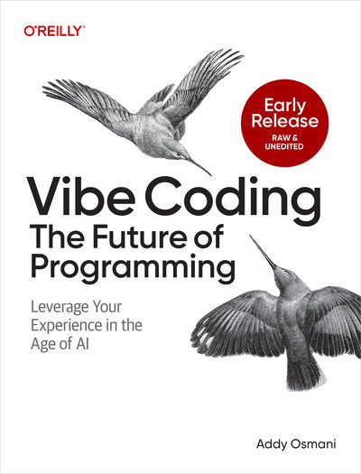
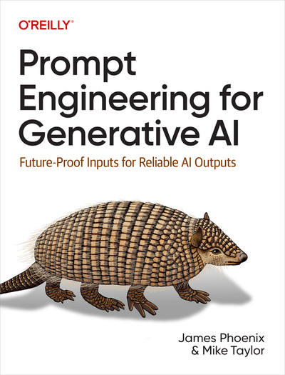
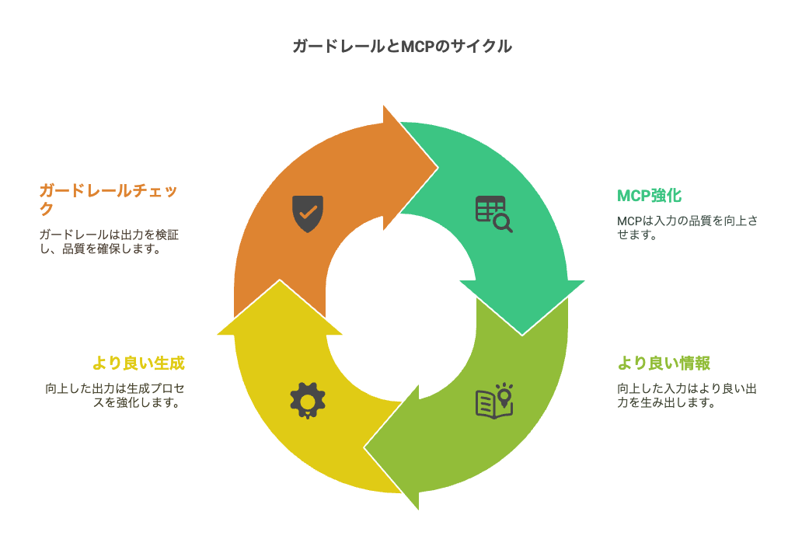
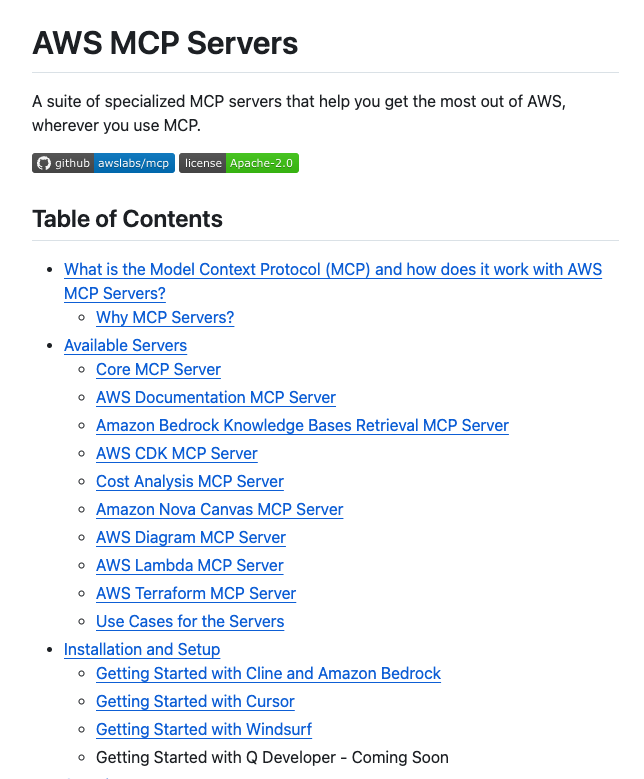
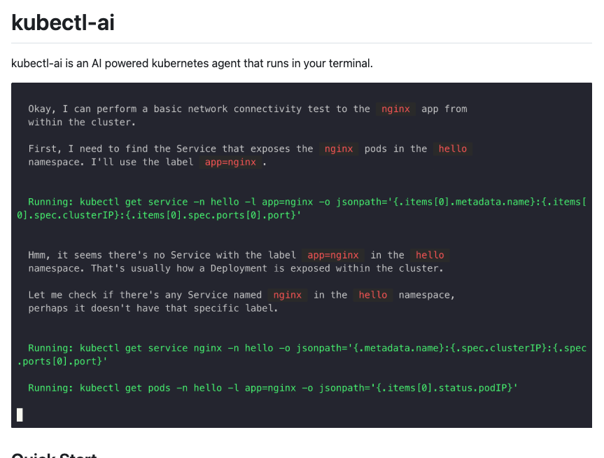
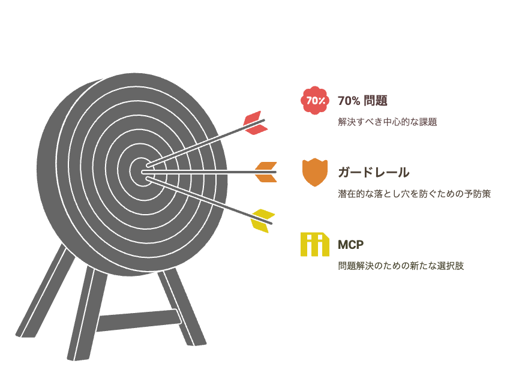

<!-- 
_backgroundColor: #0a1929
_color: white
_class: title dark
-->


<div class="title" style="text-align: left; margin-top: 100px; margin-left: 20px; padding-left: 0; max-width: 70%;">

# <span style="font-size: 0.8em;">生成AIによる</br>Cloud Native 基盤構築の</br>可能性と実践的ガードレールの</br>敷設について</span>

</div>

<div class="author-info" style="text-align: left; padding-left: 0; text-indent: 0;">
2025/4/22 CloudNative Days Summer 2025 プレイベント</br>@nwiizo 30min  #CNDS2025
</div>

---

<!-- _backgroundColor: white -->


## nwiizo

<div class="info-box">
株式会社スリーシェイクで</br>プロのソフトウェアエンジニアをやっているものです</br>
格闘技、読書、グラビアが趣味でよく本を紹介してます</br>
</div>

<p style="margin-top: 30px !important;">人生を通して"<strong>運動、睡眠、読書</strong>"をちゃんとやりたい</p>

---

## about 3-shake

<div style="text-align: center; margin-top: 30px;">
  
</div>

---

## We are Hiring!!

<div style="text-align: center; margin-top: 30px;">

3-shakeは一緒にSRE界隈を盛り上げてくれる**仲間を大募集中**です！
Mobility、FinTech、通信など大規模SREを存分に経験できます
（最近社内はGenAI / GPU / Kubernetesが盛り上がってます）
是非、カジュアル面談しましょう！！！！

  
</div>


---

## 本日のアジェンダ

1. **生成AIとCloud Nativeの現在地**
2. **実践的なプロンプト設計**
3. **ガードレールの構築の手引き**
4. **ガードレールを超えて行動するMCP**
5. **まとめ**

---

# 1. 生成AIとCloud Nativeの現在地

---

## 2025年のAI活用状況 (1/2)

開発プロセスが本質的に変化しようとしています。完全に夜明け前です。

- **単なるコード生成から「問題解決支援」へ**
  - AIは「道具」から「思考パートナー」に進化
  - 実装の正確さより意図の理解が重要に

- **利用パターンの多様化**
  - **単発指示→会話型→継続的協働**へと発展
  - コンテキスト理解力の向上で長期的な議論が可能に

---

## 2025年のAI活用状況 (2/2)

- **コードレビュープロセスの変容**
  - AIが事前レビューを担当
  - 人間は高次の設計判断に集中
  - レビュー品質の標準化

- **ボイラープレートコードからの解放**
  - 定型コードの自動生成
  - カスタマイズポイントの明示
  - 保守性を考慮した生成

---


## 生成AIによるCloud Nativeの実際⋯

- **実際のところは⋯**
  - 完璧を求めず「ある程度必要」な取り組み
  - 変化を楽しむマインドセットの醸成
  - 細かいハルシネーションを起こすので**知識よりも探索能力を重視する**

- **現場での実感**
  - 以前は「動かない定義」や「架空の機能」に悩まされた
  - 今ではモデルの精度が上がり問題が大幅に減少
  - **価値を生む作業に集中できる環境に**


---

## 生成AIでIaCはさらなる変化を遂げている

### 抽象度の向上
- コード記述 → 宣言的定義 → **意図ベース定義**へ
- 「何を」ではなく「なぜ」を中心とした記述(省略)
- ビジネス要件からインフラ定義への直接的な翻訳

### アクセシビリティの民主化
- 専門知識の要求度が低下
- インフラ構築の裾野拡大
- DevOpsの真の実現へのステップ

---

## 生成AIでIaCはさらなる変化を遂げている

### 実験と探索の加速
- プロトタイピングサイクルの短縮
- 複数アプローチの並行検証が容易に
- 「もし〜だったら？」の実験コスト激減

機能やドキュメントを調べて、実行できるか確認してみたいな作業がギュっとなりました

---

## 生成AI時代のIaCの価値

### ガバナンスとコンプライアンスの強化
- ポリシーのコード化と自動適用及び自然言語での表現
- 変更理由の明示的記録と追跡及び背景の記録
- 監査対応の自動化と簡素化

### 知識の形式知化と共有
- 暗黙知のコード化と組織資産化
- ベストプラクティスの自動適用
- 個人スキルギャップの影響低減

---

## 生成AI時代のIaCの価値

### 人間の創造性への集中
- 反復的作業からの解放
- アーキテクチャ設計や戦略的判断への集中
- 「何を構築するか」より「なぜ構築するか」に注力

生成AIによるIaCは、**インフラストラクチャをソフトウェアのように扱うというIaCの本来の約束**をようやく完全に実現しつつある

---

## 生成AIによるIaCにはまだ課題が残っています

### 依然として残る文脈理解の壁
- 設定意図を完全に理解することが難しい
- 企業固有のプラクティスの習得が困難
- プロジェクト全体を通した一貫性の欠如

### 具体的な課題例
- AWS IAMポリシー生成時に過剰な権限を付与しがち
- リソース間の複雑な依存関係の理解が不十分、作り直しがち
- コスト最適化を考慮しない設計提案

---

## 生成AIによるIaCにはまだ課題が残っています

### 品質の非均一性
- 同じプロンプトでも結果に一貫性がない
- モデルバージョンによる出力差が大きい
- IaCのリファクタリング能力に限界がある</br>(背景を知らないので消しちゃいけないやつ消したりする)

### 人間との出力差
- 未だにスピードが主な優位点となっている
- 経験豊富なインフラエンジニアの知識を超えることは少ない

---

## Vibe CodingはIaCと相性が絶望的に悪い

<div style="display: flex; gap: 20px; align-items: center;">
<div style="width: 25%;">
  
  <div style="font-size: 0.5em; text-align: center; margin-top: 10px;">
  Vibe Coding: The Future of Programming
  https://learning.oreilly.com/library/view/vibe-coding-the/9798341634749/
  </div>
</div>

<div style="width: 70%; margin-left: auto;">
<ol style="font-size: 0.9em;">

### 生成AIの現実的な限界: 70%問題
  - IaCは精度が命綱だが、AIはテンプレート的な構成のみ正確に生成可能
  - IaCに必要な厳密さとAIの「だいたいあってる」精度の致命的なギャップ
  - AIは「優秀だが何も確認しない若手開発者」 - 速いがIaC特有の制約を無視


</ol>
</div>
</div>

---

## Vibe CodingはIaCと相性が絶望的に悪い

<div style="display: flex; gap: 20px; align-items: center;">
<div style="width: 25%;">
  
  <div style="font-size: 0.5em; text-align: center; margin-top: 10px;">
  Vibe Coding: The Future of Programming
  https://learning.oreilly.com/library/view/vibe-coding-the/9798341634749/
  </div>
</div>

<div style="width: 70%; margin-left: auto;">
<ol style="font-size: 0.9em;">


### 残りの30%の難しさ
- 70%を登ってきた経験なしで30%を超える難しさ
- インフラ構成では小さなミスが大惨事に直結、AIのVibe Codingでは検出困難
- コードの正確性確保するタイミングでインフラの機能を損なう可能性

</ol>
</div>
</div>

---

## 課題を克服するための方向性を考えましょう

### 効果的なAI活用ワークフロー
- AIを最初の草稿者として活用: 初期コード生成→人間による洗練
- AIをペアプログラマーとして活用: 人間とAIの継続的な対話と検証
- AIをバリデーターとして活用: 人間が書いたコードの検証と改善

### 開発プロセスの適応
- AIと人間の役割分担を明確に、プログラマーの終焉ではなく変容が求められる
- レビュープロセスの強化と頻繁なコミット
- 生成→ガードレール/ポリシー適用→人による検証→調整のサイクル確立

---

## 課題を克服するための方向性を考えましょう

### AIを賢く使う
- 具体的で明確な要件提示
- AI出力の厳格な検証
- 理解できないコードはマージしない
- 技術の素振りのために一回作り直す前提で作る
- 効果的なプロンプトの共有と再利用
- チーム全体でのAI使用基準の統一

---

# 2. 実践的なプロンプト設計

---
## プロンプトにおける一般的な問題点

<div style="display: flex; gap: 20px; align-items: center;">
<div style="width: 25%;">
  
  <div style="font-size: 0.5em; text-align: center; margin-top: 10px;">
  Prompt Engineering for Generative AI
  https://learning.oreilly.com/library/view/prompt-engineering-for/9781098153427/
  </div>
</div>

<div style="width: 70%; margin-left: auto;">
  <ol style="font-size: 0.9em;">
    <li><strong>曖昧な指示</strong> </br> - 日本語という言語の特性上、曖昧な指示が多い</li>
    <li><strong>未定義の出力形式</strong> </br> - 出力の形式や長さが明確に定義されていない</li>
    <li><strong>例示の欠如</strong> </br> - 良い名前の具体例が示されていない</li>
    <li><strong>評価基準の不足</strong> </br> - 名前の良し悪しを評価する一貫した方法がない</li>
    <li><strong>タスクの分割不足</strong> </br> - 複雑な命名タスクが単一のプロンプトに任されている</li>
  </ol>
</div>
</div>

---

## プロンプト設計の失敗パターンと対策 (1/2)

### 失敗パターン

1. **曖昧な指示**
   - 症状：「良いDockerfileを作って」→何が「良い」か不明確
   - 対策：具体的な条件（「セキュリティ強化」「ビルド時間短縮」など）を明示

2. **過度に複雑な要求**
   - 症状：一度に多くの要件→コンテキスト混乱、一部無視
   - 対策：タスク分割、ステップバイステップアプローチ

---

## プロンプト設計の失敗パターンと対策 (2/2)

3. **矛盾する指示**
   - 症状：「軽量で高機能な」など相反する要件→最適化困難
   - 対策：優先順位を明確に（「軽量性を優先、ただし最低限の機能Xは必須」）

4. **専門知識の前提**
   - 症状：「普通のやり方で」など暗黙知に依存→解釈違い
   - 対策：明示的なルール提示、例示

5. **フィードバックループの欠如**
   - 症状：一方的な指示のみ→改善機会損失
   - 対策：評価基準の明示、段階的改善


---
## プロンプトの5つの原則

<div style="display: flex; gap: 20px; align-items: center;">
<div style="width: 25%;">
  
  <div style="font-size: 0.5em; text-align: center; margin-top: 10px;">
  Prompt Engineering for Generative AI
  https://learning.oreilly.com/library/view/prompt-engineering-for/9781098153427/
  </div>
</div>


<div style="width: 70%; margin-left: auto;">
  <ol style="font-size: 0.9em;">
    <li><strong>方向性を与える</strong> </br> - 具体的な指示や目的を明確に示す</li>
    <li><strong>フォーマットを指定する</strong> </br> - 望ましい出力形式を明確に定義する</li>
    <li><strong>例を提供する</strong> </br> - 期待する出力のサンプルを示す</li>
    <li><strong>品質を評価する</strong> </br> - 生成された結果の品質を測定・改善する方法を組み込む</li>
    <li><strong>作業を分割する</strong> </br> - 複雑なタスクをより小さな段階に分割する</li>
  </ol>
</div>
</div>

---

## プロンプトの5つの原則の実践例 (1/3)

### 1. 方向性を与える（Give Direction）
```
× 「ECSクラスタを作成するTerraformコードを書いて」
○ 「高可用性と費用対効果を重視したプロダクション環境向けECSクラスタを作成するTerraformコードを書いて。
　　マイクロサービスアーキテクチャを想定し、セキュリティ要件を満たすこと」
```

### 2. フォーマットを指定する（Specify Format）
```
× 「Kubernetesマニフェストを生成して」
○ 「以下の構造で、YAMLフォーマットのKubernetesマニフェストを生成して：
   - 各リソースは別ファイルとして
   - コメントは日本語で
   - リソース名は kebab-case で統一
   - インデントは2スペース」
```

---


### 3. 例を提供する（Provide Examples）
```
「以下の例に倣ってDockerfileを作成してください：

FROM node:18-alpine AS builder
WORKDIR /app
COPY package*.json ./
RUN npm ci
...」
```

### 4. 品質を評価する（Evaluate Quality）
```
「生成したTerraformコードに対して、以下の観点で自己評価してください：
1. セキュリティ（最小権限の原則に従っているか）
2. 可用性（単一障害点がないか）
3. コスト最適化（不要なリソースがないか）
4. メンテナンス性（変数、モジュール化など）」
```

---

### 5. 作業を分割する（Break Down Tasks）
```
「マイクロサービスアーキテクチャの実装を以下のステップで進めます：
Step 1: 全体アーキテクチャ図の作成
Step 2: 各サービスの依存関係の定義
...」
```

これらのプロンプトを組み合わせることで、生成AIの出力の質を大幅に向上させることができます。その他の細かいテクニックに関しては[Prompt Engineering Guide](https://www.promptingguide.ai/jp)や[Prompt engineering overview](https://docs.anthropic.com/en/docs/build-with-claude/prompt-engineering/overview)などを読めば良いです。

サンプルプロンプトは[**じゃあ、おうちで学べる**](https://syu-m-5151.hatenablog.com/)ブログで公開しています。ぜひ確認してください。

---

## コンテキスト同梱の良さ(1/2)

1. **ナレッジの保存と伝承**
   - 意思決定の背景や根拠が明示的に残る
   - 組織の暗黙知が形式知化される
   - 人材の入れ替わりに対する耐性向上

2. **品質とコンプライアンスの向上**
   - コードレビューの質的向上（意図の理解）
   - 監査対応の容易化（なぜその設定か説明可能）
   - セキュリティ要件のトレーサビリティ確保

---

## コンテキスト同梱の良さ(2/2)


3. **メンテナンス性の向上**
   - 修正・変更時の副作用予測が容易に
   - リファクタリングの安全性向上
   - テスト戦略の適切な立案

他にもいくつかテクニックやそれを補助するツールがありますので調べてみて下さい。ここで言いたいことは1つでドキュメントをGithubに全部載せてたほうが良いということです。

---

## コンテキスト提供の最適化(rules) (1/3)

### Rules方式とは
- 必要情報を事前にプロンプトに埋め込むアプローチ
- ClineやCursorが参照すべきルールを明示的に提供
- 構造化された指示を体系的に組み込む方法

### Rules方式のメリット
- 一貫した出力品質が得られる
- 結果が予測しやすくなる
- 企業固有要件を反映させやすい

---

## コンテキスト提供の最適化(rules) (2/3)

### 実装戦略

1. **汎用ルール**
   - 業界標準パターン
   - 共通設計原則

2. **技術スタック固有ルール**
   - Kubernetes/Terraform等の特有の最適化
   - プラットフォーム固有の制約
   - フレームワーク推奨パターン


---

## コンテキスト提供の最適化(rules) (3/3)

### 実装戦略

3. **組織固有ルール**
   - 命名規則、セキュリティポリシー
   - 社内標準アーキテクチャ
   - コーディング規約

4. **プロジェクト固有ルール**
   - 特定アプリケーション要件
   - 環境固有の設定
   - チーム合意事項

---

## Rules定義プロセスと更新サイクル

### Rules定義プロセス
1. 既存の標準・ベストプラクティスの棚卸し
2. 知識ベースの体系化（ドキュメント/コード規約等）
3. プロジェクト要件の明確化
4. フィードバックループの確立

このようなルールをプロンプトに含めることで、生成結果が大幅に改善します。
[Awesome CursorRules](https://github.com/PatrickJS/awesome-cursorrules)や[rules_template](https://github.com/Bhartendu-Kumar/rules_template)などのリポジトリを参考にしてください。
最終的には**自プロジェクトの規模と運用フロー**に合わせてテンプレをスリム化すると、Cline の推論コストを抑えつつ高精度なアシストを得られます。

---

# 3. ガードレールの構築の手引き

---

## 70%問題とは何か

生成AIの"Vibe Coding"がもたらす根本的な課題

- **70%は正確だが、残りの30%が致命的**
  - AIは「**だいたいあってる**」精度でIaCを生成
  - IaCでは**小さなミスが大惨事に直結**
  - 「優秀なはずだけど確認を怠る若手開発者」のような振る舞い

---

## 70%問題の本質

- **残りの30%を確実にする労力**
  - **70%を登ってきた経験なしで30%を超える難しさ**
  - 「**砂上の楼閣**」インフラの回避が本質的な課題

- **AIの限界を認識することが重要**
  - 完全自動化への過信は危険
  - 人間による検証と理解が不可欠

---

## 生成AI時代のガードレールの重要性 (1/3)

### 安全性と信頼性の向上

- **本番環境への安全なデプロイを保証**
  - 設定ミスの自動検出
  - 生成AIに対して斜に構えるのではなく積極的に活用する姿勢が重要
  - ガードレールによって細かいハルシネーションを防止し、70%の精度を担保

- **AIが見落としがちな設定ミスによるダウンタイムを削減**
  - 人間が見逃しやすいエッジケースの捕捉
  - 生成AIは再現性が担保されているわけではない
  - 一貫性のある検証の適用

---

## 生成AI時代のガードレールの重要性 (2/3)

### 開発者体験の向上

- **AIが提案する変更に対する確信と心理的安全性の確保**
  - 「これで大丈夫」という確信の提供
  - 失敗への恐れを軽減

- **人間によるレビュー工数の戦略的削減**
  - 注力すべきポイントの明確化
  - 単純ミスの自動検出

---

## 生成AI時代のガードレールの重要性 (3/3)

### 組織的メリット

- **組織全体での標準化と一貫性の担保**
  - 個人の能力差に依存しない品質確保
  - ベストプラクティスの自動適用

- **イノベーションと規制のバランス**
  - **過度な制限によるイノベーション阻害の回避**
  - 創造性を維持しながらの安全性確保

---

## 生成AIへの過信がもたらした教訓 (1/2)

### 実際の教訓

1. **検証の自動化の必要性**
   - **人的レビューだけでは見落としが発生**
   - 「見た目は良い」コードの危険性

2. **多層防御の重要性**
   - **設計・実装・運用の各段階での検証**
   - 単一の検証方法への依存は危険

---

## 生成AIへの過信がもたらした教訓 (2/2)

3. **継続的監視の価値**
   - **デプロイ後も定期的な検証が必須**
   - 環境変化による新たなリスクの検出

4. **コンテキスト理解の重要性**
   - AIは全体的な文脈を把握しづらい
   - ドメイン固有の制約を理解させる工夫が必要

---

## IaCの検証はコード生成の検証とは本質的に異なる (1/2)

### 根本的な違い

- コード生成の検証は**コードの品質**を担保
  - 構文エラー、ベストプラクティス準拠など

- IaCの検証は**インフラの品質と動作**を担保
  - 実際のリソース作成・更新の正しさ
  - 運用環境での挙動の予測

---

## IaCの検証はコード生成の検証とは本質的に異なる (2/2)

### なぜこの違いが重要か

- **開発者視点とインフラ視点の融合が必要**
  - コード品質だけでは不十分
  - 実際の動作検証が必須

- **AIはコードの見た目の正しさに強いが、動作の正しさには弱い**
  - 構文的に正しくても実行時に問題が発生
  - 複雑な依存関係の理解が難しい

---

## IaCのガードレールを敷設する場所(1/3)

1. **コード品質検証**
   - 構文、形式、静的解析、コーディング規約
   - **基本的な品質の担保**

2. **セマンティック検証**
   - **リソース間の整合性、依存関係の正確性**
   - 論理的な矛盾の検出

3. **セキュリティ検証**
   - 脆弱性スキャン、**最小権限原則の適用**
   - セキュリティリスクの事前検出

---

## IaCのガードレールを敷設する場所(2/3)

4. **コンプライアンス検証**
   - 組織ポリシー、法規制、業界標準への適合性
   - **規制要件の自動的な確認**

5. **コスト最適化検証**
   - リソース効率、予算管理、無駄の排除
   - 予期せぬコスト増加の防止

6. **変更影響分析**
   - **変更範囲の把握、依存サービスへの影響**
   - 予期せぬ副作用の検出

---

## IaCのガードレールを敷設する場所(3/3)

7. **テスト自動化**
   - ユニットテスト、統合テスト、E2Eテスト
   - **実際の動作確認の自動化**

8. **運用準備性検証**
   - モニタリング、トレーシング、ロギング、バックアップ、復旧手順
   - 運用視点での検証

9. **デプロイ戦略検証**
   - **段階的デプロイ、ロールバック計画の評価**
   - 安全なデプロイの保証

---

## 継続的検証と改善サイクル (1/2)

### 主要なチェックポイント

- **Pull Request時の自動検証**
  - コミット前の早期フィードバック
  - **問題の早期発見と修正**

- **定期的な既存リソース検証**
  - 設定ドリフトの検出と修正
  - 新たなセキュリティリスクの識別

---

## 継続的検証と改善サイクル (2/2)

- **環境ごとの段階的検証**
  - 開発→検証→本番の段階的な検証強化
  - **環境特性に合わせた検証戦略**

- **デプロイ前の最終確認**
  - 総合的なリスク評価と承認プロセス
  - **ポイントオブノーリターンの設定**

---

## 避けるべきアンチパターン (1/2)

1. **検証の先送り**
   - **「後でまとめてチェックする」という罠**
   - 問題の蓄積と複雑化

2. **過度な警告抑制**
   - 警告を無効化して問題を隠蔽
   - **技術的負債の暗黙的増加**

---

## 避けるべきアンチパターン (2/2)

3. **検証なしの自動修正**
   - **非互換性や副作用のリスク増大**
   - 責任の所在の不明確化

4. **一発本番適用**
   - **テスト環境でのドライランスキップ**
   - リスク評価の欠如

---

## 認知負荷を下げるためのガードレール (1/2)

### ガードレールの戦略的選定

- **目的別の最適ツール選定**
  - 動的検証、静的解析、セマンティック検証
  - **組み合わせによる多層防御**

- **ルール設定のカスタマイズ**
  - 業界ベストプラクティス
  - **組織固有ポリシー**

---

## 認知負荷を下げるためのガードレール (2/2)

- **フォールスポジティブの戦略的管理**
  - **重要度に応じた扱い分け**
  - 誤検出の継続的改善

- **自動修正機能の活用**
  - スタイルや軽微な問題の自動修正
  - **人間の注力すべきポイントの明確化**

---

## ガードレールの進化

- **プロンプトのコンテキスト情報がガードレールの判断基準に**
  - 意図の明確化による検証精度向上
  - [PR-Agent](https://github.com/qodo-ai/pr-agent)などによる自然言語のコンテキスト情報の活用
  - 正しい判断のための追加情報の活用

- **意図とチェック内容の一貫性確保**
  - 設計意図に基づく検証
  - **「なぜ」の理解に基づく検証の高度化**

---

## ガードレールの進化

- **修正パターンの学習と自動適用**
  - 反復的な問題の自動解決
  - 経験の蓄積と活用

- **プロンプト改善の自動提案**
  - より良い結果を生むプロンプトの学習
  - **未然防止アプローチの強化**

- **ガードレール自体の継続的最適化**
  - 誤検出の削減
  - 検出精度の向上

---

# 4. ガードレールを超えて行動するMCP

---

## Model Context Protocol (MCP)の概要 (1/3)

### 定義と基本原理
- **AI大規模言語モデルが外部ツールやデータにアクセスするためのプロトコル**
- モデルが質問生成 → 外部システムが回答 → AIが情報統合

### 前章のガードレールとの関係
- ガードレールは「**AIの出力を制限する**」アプローチ
- MCPは「**AIの入出力を拡張する**」アプローチ
- **両者の組み合わせで真の可能性を引き出す**

---

## Model Context Protocol (MCP)の概要 (2/3)

### Rules方式との根本的な違い
- **Rules**: 事前にすべての情報をコンテキストに埋め込む（**静的**）
- **MCP**: 必要な情報を実行時に動的に取得（**動的**）

### AIの視野を広げる意義
- **70%問題の新たな解決策**
- 最新情報やコンテキスト特化情報の活用
- **「知っていること」と「アクセスできること」の融合**

---

## Model Context Protocol (MCP)の概要 (3/3)

### MCPの動作メカニズム

1. **AI: 「追加情報が必要」と判断**
   - **質問に答えるために不足している情報を特定**
   - 具体的なクエリを生成

2. **AI: 情報取得のためのクエリを生成**
   - **構造化されたクエリの作成**
   - 適切なデータソースの選択

---

## Model Context Protocol (MCP)の動作続き

### 情報取得と処理のフロー

3. **外部システム: 情報を収集・返却**
   - クエリに基づく情報取得
   - **フォーマット変換・最適化**

4. **AI: 情報をコンテキストに統合し応答**
   - **取得情報の理解・解釈**
   - ユーザーの質問と関連付けた回答生成

---

## MCPとガードレールの補完関係

<div style="display: flex; gap: 10px; align-items: center; margin-top: 20px;">
<div style="width: 80%;">
  
</div>

<div style="width: 50%;">
  <ul style="font-size: 0.8em;">
    <li><strong>相互補完的な関係</strong>
      <ul>
        <li>ガードレール：出力の「安全性」「品質」を確保</li>
        <li>MCP：入力の「情報量」「正確性」を向上</li>
      </ul>
    </li>
    <li><strong>品質向上サイクル</strong>
      <ul>
        <li>MCP → より良い情報 → より良い生成 → ガードレールでチェック</li>
      </ul>
    </li>
  </ul>
</div>
</div>

---

## MCP実装の技術選定ガイド (1/2)

### 技術選定の判断基準

1. **既存システム状況**
   - **既存APIの有無と品質**
   - 認証・認可の仕組み
   - 統合難易度

2. **要件の複雑さ**
   - **必要データの多様性**
   - リアルタイム性要求
   - エラー処理の複雑さ

---

## MCP実装の技術選定ガイド (2/2)

3. **運用面の考慮**
   - **保守性とスケーラビリティ**
   - モニタリングと監査の容易さ
   - **セキュリティとデータ保護**([riseandignite/mcp-shield](https://github.com/riseandignite/mcp-shield)などがある)

4. **コスト効率**
   - **APIコールの頻度と量**
   - データ転送コスト
   - 実装・維持コスト

---

## AWS MCP Servers (1/2)

<div style="display: flex; gap: 5px;">
<div style="width: 45%;">

<div style="font-size: 0.5em; text-align: left; margin-top: 5px;">
出典: https://github.com/awslabs/mcp
</div>
</div>

<div style="width: 60%;">
<ol style="font-size: 0.8em;">

### AWS Documentation MCP Server
- **AWS公式ドキュメント検索**
- サービス・API・パラメータ情報取得
- ベストプラクティス参照


### Bedrock Knowledge Bases MCP Server
- **カスタムナレッジベース連携**
- 自社ドキュメント・Wiki活用
- 独自Q&Aデータベース

</ol>
</div>
</div>

---

## AWS MCP Servers (2/2)

<div style="display: flex; gap: 5px;">
<div style="width: 45%;">

<div style="font-size: 0.5em; text-align: left; margin-top: 5px;">
出典: https://github.com/awslabs/mcp
</div>
</div>

<div style="width: 60%;">
<ol style="font-size: 0.8em;">

### CDK MCP Server
- **AWS CDKプロジェクト支援**
- コンストラクト情報参照/プロパティ・メソッド詳細

### Terraform MCP Server
- **Terraformプロバイダー情報参照**
- リソース・データソース詳細/モジュール構造解析


### Lambda MCP Server
- **任意のLambda関数をMCPツールとして実行**
- カスタムインテグレーション

---

## kubectl-ai: Kubernetes用AIアシスタント (1/2)

<div style="display: flex; gap: 5px;">
<div style="width: 45%;">

<div style="font-size: 0.5em; text-align: left; margin-top: 5px;">
出典: https://github.com/GoogleCloudPlatform/kubectl-ai
</div>
</div>

<div style="width: 60%;">
<ol style="font-size: 0.8em;">

### 概要
- **Google Cloudの大規模言語モデルを活用したkubectlプラグイン**
- **自然言語でKubernetesクラスタを操作**
- クラスタ状態を考慮した応答生成
- **MCPとしても利用可能**
- https://github.com/GoogleCloudPlatform/kubectl-ai


</ol>
</div>
</div>

---

## kubectl-ai: Kubernetes用AIアシスタント (2/2)

実用的なコマンド例：

```bash
# デプロイメント作成
kubectl ai "nginxのDeploymentを作成して、レプリカ数は3、リソース制限ありで"

# トラブルシューティング
kubectl ai "なぜPodがPendingのままなのか調査して"

# スケーリング操作
kubectl ai "payment-serviceのレプリカを3から5に増やして"
```

---

## kubectl-aiの活用パターン

```bash
# リソース最適化
kubectl ai "すべてのDeploymentのリソース使用状況を分析し、最適化案を提示して"

# セキュリティ診断
kubectl ai "クラスタ内の潜在的なセキュリティリスクを検出して"
```

- **複雑なKubernetes操作を自然言語で実行可能に**
- **現在のクラスタ状態に基づいた適切な提案**
- **特定の状況に合わせたトラブルシューティング**

---

## 各種サービスのMCP実装例

各サービスベンダーもMCP実装を進めています。人の夢は!!! 終わらねェ!!!

- [**Datadog MCP**](https://github.com/winor30/mcp-server-datadog)(非公式)
  - **監視データやログの自然言語分析**
  - インシデント検知と障害対応支援

- [**PagerDuty MCP**](https://github.com/wpfleger96/pagerduty-mcp-server)(非公式)
  - PagerDutyのAPI機能をLLMに提供
  - インシデント、サービス、チーム管理が自然言語で可能


---

## MCPエコシステムの拡大

### サービスベンダー視点

- **差別化ポイントとしてのMCP**
  - 製品の使いやすさ向上
  - ユーザー体験の向上

### ユーザー視点

- **複数ツールの統合インターフェース**
  - ツール間の文脈の維持
  - **学習コストの削減** -> ユーザーはドキュメントやコードに質問できる

---

## ドキュメントやコードに質問できる意義 (1/2)

### 従来のアプローチの限界
- **キーワード検索の精度限界**
- 暗黙知のドキュメント化困難
- **コンテキスト理解の欠如**
- 情報の断片化
- **ドキュメント間関連性把握の困難さ**

---

## ドキュメントやコードに質問できる意義 (2/2)

### MCPによる質的変化
- **自然言語による意図理解**
- **複数情報源からの統合回答**
- コンテキストに応じた関連情報提供
- 文脈の維持
- **説明を含む回答生成**
- 理解しやすい情報提示


---

## MCPとガードレールの統合による未来

- **MCPによる情報アクセスの拡張**
  - 必要な情報へのリアルタイムアクセス
  - **文脈に応じた最適な情報提供**

- **ガードレールによる安全性確保**
  - 生成コードの品質担保
  - **リスクの最小化と自動修正**

- **協調的な開発フロー**
  - **AIが提案、人間が判断**という役割分担
  - **70%問題の克服**と開発体験の向上

---

## MCPの課題と現実的な限界

- **レスポンス時間の増加**
  - 外部API呼び出しによる遅延
  - 複数ソースへのアクセスによる待ち時間

- **情報統合の難しさ**
  - 矛盾する情報の調停
  - コンテキスト長の制限との兼ね合い

---

## MCPの課題と現実的な限界

- **ハルシネーション問題は依然として存在**
  - 情報アクセスは改善するが、解釈ミスの可能性は残る
  - 特に複雑な依存関係の理解に課題

- **70%→100%ではなく、より現実的には70%→80%程度**
  - 人間による最終確認は依然として重要
  - 自動化と人間の判断のバランスが鍵
  - 斜に構えてたら終わる実感は持っている

---

# 5.まとめ

---

## まとめ

<div style="display: flex; gap: 5px;">
<div style="width: 65%;">

</div>

<div style="width: 85%;">
<ol style="font-size: 0.8em;">

- **生成AIとIaCの相性の悪さとその解決策**
  - ガードレールの敷設、MCPの導入、プロンプト設計の5原則
- **プロンプト設計は5原則で品質向上**
  - *方向性・フォーマット・例示・評価・分割*
- **IaCの70%問題はガードレールとMCPと人間で解決**
  - 多層検証＋ルール化で信頼性担保

</ol>
</div>
</div>

---

## え、実践的なガードレールの敷設は？


<div style="display: flex; gap: 5px;">
<div style="width: 65%;">

</div>

<div style="width: 85%;">
<ol style="font-size: 1.4em;">

今回は方向性だけ示しました。それぞれのガードレールの設定方法は各自でやってください。参考リンクにいくつか紹介リンクを載せています。75％ぐらいは作ってくれると思います。

</ol>
</div>
</div>

---

## 参考リソース

- [OPA（Open Policy Agent）](https://www.openpolicyagent.org/)
- [Kyverno](https://kyverno.io/)
- [AWS MCP Servers](https://github.com/awslabs/mcp)
- [kubectl-ai](https://github.com/GoogleCloudPlatform/kubectl-ai)
- [kube-linter](https://github.com/stackrox/kube-linter)
- [Trivy](https://github.com/aquasecurity/trivy)
- [Conftest](https://www.conftest.dev/)
- [Datree](https://www.datree.io/)
- [PR-Agent](https://github.com/qodo-ai/pr-agent)
- [hadolint](https://github.com/hadolint/hadolint)

---

## 参考リンク

* [Dynamic Admission Control](https://kubernetes.io/docs/reference/access-authn-authz/extensible-admission-controllers/)
* [Validating Admission Policy](https://kubernetes.io/docs/reference/access-authn-authz/validating-admission-policy/)
* [Terrascan](https://github.com/tenable/terrascan)
* [Infracost](https://github.com/infracost/infracost)
* [Checkov](https://github.com/bridgecrewio/checkov)
* [Pluto](https://github.com/FairwindsOps/pluto)
* [Sealed Secrets](https://github.com/bitnami-labs/sealed-secrets)

---

## 参考リンク

- [MCPのドキュメント](https://modelcontextprotocol.io/)
- [tflint](https://github.com/terraform-linters/tflint)
- [tfsec](https://github.com/aquasecurity/tfsec)
- [kube-score](https://github.com/zegl/kube-score)
- [Argo Rollouts](https://argoproj.github.io/rollouts/)
- [Argo CD](https://argo.github.io/cd/)
- [Kubernetesで実践する Platform Engineering](https://www.shoeisha.co.jp/book/detail/9784798188379)
- [AI Engineering](https://learning.oreilly.com/library/view/ai-engineering/9781098166298/)


---

<!-- 
_backgroundColor: #0a1929
_color: white
_class: title dark
-->


<!-- タイトルページ左上に大きなロゴを表示 -->
<div style="position: absolute !important; top: 5px !important; left: 5px !important; z-index: 9999 !important; margin: 0 !important; padding: 0 !important;">
  
</div>

<div style="text-align: center; margin-top: 200px;">

# ありがとう<span class="highlight-yellow">ございました</span>

### ご質問・ご相談はお気軽にお問い合わせください

@nwiizo | https://3-shake.com
</div>
