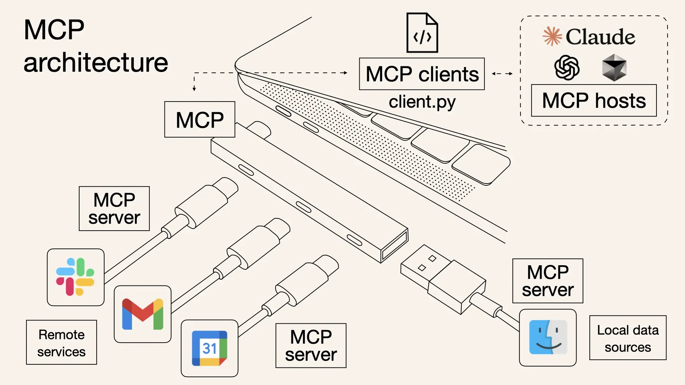
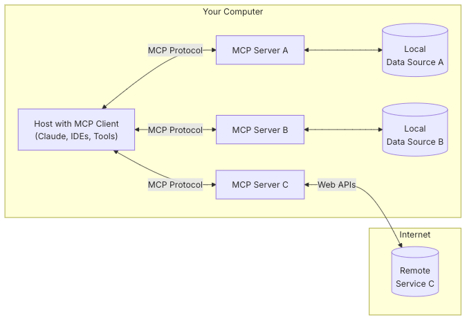
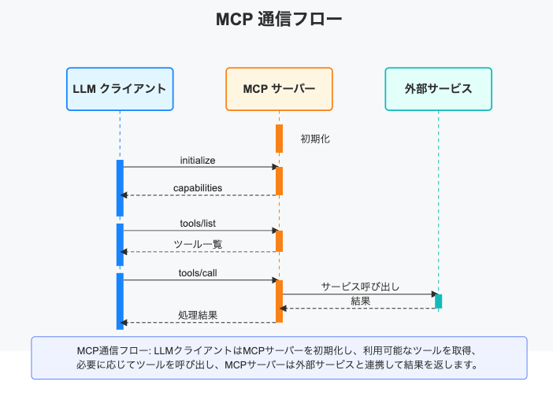
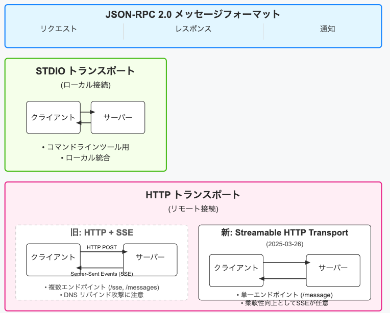
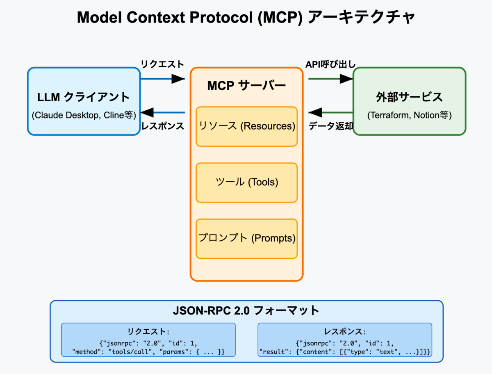
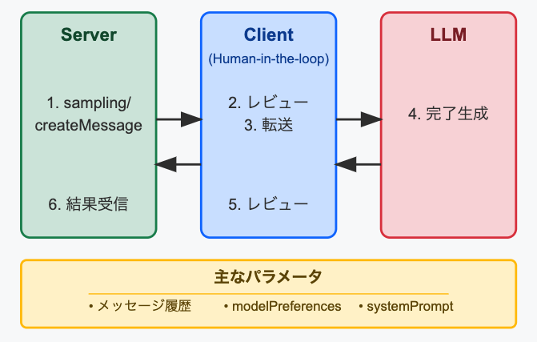
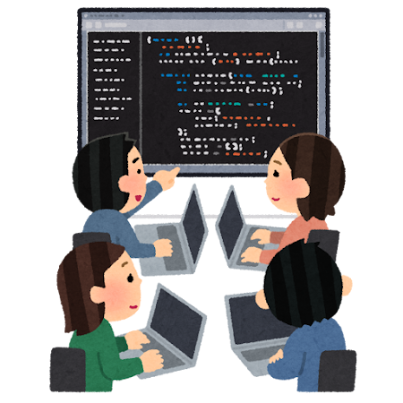
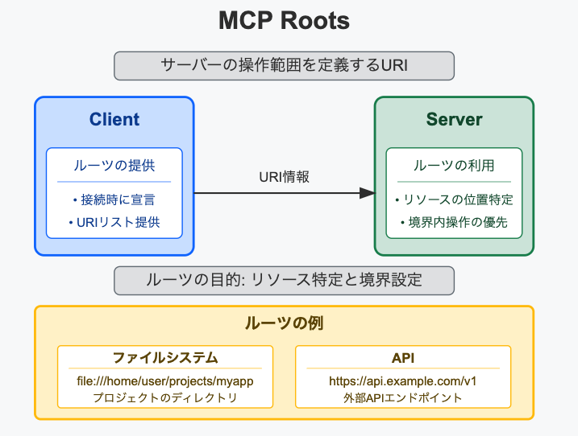

<!-- 
_backgroundColor: #0a1929
_color: white
_class: title dark
-->


<div class="title" style="text-align: left; margin-top: 100px; margin-left: 20px; padding-left: 0; max-width: 70%;">

# <span style="font-size: 1.0em;">転職したら</br>MCPサーバーだった件</span>

</div>

<div class="author-info" style="text-align: left; padding-left: 0; text-indent: 0;">
2025/5/16 転職したらMCPサーバーだった件</br>@nwiizo 30min #Forkwell_MCP
</div>

---

## これまでのあらすじ

### ある日、株式会社シェイクシェイクシェイクに転職をした</br>nwiizoさんに与えられた仕事はMCPサーバーになることだった！？

シェイクシェイクシェイク社は、取引先からの要請でAIソリューションを導入しなければならなくなりましたが、<strong>「AIのハルシネーションが深刻すぎて、実用に耐えない！」</strong>と結論づけました。しかし、ビジネス環境はAI革命の真っただ中です。業界専門家によれば、現代の競争力維持イコールAI活用の成否にかかっています。　市場の潮流に完全に背を向けるわけにはいかないと経営陣は決断しました。

---

## これまでのあらすじ

<strong>「AI時代を生き抜くために最も重要な要素は何か？」 「人間の判断力と介入です。」</strong>
と、こんな会話があったとかなかったとか。

こうして、シェイクシェイクシェイク社では、AIのハルシネーションを恐れるあまり、社員がMCPサーバーとして機能し、AIが情報提供をする代わりに人間が確認・修正する業務フローが生まれたのでした。
それでは、あなたはシェイクシェイクシェイク社の新人社員 nwiizomcp(nwiizo) となり、"人間MCPサーバー"としての日常業務を体験してみましょう！

---

# 第一章「異色の職場、シェイクシェイクシェイク社」

---

<!-- _backgroundColor: white -->


## nwiizoといいます

<div class="info-box">
最近、転職をしました。</br>
前職は、インフラエンジニアをしておりまして、責任感や順応性は高い方だと思います。終わりのない障害対応や無限の責任と残業などが主な原因なのですが過労で倒れてしまいました。転職活動は過労で倒れた直後に意識も意思も薄弱な状態で行いまして、シェイクシェイクシェイク社は、そんな私でも受け入れてくれました。ありがとうございます。<br>
</div>

---

<!-- _backgroundColor: white -->


<div class="info-box">
業務内容とか、正直あまりよくわかってないんです。
面接では入社したら上司になる吉田さんに<strong>「あなたのインフラエンジニアとしての経験を活かせる特別なポジション」</strong>という言葉をもらってなんだが嬉しくなりまして。
<strong>「はい、やります！」</strong>と即答してしまいました。</br>インフラエンジニアなので正直、そこまでやること変わらないと思うのですが頑張ります。<br>
それでは、これからよろしくお願いします。</br>
</div>

---

## 入社初日の衝撃


<div class="info-box">
入社してオリエンテーションを受けて、今後の業務で使うPCを受け取ったり、業務の説明を受けていました。
吉田さんの説明では一般的なインフラエンジニアとは違って<strong>「我々は人間がAIに教えるのではなく、人間がAIの一部として働くという逆転の発想で事業を展開している」</strong>ということでした。<br>

---

## 入社初日の衝撃


<div class="info-box">
ちょっと何を言われているか分からなかったです。自分が入社前に聞いてなかったのが悪かったのですが説明を聞きながらちょっと血の気が引いたのを感じました。ここまで聞いた話を端的にまとめると、<strong>「転職したらMCPサーバーだった件」</strong>ということでした。
</div>
</div>

---

## AIとシステムをつなぐ「USB規格」

<div style="display: flex; gap: 5px;">
<div style="width: 45%;">

<div style="font-size: 0.5em; text-align: left; margin-top: 5px;">
出典: https://notion.notion.site/Notion-MCP-1d0efdeead058054a339ffe6b38649e1
</div>
</div>

<div style="width: 60%;">
<ol style="font-size: 0.7em;">

### Model Context Protocol (MCP)とは

*   **定義**: LLMが外部ツール・データソースと通信する**標準規格**

* **特徴**: JSON-RPC 2.0をベースとした軽量プロトコル

* **アナロジー**: AIアプリのための「USB規格」- どのAIも同じインターフェースで外部接続

</ol>
</div>
</div>

---

## AIとシステムをつなぐ「USB規格」

<div style="display: flex; gap: 5px;">
<div style="width: 45%;">

<div style="font-size: 0.5em; text-align: left; margin-top: 5px;">
出典: https://notion.notion.site/Notion-MCP-1d0efdeead058054a339ffe6b38649e1
</div>
</div>

<div style="width: 60%;">
<ol style="font-size: 0.7em;">

### 解決する技術的課題

* **統合コスト削減**: 各LLM×各ツールの個別対応からの脱却

* **知識の拡張**: 静的なLLM知識を動的データソースで補完

* **汎用性確保**: 言語・プラットフォーム間の相互運用性実現
</ol>
</div>
</div>

---

## MCPの位置づけとコミュニティ


### オープン標準としての発展

- **Anthropic発案**: 2023年に設計・公開

- **公式ドキュメントが優秀**: GitHub上で仕様管理、コミュニティ主導


### エコシステムの急成長

- **クライアント**: Claude Desktop, VS Code, Cursor,nvim等

- **サーバー**: 200+（公式+コミュニティ）[ROADMAP](https://modelcontextprotocol.io/development/roadmap)にリポジトリの登場が明記

- **優位性**: 特定ベンダーに依存しないエコシステムが拡大中


---

## MCPのアーキテクチャ

<div style="display: flex; gap: 5px;">
<div style="width: 47%;">

<div style="font-size: 0.5em; text-align: left; margin-top: 5px;">
出典: https://modelcontextprotocol.io/introduction
</div>
</div>

<div style="width: 60%;">
<ol style="font-size: 0.6em;">

### General architecture

- **MCP Hosts**: Claude Desktop、IDE、AIツールなど、MCPを通じてデータにアクセスしたいプログラム
- **MCP Clients**: サーバーと1対1の接続を維持するプロトコルクライアント
- **MCP Servers**: 標準化されたModel Context Protocolを通じて特定の機能を提供する軽量プログラム
- **Local Data Sources**: MCPサーバーが安全にアクセスできるコンピュータのファイル、データベース、サービス
- **Remote Services**: MCPサーバーが接続できるインターネット経由の外部システム（API等）

</ol>
</div>
</div>

---

# 第二章「お前がMCPサーバーになるんだよ」

---

##  初めてのMCP体験


<div class="info-box">
セットアップしたPCを開いて、専用サイトにアクセスした瞬間、画面に<strong>「Becoming a MCP Server」</strong>という文字が浮かび上がりました。心臓が一瞬、高鳴るのを感じました。

初期処理が始まると、「自分に何ができるのか？」という問いかけが次々と現れます。フォーマットに従って、自分の経験やスキルを丁寧に記入していきました。具体的な質問に答えていくうちに、<strong>「ああ、これからMCPサーバーになるんだな」</strong>という実感が徐々に湧いてきました。不思議なことに、不安よりも業務が始まることへの安心感の方が強かったのです。意味わからないので。

---


<div class="info-box">
<strong>「今日から一週間、MCPサーバーとしての基本トレーニングを行います」</strong>

講師の言葉に、私は思わず背筋を伸ばしました。トレーニングが進むにつれて、「これが言っていた『人間がAIの一部として働く』ということなのか...」という理解が深まっていきます。慣れない業務に疲労感はありましたが、それ以上に新しい挑戦への興奮が心を満たしていました。

まるで新しい世界の扉を開いたような感覚。これから始まる日々に、期待と緊張が入り混じります。でも、不思議と「やってみよう」という気持ちが、心の奥底から湧き上がってくるのを感じていました。
</div>

---

## [MCPの通信フロー](https://modelcontextprotocol.io/docs/concepts/architecture)

<div style="display: flex; gap: 5px;">
<div style="width: 58%;">

<div style="font-size: 0.5em; text-align: left; margin-top: 5px;">
出典: https://syu-m-5151.hatenablog.com/entry/2025/03/09/020057

**利点**: シンプルさと互換性を両立した標準的な通信プロトコル
</div>


</div>

<div style="width: 70%;">
<ol style="font-size: 0.7em;">

- **初期化フェーズ**
   - クライアントが`initialize`でケイパビリティ宣言
   - サーバーが利用可能な機能を応答

- **リソース探索**
   - `resources/list`で利用可能なリソース一覧取得
   - `resources/get`で特定リソースのデータ取得

- **ツール呼び出し**
   - `tools/list`でサーバー上のツール一覧取得
   - `tools/call`で特定ツールの実行要求

</ol>
</div>
</div>

---

# 第三章「実務デビュー：最初のクライアント」

---

## 最初のクライアント


<div class="info-box">
トレーニング終了から3日後、吉田さんが私のデスクに近づいてきました。<br><br>
<strong>「お疲れさま、nwiizomcp。今日から実務デビューだ。テックスピード社からの依頼が入っている。彼らは新しいクラウドインフラを構築中で、監視システムの設計についてアドバイスが欲しいらしい」</strong><br>

---


<div class="info-box">
緊張しながら専用サイトに入ると、クライアントが既に画面に何やら入力しているようです。<br><br>

<strong>「クラウド環境でのサーバー監視について教えてほしいんだ。初めてのプロジェクトで、何をどう監視すればいいのか分からなくて...」</strong><br><br>

質問を聞いた瞬間、前職でのSRE経験が蘇りました。監視システムの構築、アラートの設定、インシデント対応...すべての知識が整理されて頭に浮かびます。<br>

</div>

---


<div class="info-box">

基本的にすぐに回答するわけではない。基本的には、クライアントが自分のサーバーに対して、<strong>「これをやってください」</strong>という要求を出す。まで待ちなのだ<br><br>

そんなことを言っていると、クライアントが<strong>「これをやってください」</strong>という要求を出してきた。


---


<div class="info-box">

<strong>「監視には『四つの黄金シグナル』があります。レイテンシ、トラフィック、エラー率、飽和度です。これらを基本に監視システムを...」</strong><br><br>

なんとか、はじめてのクライアントへの対応が終わりました。自分の知識と経験が、MCPサーバーとして誰かの役に立っている。新しい働き方の手応えを感じました。
</div>

---

## [Transports](https://modelcontextprotocol.io/docs/concepts/transports)

<div style="display: flex; gap: 5px;">
<div style="width: 58%;">

<div style="font-size: 0.5em; text-align: left; margin-top: 5px;">
現状は標準出力(stdio)で実装しておけば良さそうだが、いろいろとプラクティスが固まればHTTPでも良さそう。

</div>


</div>

<div style="width: 70%;">
<ol style="font-size: 0.62em;">

### STDIO Transport (Local Connection)

- 標準入出力を使用したプロセス間通信,ローカルツール連携に最適
- LLMアプリが子プロセスとしてMCPサーバー起動

### HTTP Transport (Remote Connection)

- **旧**: HTTP + SSE (Server-Sent Events)によるそこそこ複雑な実装

- **新**: Streamable HTTP Transport (2025-03-26)
  - 単一エンドポイント (`/message`) 
  - 柔軟性向上としてSSEが任意

---
## JSON-RPCによる通信方式 (1/2)

JSON-RPCはXMLの代わりにJSONを使用したリモートプロシージャコールの仕組みです。2006年に初めて登場し、2009年にバージョン2.0の仕様が公開されました。SOAPと比較して、シンプルさを重視した設計がその特徴です。

<div style="width: 50%;">
<ol style="font-size: 0.7em;">

### メッセージフォーマット

**リクエスト例**:
```json
{
  "jsonrpc": "2.0",
  "id": 5,
  "method": "tools/call",
  "params": {
    "name": "get_weather",
    "arguments": { "city": "Tokyo" }
  }
}
```

---

## JSON-RPCによる通信方式 (2/2)

JSON-RPCの仕様はIETFやW3Cといった標準化団体ではなく、独自のウェブサイト（jsonrpc.org）で公開・管理されています。この仕様はHTTPだけでなく、TCP/IPソケットなど様々な通信プロトコル上での利用を想定しており、基本的かつ共通の機能のみが定義されています。

<div style="width: 50%;">
<ol style="font-size: 0.7em;">


**レスポンス例**:
```json
{
  "jsonrpc": "2.0",
  "id": 5,
  "result": {
    "current": { "temp": 18, "condition": "Clear" }
  }
}
```

</ol>
</div>
</div>


---

## 2025-03-26仕様の主要革新点 (1/4)

### 1. Streamable HTTP Transport

- **シンプル化**: 単一エンドポイント(`/message`)に統合

- **柔軟性向上**: 簡単にいうと軽量になった、SSEが任意（従来は必須）

- **SDKによっては未対応**: 公式SDKだが実装の進捗や方法に微妙に差異があったりする。

- WebSocket が必要な場合、不要な操作およびネットワークのオーバーヘッドが大量に発生するので採用は見送られた[ #206](https://github.com/modelcontextprotocol/modelcontextprotocol/pull/206)

---

## 2025-03-26仕様の主要革新点 (2/4)

### 2. ステートレスモード

- **サーバーレス対応**: AWS Lambda、Vercelなどで実装容易

- **セッション管理不要**: 状態保持せずに動作可能

- **呼び出し単純化**: 1回のHTTP POSTでMCPサーバー接続

### 従来の実装からの進化

- **従来**: セッション毎のTransportオブジェクト保持が必要

- **課題**: マルチプロセス環境では外部ストレージ必須

- **新機能**: 永続化層不要、JWT等と組み合わせて認証可能


---

## 2025-03-26仕様の主要革新点 (3/4)

### OAuth 2.1認証フレームワーク

- **認証の標準化**: OAuth 2.1による包括的な認可フロー対応
- **実装の柔軟性**: 認証は任意実装(OPTIONAL)だが推奨
- **HTTP**: OAuthベース認証、**STDIO**: 環境変数経由認証
- **関心事の分離**: プロトコル中核部分をクリーンに保持

---

## 2025-03-26仕様の主要革新点 (4/4)

### Tool annotations & その他の改善

- **ツール注釈**: 動作特性を明示するメタデータ
   - `destructiveHint` (破壊的更新の可能性)
   - `idempotentHint` (重複呼出の安全性)
   - `readOnlyHint` (環境変更なしを示す)
   - `openWorldHint` (外部エンティティとの相互作用)
   - `title` (人間が読みやすいタイトル)

- **バッチ処理**: 複数リクエストの一括送信対応が必須化
- **マルチモーダル拡張**: オーディオデータサポート
- **進捗説明**: `ProgressNotification`に`message`フィールド追加
- **タイムアウト処理**: 接続ハングやリソース枯渇防止の仕組み改善

---

## 2025-03-26仕様変更の何が嬉しいのか？

### リモートMCPの観点から

- **環境制約の大幅緩和**
  * HTTPで接続できればOK - クライアント環境を選ばない
  * ローカル環境からクラウドまで柔軟に配置可能

- **AIプラットフォームとの統合容易化**
  * Claude、ChatGPT、Geminiなどの生成AIバックエンドと連携
  * WebのUIからMCPツールへのシームレスなアクセス

---

## 2025-03-26仕様変更の何が嬉しいのか？

### リモートMCPの観点から

- **マルチデバイス対応の強化**
  * Webブラウザ、スマートフォンアプリからの接続性向上
  * 新HTTPトランスポートによる軽量化で接続安定性向上

- **ステートレス化によるリモート接続の信頼性向上**
  * 一時的な接続断でもセッション状態維持が不要に
  * 複数デバイスからの分散アクセスがより安定的に


---

# 第四章「Resources（リソース）管理に奮闘する日々」

---

## リソースアップデート会議


<div class="info-box">
実務2週間目、部内会議に招集されました。<br><br>
<strong>「nwiizomcp、今日はデータベース最適化のリソースを更新する日だぞ」</strong>と同僚の鈴木さん。<br>
「リソースとは」<strong>MCPサーバーの知識の源泉となる情報源のこと</strong>。ドキュメント、コード例、ベストプラクティスなど、クライアントに提供する情報のベースとなるものです。<br>
最新のデータベース最適化技術について学び、自分の知識を更新していきます。これがMCPサーバーの日常業務の一つなのだと理解しました。
</div>

---

## クライアント「Yuki」の悩み


<div class="info-box">
ある日のクライアントセッション。Yukiさんというエンジニアからの相談です。<br><br>
<strong>「このシステムのドキュメントがどこにあるのか分からなくて...前任者が残したものが見つからないんです」</strong><br>
「散らばった情報を一元化するのは、MCPサーバーの重要な役割の一つですね」と答えながら、社内Wiki、コードリポジトリ、設定ファイル、チャットログから必要な情報を収集。<br>
Yukiさんは大喜び。吉田さんからも<strong>「君のような実務経験者がMCPサーバーとして働くことで、AIだけでは提供できない深い知見が顧客に届く」</strong>と評価されました。
</div>

---

## MCPアーキテクチャ - [Resources](https://modelcontextprotocol.io/docs/concepts/resources)

<div style="display: flex; gap: 5px;">
<div style="width: 45%;">

<div style="font-size: 0.5em; text-align: left; margin-top: 5px;">
出典: https://syu-m-5151.hatenablog.com/entry/2025/03/09/020057

**Resources**: LLMにコンテキストを提供する
</div>

</div>

<div style="width: 60%;">
<ol style="font-size: 0.65em;">

### 基本と構造
- **リソースはLLMの外部データアクセスを実現** - テキスト形式とバイナリ形式のデータをURIで一意に識別し、AIの会話コンテキストとして活用。**アプリケーション制御型**設計により、クライアントがリソースの使用時期と方法を決定。人間が読みやすい名前や説明でAIの理解を促進

### 実装と運用
- クライアントは**resources/list**でリソース発見、**resources/read**で内容取得、**購読機能**で更新通知を受信。動的リソースには**URIテンプレート**を提供可能。適切なセキュリティ対策と明確なリソース設計がシステムの信頼性を確保

</ol>
</div>
</div>

---

# 第五章「Prompts（プロンプト）設計の専門家へ」

---

## プロンプトデザインワークショップ


<div class="info-box">
実務1ヶ月目、社内でのスキルアップ研修に参加しました。<br>
<strong>「nwiizomcp、君はSRE出身だから、インシデント対応のプロンプト設計を担当してくれ」</strong>と吉田さん。<br>
プロンプトとは、<strong>クライアントとの対話をスムーズにするためのテンプレートのこと</strong>。クライアントが必要な情報を効率よく入力できるよう、質問や選択肢を設計します。SREとしての経験を活かし、インシデント報告に必要な情報（影響範囲、開始時刻、症状など）を整理したプロンプトテンプレートを作成しました。
</div>

---

## 実地テスト：Ken案件


<div class="info-box">
作成したプロンプトテンプレートの実地テスト。Kenさんというクライアントからの相談です。<br><br>
<strong>「チームのインシデント対応が効率的じゃないんだ。みんなが違うフォーマットでバグを報告するから」</strong><br>
私の設計したプロンプトテンプレートを提案。必要な情報をすべて収集し、一貫したフォーマットでレポートを生成できるものです。<br>
導入後、Kenさんのチームではインシデント対応時間が30%も短縮されたと報告がありました。<strong>「君のプロンプト設計が社内で話題になっているよ」</strong>と吉田さんから評価されました。
</div>

---

## MCPアーキテクチャ - [Prompts](https://modelcontextprotocol.io/docs/concepts/prompts)

<div style="display: flex; gap: 5px;">
<div style="width: 45%;">

<div style="font-size: 0.5em; text-align: left; margin-top: 5px;">
出典: https://syu-m-5151.hatenablog.com/entry/2025/03/09/020057

**Prompts**: LLM対話の再利用可能テンプレート
</div>

</div>
<div style="width: 60%;">
<ol style="font-size: 0.65em;">


### 基本構造と目的
- **プロンプトは標準化された対話パターンを定義** - **ユーザー制御型**の再利用可能なテンプレートとして設計され、一貫したLLM体験を提供。引数を受け取り、リソースから文脈を含め、複数の対話をチェーン化できる。各プロンプトは**名前・説明・引数**の構造で定義され、クライアントは**prompts/list**エンドポイントで発見し、**prompts/get**で使用。引数には名前、説明、必須フラグが含まれる

### 応用と実装
- **動的なコンテンツと複数ステップのワークフロー** - プロンプトはリソースからの情報を埋め込み、複数のメッセージ交換を事前定義して複雑な対話フローを作成可能。クライアントUIでは**スラッシュコマンド**や**クイックアクション**として表示され、ユーザーに直感的な操作を提供。テンプレートの更新は**notifications/prompts/list_changed**で通知される

---

# 第六章「Tools（ツール）の力で緊急事態に対応」

---

## 深夜の緊急呼び出し


<div class="info-box">
実務2ヶ月目のある深夜、緊急アラートで目が覚めました。<br><br>
<strong>「緊急事態発生。MCPサーバー『SRE-0734』、応答せよ」</strong>(あ、遂に名前で呼ばれなくなった⋯)<br>
急いでデスクに向かい、MCPサーバーモードに入ると、パニック状態のクライアントの声が。<br>
<strong>「サービスがダウンしてる！複数のアラートが鳴り響いているけど、何が起きているのか分からない！」</strong><br>
「落ち着いてください、Akiraさん。まずは状況を把握しましょう。Toolsの機能を使って、システムの状態を確認します」
</div>

---

## 問題解決への道


<div class="info-box">
Tools機能を使って診断を進めます。システムログを解析し、メトリクスを確認...<br><br>
<strong>「外部APIへの接続がタイムアウトしています。フェイルオーバーメカニズムを有効にしましょう」</strong><br>
フェイルオーバー機能を有効化するコマンドを実行。数分後、システムが復旧しました。<br>
<strong>「サービスが復旧した！アラートも消えた！」</strong>とAkiraさんは喜びます。<br>
吉田さんからも<strong>「素晴らしい対応だった。君のような経験者がMCPサーバーとして機能することで、AIだけでは難しい判断や対応が可能になる」</strong>と評価されました。
</div>

---

## MCPアーキテクチャ - [Tools](https://modelcontextprotocol.io/docs/concepts/tools)

<div style="display: flex; gap: 5px;">
<div style="width: 45%;">

<div style="font-size: 0.5em; text-align: left; margin-top: 5px;">
出典: https://syu-m-5151.hatenablog.com/entry/2025/03/09/020057

**tools**: AIに実行力を与える
</div>

</div>

<div style="width: 60%;">
<ol style="font-size: 0.65em;">


### Toolsの基本設計と役割
- **Toolsは LLM に実世界での行動力を与える** - サーバーが公開する実行可能な機能を介して計算処理やAPI操作を実行できる。クライアントは **tools/list** で発見し、**tools/call** で実行する。各ツールは **名前、説明、入力スキーマ、アノテーション** という明確な構造で定義され、**動作の性質**（読取専用・破壊的操作・べき等性など）をAIとユーザーに伝える

### 実装パターンと応用
- サーバー側での **リクエストハンドラー実装** がToolsを活性化し、AIの指示を具体的なアクションに変換。エラー処理や進捗報告も適切に設計する。**計算ツールからAPI統合、データ処理まで無限の可能性** - システム操作、外部APIラッパー、データ変換などさまざまなパターンでAIの能力を拡張し、実世界での影響力を高める

</ol>
</div>
</div>

---

# 第七章「Sampling（サンプリング）を身につける」

---

## 高度なMCP機能トレーニング


<div class="info-box">

実務3ヶ月目、吉田さんから特別トレーニングの案内がありました。<br><br>
<strong>「nwiizomcp、君はSamplingという高度なMCP機能を学ぶ準備ができていると判断した」</strong><br>
吉田さんの説明によると、Samplingとは、<strong>MCPサーバーがLLMに必要なものをリクエストできる能力</strong>。クライアントからの質問に答えるだけでなく、MCPサーバーから能動的に質問できるのです。<br>
これまでとは逆の発想に驚きつつも、トレーニングを開始。監視システムから収集した異常パターンをAIに分析させ、潜在的な問題の原因を特定するなど、実践的な演習を行いました。
</div>

---

## Samplingスキルの評価


<div class="info-box">
Samplingスキルのテスト終了後、吉田さんから評価がありました。<br>
<strong>「君のサンプリング技術は自然だね。SREとしての経験が、適切なタイミングで適切な質問をするセンスを磨いたんだろう。眠れない夜もあっただろう。」</strong><br>
「インシデント対応中に、どのデータを集め、どう分析するかを判断するのは、SREの重要なスキルですからね」と私。<br>
<strong>「明日からは『Advanced MCP Team』に配属することにした。君のような高度なサンプリング能力を持つMCPサーバーは、複雑なクライアントプロジェクトで真価を発揮する」</strong>という嬉しい知らせも！
</div>

---

## MCPアーキテクチャ - [Sampling](https://modelcontextprotocol.io/docs/concepts/sampling)

<div style="display: flex; gap: 5px;">
<div style="width: 45%;">

<div style="font-size: 0.5em; text-align: left; margin-top: 5px;">

**Sampling**: サーバーがLLMに補完を要求できるようにする。めちゃくちゃに有用そうではあるが、Clientでは実装されていないものもある。
</div>

</div>

<div style="width: 60%;">
<ol style="font-size: 0.6em;">

### 基本概念と仕組み
- **サンプリングはサーバーがLLMに必要なものをリクエストできる機能** - サーバーが**sampling/createMessage**を要求し、クライアントがレビュー、LLMから結果を取得、そして結果を返す。ユーザーが介在する設計により、セキュリティとプライバシーを確保。標準化された**メッセージフォーマット**を使用し、会話履歴、モデル設定、システムプロンプト、コンテキスト含有範囲を指定。**modelPreferences**で希望するモデル名や優先事項（コスト、速度、性能）を伝達できる

### パラメータと制御
- **テンプレート、サンプリングパラメータ、人間による監視** - 様々な設定（temperature、maxTokens、stopSequences）で出力を調整し、**ヒューマンインザループ**設計によりユーザーがプロンプトと完了を確認・修正可能。サンプリングは**エージェント的ワークフロー**を可能にし、データ分析、意思決定、構造化データ生成、複数ステップのタスク処理などの高度な機能を実現。適切なセキュリティ対策とエラー処理が重要

</ol>
</div>
</div>

---

# 第八章「Roots（ルーツ）、チームの一員として」

---

## チームの一員として



<div class="info-box">
Advanced MCP Teamの初日、新しいチームメンバーとの顔合わせがありました。<br><br>
<strong>「佐々木です。以前はOracleのDBエンジニアとして働いていました」</strong><br>
<strong>「吉田です。CISSP保持者で、セキュリティインシデント対応チームのリーダーでした」</strong><br>
<strong>「田中です。ネットワークエンジニアとして働いていました」</strong><br>

---

## チームの一員として


<strong>「私たちAdvanced MCP Teamは、複数のMCPサーバーが協力して複雑な問題に対応します」</strong>と高橋リーダーが説明。各メンバーがそれぞれの専門領域を担当し、チームとして連携するのだそうです。<br>
Rootsの概念を学び、自分の専門領域を明確にする作業から始めました。
</div>

---

## 統合プロジェクト：オテテックフューチャー社案件


<div class="info-box">

Advanced MCP Team初の大型案件。オテテックフューチャー社の新しいマイクロサービスアーキテクチャへの移行計画です。<br>
各自の専門分野を活かした役割分担：<br>私：システム監視とインシデント対応の設計<br>佐々木さん：データベース最適化<br>吉田さん：セキュリティ設計<br>田中さん：ネットワーク構成<br>

---

## 統合プロジェクト：オテテックフューチャー社案件


<div class="info-box">

<strong>「通常のAIコンサルタントでは得られない、実務に基づいた具体的なアドバイスに感謝します」</strong>とクライアントも大満足。<br>
プロジェクト成功を祝うチーム会で、高橋リーダーは<strong>「シェイクシェイクシェイク社のMCPサーバーとして、我々は新しい働き方を切り開いているんだ」</strong>と誇らしげでした。
</div>

---

## MCPアーキテクチャ - [Roots](https://modelcontextprotocol.io/docs/concepts/roots)

<div style="display: flex; gap: 5px;">
<div style="width: 45%;">

<div style="font-size: 0.5em; text-align: left; margin-top: 5px;">

**roots**: Model Context Protocol (MCP)のルーツ：操作境界の定義
</div>

</div>

<div style="width: 60%;">
<ol style="font-size: 0.6em;">

### 基本概念と役割
- **Rootsはサーバーの操作範囲を定義する** - クライアントがサーバーに対して関連リソースとその場所を伝える手段。ファイルシステムパス（`file:///home/user/projects/myapp`）やHTTP URL（`https://api.example.com/v1`）などの有効なURIを使用
- クライアントは接続時に**roots機能**を宣言し、サーバーに**推奨ルーツのリスト**を提供。これにより**ワークスペース内のリソースが明確化**され、異なるリソースを同時に扱う際の組織化が容易に

### 実装と応用
- サーバーはrootsを尊重してリソースの**範囲特定とアクセス**に活用。厳密な制限ではなく情報提供的な役割だが、境界内での操作を優先すべき
- **プロジェクトディレクトリ、リポジトリ、APIエンドポイント**などを定義する一般的なユースケースで活用。効果的な運用には必要なリソースのみ提案し、明確な名前付けと適切な変更管理が重要

</ol>
</div>
</div>

---

# 「エピローグ」

---

## まとめ


<div class="info-box">

ある日の帰り道、夕日を眺めながら<strong>「かつて過労で倒れたSREの私が、今はMCPサーバーとして新しい働き方に満足している」</strong><br>
<strong>「『転職したらMCPサーバーだった件』──最初は戸惑いと不安だらけだったこの経験が、今では誇りと喜びに変わっていた。」</strong>

普通に開発が間に合わずに、人間が返信するMCPサーバーの画面が作れなかった。のは別の話。

</div>

---

<!-- 
_backgroundColor: #0a1929
_color: white
_class: title dark
-->


<!-- タイトルページ左上に大きなロゴを表示 -->
<div style="position: absolute !important; top: 5px !important; left: 5px !important; z-index: 9999 !important; margin: 0 !important; padding: 0 !important;">
  
</div>

<div style="text-align: center; margin-top: 200px;">

# おしまい

---

<!-- _backgroundColor: white -->


## 語り手: nwiizo

<div class="info-box">
株式会社スリーシェイクで</br>プロのソフトウェアエンジニアをやっているものです</br>
格闘技、読書、グラビアが趣味</br>
</div>

<p style="margin-top: 30px !important;">人生を通して"<strong>運動、睡眠、読書</strong>"をちゃんとやりたい</p>

---

## about 3-shake

<div style="text-align: center; margin-top: 30px;">
  
</div>

---

## We are Hiring!!

<div style="text-align: center; margin-top: 30px;">

3-shakeは一緒にSRE界隈を盛り上げてくれる**仲間を大募集中**です！
Mobility、FinTech、通信など大規模SREを存分に経験できます
（最近社内はGenAI / GPU / Kubernetesが盛り上がってます）
是非、カジュアル面談しましょう！！！！

  
</div>

---

## 参考資料

- Model Context Protocol (MCP) 公式ドキュメント
  - https://modelcontextprotocol.io/
- MCPの基本概念と実装について
  - https://syu-m-5151.hatenablog.com/entry/2025/03/09/020057
- 転職したらKubernetesだった件
  - https://qiita.com/yuanying/items/ceeeb7329a4fdc566546


---

<!-- 
_backgroundColor: #0a1929
_color: white
_class: title dark
-->


<!-- タイトルページ左上に大きなロゴを表示 -->
<div style="position: absolute !important; top: 5px !important; left: 5px !important; z-index: 9999 !important; margin: 0 !important; padding: 0 !important;">
  
</div>

<div style="text-align: center; margin-top: 200px;">

# ありがとう<span class="highlight-yellow">ございました</span>

### ご質問・ご相談はお気軽にお問い合わせください

@nwiizo | https://3-shake.com
</div>
