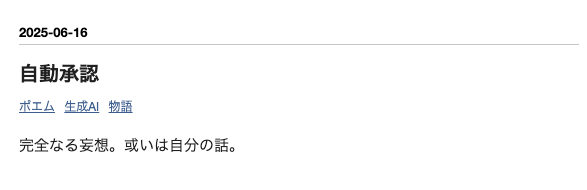

<!-- 
_backgroundColor: #0a1929
_color: white
_class: title dark
-->


<div class="title" style="text-align: left; margin-top: 100px; margin-left: 20px; padding-left: 0; max-width: 70%;">

# <span style="font-size: 0.85em;">生成AIで小説を書くために</br><span style="font-size: 0.7em;">プロンプトの制約や原則について学ぶ</span></span>

</div>

<div class="author-info" style="text-align: left; padding-left: 0; text-indent: 0;">
2025/06/29 #女オタ生成AIハッカソン 2025 夏の陣@東京
@nwiizo 30min
</div>

---

<!-- _backgroundColor: white -->


## nwiizo

<div class="info-box">
株式会社スリーシェイクで
プロのソフトウェアエンジニアをやっているものです
格闘技、読書、グラビアが趣味でよく本を紹介してます
</div>

<p style="margin-top: 30px !important;">人生を通して"<strong>運動、睡眠、読書</strong>"をちゃんとやりたい</p>

---

<!-- _backgroundColor: white -->

## about 3-shake

<div style="text-align: center; margin-top: 30px;">
  
</div>

---

## 生成AIで小説を書いたことはありますか？

<div style="text-align: center; margin-top: 50px; font-size: 1.4em;">

最初は「<span class="highlight-blue">すごい！</span>」と感動

↓

読み返すと「<span class="highlight-red">なんか違う...</span>」

</div>

<div style="margin-top: 40px; font-size: 1.1em;">

❌ キャラクターが薄っぺらい  
❌ 会話が不自然  
❌ 行動に一貫性がない  
❌ 「AIが書いた感」が抜けない

</div>

---

## 今日のゴール

<div style="text-align: center; margin-top: 40px; font-size: 1.5em;">

**生成AIを魔法のツールだと思わない**

</div>

<div style="text-align: center; margin-top: 30px; font-size: 1.2em;">

制約と原則を理解して、<br>
実際に手を動かして技芸として身につける

</div>

<div style="display: flex; gap: 60px; margin-top: 50px; align-items: center;">
<div style="flex: 1; text-align: center;">

### 📚 **理解**
制約・限界・特性  
（AIの正体を知る）

</div>
<div style="font-size: 2em;">→</div>
<div style="flex: 1; text-align: center;">

### 🎨 **実践**
原則・手法・工夫  
（技芸として体得）

</div>
</div>

---

## なぜ技芸として学ぶのか？

<div style="text-align: center; margin-top: 30px; font-size: 1.3em;">

**理論だけでは身につかない**

</div>

<div style="display: flex; gap: 20px; margin-top: 30px;">
<div style="flex: 1; text-align: center;">

### 🎹 楽器の演奏
<div class="small-text">
楽譜を読めても<br>
弾けるわけではない<br><br>
実際に触って、失敗して<br>
感覚を掴む
</div>

</div>
<div style="flex: 1; text-align: center;">

### 🍳 料理
<div class="small-text">
レシピを知っても<br>
美味しく作れない<br><br>
何度も作って<br>
加減を体で覚える
</div>

</div>
<div style="flex: 1; text-align: center;">

### 🖌️ 絵画
<div class="small-text">
技法を学んでも<br>
描けるわけではない<br><br>
手を動かして<br>
自分の表現を見つける
</div>

</div>
</div>

<div style="text-align: center; margin-top: 40px; font-size: 1.2em; color: #4AADDD;">

プロンプトエンジニアリングも同じ技芸の領域

</div>

---

## なぜ創作者には難しいのか？

<div style="display: flex; gap: 40px; margin-top: 40px;">

<div style="flex: 1;">

### 🔧 **エンジニアが作った道具**

- 論理的な命令を期待
- 構造化された入力を前提
- エラーメッセージも技術用語
- 「正確さ」を重視

</div>

<div style="flex: 1;">

### 🎨 **創作者の思考**

- 感覚的・直感的な表現
- 曖昧さや揺らぎを含む
- イメージから言葉へ
- 「味わい」を重視

</div>

</div>

<div style="text-align: center; margin-top: 50px; font-size: 1.1em; color: #4AADDD;">

このギャップを埋めるのが、技芸としてのプロンプトエンジニアリング

</div>

---

## AI小説「あるある」

<div style="font-size: 1.3em; text-align: center; margin-top: 50px;">

🛻 **物理法則の破綻**  
「壁を背にした位置から背後を攻撃される」

</div>

<div style="font-size: 1.3em; text-align: center; margin-top: 40px;">

🤯 **性格の破綻**  
「家族愛が最優先のキャラが家族を見捨てる」

</div>

<div style="text-align: center; margin-top: 50px; font-size: 1.2em;">

あなたも経験ありませんか？

</div>

---

## 「読むのがしんどい」問題

<div style="text-align: center; margin-top: 30px; font-size: 1.4em;">

あらすじは面白そうなのに...

<span class="highlight-red">なぜか読むのが疲れる</span>

</div>

<div style="display: flex; gap: 40px; margin-top: 40px;">
<div style="flex: 1;">

### 😵 情報整理の負担
<div style="font-size: 0.9em; text-align: left;">

「彼女は振り返った。  
そこには男が立っていた。  
『久しぶりだね』と彼は言った。」

→ **え？この男誰だっけ？**  
→ **二人の関係性は？**

</div>

</div>
<div style="flex: 1;">

### 🌀 感情の急変
<div style="font-size: 0.9em; text-align: left;">

「私は激怒した。  
でも彼の笑顔を見ると  
なぜか許してしまった。」

→ **怒りはどこへ？**  
→ **心理描写が雑すぎる**

</div>

</div>
</div>

---

## 物語が「死んでいる」理由

<div style="text-align: center; margin-top: 20px; font-size: 1.3em;">

優れた物語に必要なもの：<span class="highlight-red">予測と裏切りのリズム</span>

</div>

<div style="display: flex; gap: 40px; margin-top: 30px;">
<div style="flex: 1;">

### 📖 物語の生命力とは
<div style="font-size: 0.85em;">

- 読者の**期待を適度に裏切る**
- **既視感と新鮮さ**のバランス
- 論理的だが**意外性のある**転換

</div>

</div>
<div style="flex: 1;">

### 💀 AI生成物語の致命傷
<div style="font-size: 0.85em;">

- すべてが**予定調和**で進行
- 展開が**教科書的**
- **あらすじを読んでいる**感覚

</div>

</div>
</div>

<div style="text-align: center; margin-top: 30px; font-size: 1em; color: #4AADDD;">

物語は読者との駆け引き。AIだけでは駆け引きが成立しない

</div>

---

## なぜこんな問題が起きるのか？

<div style="text-align: center; margin-top: 40px; font-size: 1.3em;">

### LLMの3つの根本的制約

</div>

<div style="margin-top: 40px;">

### 1️⃣ <span class="highlight-blue">Lost in the Middle現象</span>
長い文章の**真ん中あたりの情報を忘れやすい**

### 2️⃣ <span class="highlight-blue">複数制約の同時処理困難</span>
「優しくて厳しい」など**矛盾する要求を同時に満たせない**

### 3️⃣ <span class="highlight-blue">人格構造の理解限界</span>
表面的パターンは学習できても、**内的一貫性は維持できない**

</div>

---

## LLMの正体を知ろう

<div style="text-align: center; margin-top: 50px; font-size: 1.5em;">

大規模言語モデル（LLM）は

<span class="highlight-red">次の単語を予測するモデル</span>

</div>

<div style="text-align: center; margin-top: 50px; font-size: 1.2em;">

つまり、**文書を補完するエンジン**

</div>

<div style="text-align: center; margin-top: 40px; font-size: 1.1em; color: #4AADDD;">

仕組みを理解することで、<br>
より効果的に活用できるようになります

</div>

---

## では、どうすればいいのか？

<div style="text-align: center; margin-top: 50px; font-size: 1.5em;">

AIの制約を理解して活用する

**プロンプトエンジニアリング5原則**

</div>

---

## エンジニアの道具を創作者の筆に

<div style="margin-top: 40px;">

### 🤖 **現状：エンジニア向けの設計**
<div class="small-text">

- プログラミング言語のような構造化を期待
- デバッグ的思考（エラー→修正）が前提
- 明示的な指示による制御

</div>

### ✍️ **解決策：創作者向けの翻訳**
<div class="small-text">

- 感覚的表現を構造化された指示に変換
- 試行錯誤を「実験」として楽しむ
- 制約を「創作の枠組み」として活用

</div>

</div>

---

## プロンプトエンジニアリング5原則

<div style="text-align: center; margin-top: 30px; font-size: 1.1em; color: #4AADDD;">

「プロンプトエンジニアリング」という名前は難しそうですが...

</div>

<div style="text-align: center; margin-top: 30px; font-size: 1.3em;">

**🎼 楽譜であり 🍳 レシピであり 🖌️ 技法です**

</div>


<div style="display: flex; flex-wrap: wrap; justify-content: center; gap: 30px; margin-top: 40px;">
<div style="text-align: center;">
<div style="font-size: 2em;">1️⃣</div>
<div>方向性</div>
</div>
<div style="text-align: center;">
<div style="font-size: 2em;">2️⃣</div>
<div>形式</div>
</div>
<div style="text-align: center;">
<div style="font-size: 2em;">3️⃣</div>
<div>例示</div>
</div>
<div style="text-align: center;">
<div style="font-size: 2em;">4️⃣</div>
<div>評価</div>
</div>
<div style="text-align: center;">
<div style="font-size: 2em;">5️⃣</div>
<div>分割</div>
</div>
</div>

---

## 原則1: Give Direction（方向性を示せ）

<div style="text-align: center; margin-top: 30px; font-size: 1.3em;">

**🎯 具体的で明確な指示を与える**

</div>

<div style="margin-top: 40px;">

### ❌ 曖昧な指示
<div class="small-text">

```
「面白いキャラクターを作って」
「感動的なシーンを書いて」
「いい感じの展開にして」
```

</div>

### ✅ 明確な指示
<div class="small-text">

```
「30代女性、図書館司書、人見知りだが本の話題では饒舌になる」
「母の形見の指輪を見つけた瞬間の、悲しみと温かさが混じる感情」
「主人公が自分の弱さを認めることで、真の強さに気づく展開」
```

</div>

</div>

<div style="text-align: center; margin-top: 40px; font-size: 1.1em; color: #4AADDD;">

AIは「面白い」「いい感じ」の解釈ができない

</div>

---

## 原則2: Specify Format（形式を指定せよ）

<div style="text-align: center; margin-top: 10px; font-size: 1.0em;">

**📝 出力の形式を明確に指定する**

</div>

<div style="margin-top: 10px; font-size: 0.8em;">

### ❌ 形式指定なし
<div style="font-size: 0.75em;">
「キャラクター設定を教えて」→ AIが勝手に形式を決めて、使いにくい出力に
</div>

### ✅ 形式を明確に指定
<div style="font-size: 0.7em;">

```
以下の形式でキャラクター設定を出力してください：

【基本情報】
- 名前：
- 年齢・職業：
- 一言で表すと：

【内面】
- 大切にしている価値観：
- 隠している弱さ：
- 無意識の口癖：
```

</div>

</div>

<div style="text-align: center; margin-top: 10px; font-size: 0.85em; color: #4AADDD;">
形式を指定すると、すぐに使える出力が得られる
</div>

---

## 原則3: Provide Examples（例を示せ）

<div style="text-align: center; margin-top: 15px; font-size: 1.1em;">

**💡 具体例でAIの理解を深める**

</div>

<div style="margin-top: 15px; font-size: 0.85em;">

### ❌ 例示なし
<div style="font-size: 0.8em;">

```
「キャラクターの感情を行動で表現して」
→ 「彼女は悲しかった」のような説明的な文章に
```

</div>

### ✅ 例を示して方向性を明確に
<div style="font-size: 0.75em;">

```
感情を行動で表現してください。例：
- 怒り → 手に持っていたペンを強く握りしめ、インクが滲んだ
- 不安 → 何度も同じページを読み返すが、一文字も頭に入らない
- 喜び → 図書館なのに小さく飛び跳ねて、慌てて周りを見回した

では「後悔」を行動で表現してください。
```

</div>

</div>

<div style="text-align: center; margin-top: 15px; font-size: 0.9em; color: #4AADDD;">

例があることで、AIは「どのレベルの具体性」を求められているか理解する

</div>

---

## 原則4: Evaluate Quality（品質を評価せよ）

<div style="text-align: center; margin-top: 15px; font-size: 1.1em;">

**⭐ 明確な評価基準を設定する**

</div>

<div style="margin-top: 15px; font-size: 0.85em;">

### ❌ 評価なし
<div style="font-size: 0.8em;">

```
「キャラクターを作って」
→ 作りっぱなしで、良し悪しが分からない
```

</div>

### ✅ 評価基準を組み込む
<div style="font-size: 0.75em;">

```
キャラクターを作成し、以下4項目で評価（各10点）：

1. 独自性：他にない個性があるか
2. 一貫性：矛盾がないか
3. 共感性：感情移入できるか
4. 成長性：変化の余地があるか

30点以上を目指して調整する
```

</div>

</div>

<div style="text-align: center; margin-top: 15px; font-size: 0.9em; color: #4AADDD;">

評価基準でAIも自己改善できる

</div>

---

## 原則5: Divide Labor（作業を分割せよ）

<div style="text-align: center; margin-top: 15px; font-size: 1.1em;">

**🧩 複雑なタスクは段階的に実行**

</div>

<div style="margin-top: 15px; font-size: 0.85em;">

### ❌ 一度に全部
<div style="font-size: 0.8em;">
「感動的な短編小説を書いて」→ 浅い、ありきたりな物語に
</div>

### ✅ 段階的に構築
<div style="font-size: 0.7em;">

```
Step 1: テーマと核となる感情を決める
       「喪失からの再生」「悲しみの中の希望」
Step 2: 感情を体現するキャラクターを作る
       「大切な人を失った主人公」
Step 3: 転換点となる出来事を設計
       「亡き人の未完の作品を発見」
Step 4: 各シーンを丁寧に描写
       「無機質な日常から始める」
```

</div>

</div>

<div style="text-align: center; margin-top: 15px; font-size: 0.9em; color: #4AADDD;">

段階的なアプローチで、深みのある物語が生まれる

</div>

---

## 実践：段階的キャラクター設計

<div style="text-align: center; margin-top: 50px; font-size: 1.5em;">

🧩 **Chain-of-Thought (CoT) Prompting**

「一気に」ではなく「ステップバイステップ」

</div>

<div style="text-align: center; margin-top: 40px; font-size: 1.1em;">

なぜ効果的？  
↓  
LLMは<span class="highlight-blue">線形処理</span>が得意  
複雑なタスクを<span class="highlight-blue">小さく分割</span>すると精度UP

</div>

---

## 失敗例 vs 成功例

<div style="display: flex; gap: 60px; margin-top: 40px;">
<div style="flex: 1;">

### ❌ 失敗例

```
「魅力的で一貫性のある
キャラクターを作って
小説を書いて」
```

<div style="text-align: center; margin-top: 30px; font-size: 1.2em;">
↓  
<span class="highlight-red">情報過多で混乱</span>
</div>

</div>
<div style="flex: 1;">

### ✅ 成功例

```
Step1: 価値観1つ
↓
Step2: 矛盾1つ
↓
Step3: 行動3つ
```

<div style="text-align: center; margin-top: 30px; font-size: 1.2em;">
↓  
<span class="highlight-blue">明確で一貫性あり</span>
</div>

</div>
</div>

---

## 一貫性を保つコツ

<div style="text-align: center; margin-top: 40px;">

### 🌍 **物理的一貫性**

</div>

```
◼ 移動時間は現実的に
◼ 同時に2箇所にいない
◼ 各シーンで位置を明記
```

<div style="text-align: center; margin-top: 40px;">

### 🧠 **心理的一貫性**

</div>

```
◼ 設定した価値観から逸脱しない
◼ 性格が変わるなら理由を
◼ 感情変化は段階的に
```

---

## 高度なテク：「赤ずきん原則」

<div style="text-align: center; margin-top: 50px; font-size: 1.4em;">

👧 **道から外れるな**

</div>

<div style="text-align: center; margin-top: 50px; font-size: 1.2em;">

LLMが<span class="highlight-blue">訓練された文書形式</span>を使う  
↓  
<span class="highlight-blue">安定した出力</span>が得られる

</div>

<div style="margin-top: 40px; text-align: center;">

「モデルが訓練された道から遠く離れてはいけない」

</div>

---

## 具体例：慣れ親しんだ形式を使う

<div style="display: flex; gap: 40px; margin-top: 30px;">
<div style="flex: 1;">

### 📰 ニュース記事形式

```markdown
【人物特報】
地方都市の図書館司書、
田中花子さん（28）が話題に
```

<div style="text-align: center; margin-top: 20px;">
LLMはニュース記事を  
大量に学習済み
</div>

</div>
<div style="flex: 1;">

### 🎤 インタビュー形式

```markdown
【人物インタビュー】
記者：価値観は？
田中：知識で人を助けたい
```

<div style="text-align: center; margin-top: 20px;">
対話形式で  
自然な流れを作る
</div>

</div>
</div>

---

## 創作プロが使うテクニック

<div style="display: flex; gap: 40px; margin-top: 30px;">
<div style="flex: 1;">

### 📝 荒木飛呂彦の「身上調査書」

<div style="text-align: center; margin-top: 30px;">

キャラクターを**警察の調書**のように細かく設定

</div>

<div style="margin-top: 30px; font-size: 0.9em;">

```
基本情報：名前・年齢・職業
核となる価値観：1つに限定
最大の恐れ：具体的に
行動パターン：3つ
```

</div>

</div>
<div style="flex: 1;">

### 💬 大塚英志の「30問答」

<div style="text-align: center; margin-top: 30px;">

キャラへの**インタビュー**で深みを出す

</div>

<div style="text-align: center; margin-top: 20px; font-size: 0.9em; color: #666;">

でも正直...<br>
<span class="highlight-red">30問全部自分で考えるのはしんどい</span><br>
<span class="highlight-blue">楽しく考えられる時間は意外と短い</span>

</div>

</div>
</div>

<div style="text-align: center; margin-top: 30px; font-size: 1.2em; color: #4AADDD;">

**だからこそAIとの協働が効果的**

</div>

---

## 生成AIを活用した創作活動

<div style="display: flex; align-items: center; gap: 30px; margin-top: 20px;">
<div style="flex: 1;">

<div style="text-align: center; font-size: 1.3em;">

**プロンプトの技芸で創作の壁を越える**

</div>

<div style="text-align: center; margin-top: 40px; font-size: 1.2em;">

成功のポイントは  
<span class="highlight-blue">明確な「型」と制約条件</span>

</div>

</div>
<div style="width: 400px;">

<div style="text-align: center; margin-top: 10px; font-size: 0.7em; color: #999;">
<small>AIとの対話で簡単に物語の骨組みが作れる</small>
</div>
</div>
</div>

<div style="display: flex; gap: 40px; margin-top: 40px;">
<div style="flex: 1;">

### 🎯 進んだテクニック
<div class="small-text">

**結末から逆算する**

- 映画の予告編を作るように
- ゴールを明確に設定
- 逆順で構成を組み立て

</div>

</div>
<div style="flex: 1;">

### 📝 基本の制約設定
<div class="small-text">

- **ジャンル**の明確化
- **文字数**の設定
- **時代設定**の定義
- **登場人物の特徴**

</div>

</div>
</div>

---

## 効果的な作業フローと実践

<div style="text-align: center; margin-top: 40px; font-size: 1.3em;">

**段階的アプローチ + 柔軟な調整**

</div>

<div style="display: flex; gap: 60px; margin-top: 40px;">
<div style="flex: 1;">

### 📝 3ステップ作業法

1. **全体構想**  
   AIにストーリーライン作成依頼

2. **段階的詳細化**  
   細部を少しずつ詰める

3. **柔軟な調整**  
   結末や展開を必要に応じて修正

</div>
<div style="flex: 1;">

### 🎯 成功のコツ

- **要求を小分けに**
- AIの素直な反応を活用
- 予想外の出力は軌道修正

<div class="tiny-text" style="margin-top: 20px; color: #4AADDD;">
人間の創造性 × AIの処理能力
</div>

</div>
</div>

---

## CHARACTER.md：プロジェクト設定の体系化

<div style="text-align: center; margin-top: 50px; font-size: 1.5em;">

**キャラクター設定を構造化する**

</div>

<div style="text-align: center; margin-top: 40px;">

<div style="font-size: 1.2em; margin-bottom: 30px;">
小説プロジェクト用設定管理システム
</div>

<div class="small-text">
キャラクターの一貫性を保つための<br>
体系的な設定ファイル
</div>

</div>

---

## CHARACTER.md の構造

```markdown
# CHARACTER.md

## 【主人公：田中花子の設定】
```

<div style="margin-top: 40px;">

### 🎯 不変コア（絶対に変更されない要素）
<div class="small-text">

- 核となる価値観：「知識を通じて人を助けたい」
- 最大の恐れ：「自分の無力さを実感すること」
- 根本的矛盾：「人助けしたいのに対人関係が苦手」

</div>

</div>

---

## CHARACTER.md の構造（続き）

### 🔄 準安定層（状況に応じて変化するが範囲限定）
<div class="small-text">

- 現在の感情状態：やや内向的だが、本の話題では活発
- 人間関係：同僚とは表面的、利用者には献身的

</div>

### 🎨 可変層（柔軟に調整可能）
<div class="small-text">

- 具体的な話し方：関西弁（軽め）、丁寧語ベース
- 口癖：「まあ、そんなもんかな」「ちょっと待って」

</div>

---

## バージョン管理で創作を効率化

<div style="text-align: center; margin-top: 40px; font-size: 1.3em;">

**複数のストーリー展開を同時に試せる**

</div>

<div style="margin-top: 40px;">

<div style="display: flex; gap: 40px;">
<div style="flex: 1;">

### 🌳 Gitの活用例
<div class="small-text">

- **メインルート**: 主軸の物語
- **別展開A**: ハッピーエンド版
- **別展開B**: バッドエンド版
- **実験用**: キャラ性格変更版

</div>

</div>
<div style="flex: 1;">

### 💡 メリット
<div class="small-text">

- いつでも前の版に戻れる
- 複数案を比較できる
- 共同執筆が簡単に
- アイデアを失わない

</div>

</div>
</div>

</div>

<div style="text-align: center; margin-top: 40px; font-size: 1.1em; color: #4AADDD;">

プログラマーの道具を創作に応用

</div>

---

## Git worktreeという便利な仕組み

<div style="text-align: center; margin-top: 30px; font-size: 1.2em;">

**同じ作品の複数バージョンを別フォルダで同時編集**

</div>

<div style="margin-top: 40px;">

### 📁 フォルダ構成のイメージ
<div class="tiny-text">

```
小説プロジェクト/
├── メイン版/          ← 今ここで執筆中
├── 実験版/            ← 新しいアイデアを試す
└── バックアップ版/    ← 安全な状態を保存
```

</div>

### 🎯 使い方の例
<div class="tiny-text">

1. メイン版で執筆を進めながら
2. 実験版で「もしこのキャラが違う性格だったら？」を試す
3. 良ければメイン版に取り込み、ダメなら破棄

</div>

</div>

<div style="text-align: center; margin-top: 30px; font-size: 0.9em; color: #666;">

※ エンジニアはこの方法で効率的にコードを書いています

</div>

---

## 実際に手を動かすことの重要性

<div style="text-align: center; margin-top: 40px; font-size: 1.5em;">

**AIとの対話は、新しい楽器を習うようなもの**

</div>

<div style="margin-top: 40px;">

### 🎹 技芸習得のプロセス

<div style="display: flex; gap: 40px; margin-top: 30px;">
<div style="flex: 1;">

#### 知識を得る
- 原理を理解する
- 先人の知恵を学ぶ
- パターンを知る

</div>
<div style="flex: 1;">

#### 体で覚える
- 実際に試してみる
- 自分の感覚を掴む
- 独自のスタイルを見つける

</div>
</div>

</div>

<div style="text-align: center; margin-top: 50px; font-size: 1.2em; color: #4AADDD;">

理論と実践の両輪で、あなただけの創作スタイルが生まれる

</div>

---

## 段階的品質向上ワークフロー

<div style="display: flex; gap: 40px; margin-top: 30px;">
<div style="flex: 1; border: 1px solid #ddd; padding: 20px; border-radius: 8px;">

### 📝 Phase 1: 基本設計
<div class="tiny-text">

**目標：キャラクターの核を確立**  
制約：価値観1つのみに集中

#### Step 1: コアとなる価値観
「この人物の人生で最優先事項は？」  
例：「家族の安全と幸福」

#### Step 2: 行動指針化
「この価値観はどんな行動を導く？」  
例：危険回避、情報収集、犠牲的行動

<div style="margin-top: 15px; color: #4AADDD;">
✓ 価値観が具体的か  
✓ 行動パターンが明確か
</div>

</div>

</div>
<div style="flex: 1; border: 1px solid #ddd; padding: 20px; border-radius: 8px;">

### 🎨 Phase 2: 複雑性の追加
<div class="tiny-text">

**目標：内面の矛盾を設定**  
制約：Phase1を維持しつつ対立要素追加

#### Step 1: 矛盾する欲求
「家族優先」の人の対立する欲求  
例：「個人的成長への憧れ」

#### Step 2: 葛藤の場面設定
矛盾が表面化する状況  
例：転職オファー（成長 vs 家族）

<div style="margin-top: 15px; color: #4AADDD;">
✓ 矛盾が人間らしさを生むか  
✓ 葛藤の解決が自然か
</div>

</div>

</div>
</div>

---

## よくある失敗と対処法

### 失敗例1: 制約過多による性能低下

<div style="text-align: center; margin-top: 40px;">

**問題**: 「優しくて、強くて、賢くて、面白くて、神秘的で...」

</div>

<div style="margin-top: 30px;">

**原因**: 複数制約同時処理によるLLM性能低下

**解決策**: Tree-of-Thoughts（選択肢の並行検討）

</div>

---

## Tree-of-Thoughtsによる解決

<div style="display: flex; gap: 40px; margin-top: 40px;">
<div style="flex: 1; text-align: center;">

### 案A：優しさ重視型
<div class="small-text">

共感しやすい、親しみやすい

適用：日常系、癒し系小説

</div>
</div>
<div style="flex: 1; text-align: center;">

### 案B：知性重視型
<div class="small-text">

論理的展開、問題解決能力

適用：ミステリー、SF小説

</div>
</div>
</div>

<div class="tiny-text" style="text-align: center; margin-top: 40px; color: #4AADDD;">
判断基準：物語ジャンル＋読者層で決定
</div>

---

## 失敗例2: 物理空間での論理破綻

<div style="text-align: center; margin-top: 40px;">

**問題**: 空間認識限界による物理法則違反

</div>

<div style="margin-top: 30px;">

### 推奨アプローチ
<div class="small-text">

1. アクションより心理・感情描写を重視
2. 空間配置は簡潔な表現に留める  
3. 物理法則が重要な場面は人間が最終確認

</div>

</div>

---

## 表現例の比較

<div style="margin-top: 40px;">

### ❌ 物理描写詳細
<div class="small-text">

「剣を振り上げた瞬間、敵は背後から...」

</div>

### ✅ 心理描写重視
<div class="small-text">

「緊張が頂点に達した時、予期しない声が...」

</div>

</div>

<div class="tiny-text" style="text-align: center; margin-top: 50px; color: #4AADDD;">
解決策：心理描写重視＋物理描写最小化
</div>

---

## 品質保証：継続的改善システム

<div style="text-align: center; margin-top: 50px; font-size: 1.3em;">

**各シーン生成後の必須確認**

</div>

<div style="display: flex; gap: 60px; margin-top: 40px;">
<div style="flex: 1;">

### 🎭 キャラクター一貫性
□ 行動は価値観と一致？  
□ 話し方は統一？  
□ 関係性は維持？  
□ 性格変化は自然？

</div>
<div style="flex: 1;">

### 📖 読者体験
□ 感情の流れは論理的？  
□ 物理法則は正しい？  
□ 理解しやすい？  
□ キャラは「生きてる」？

</div>
</div>

---

## 品質向上の3段階

<div style="text-align: center; margin-top: 40px; font-size: 1.3em;">

**段階的に深みを積み上げる**

</div>

<div style="display: flex; gap: 30px; margin-top: 30px;">
<div style="flex: 1; border: 1px solid #ddd; padding: 20px; border-radius: 8px;">

### 📝 第1段階: 基本一貫性
<div class="tiny-text">

**目標**: 土台を固める

✓ 単一制約（核となる価値観）の維持確認  
✓ 明らかな矛盾の修正  
✓ 基本的な話し方パターンの統一

<div style="margin-top: 10px; color: #4AADDD;">
重点：シンプルな一貫性
</div>

</div>

</div>
<div style="flex: 1; border: 1px solid #ddd; padding: 20px; border-radius: 8px;">

### 🎨 第2段階: 複雑性バランス
<div class="tiny-text">

**目標**: 深みを加える

✓ 内面の矛盾が適切か  
✓ 成長や変化は自然か  
✓ 理解可能な複雑さか

<div style="margin-top: 10px; color: #4AADDD;">
重点：人間らしさの追加
</div>

</div>

</div>
<div style="flex: 1; border: 1px solid #ddd; padding: 20px; border-radius: 8px;">

### ⭐ 第3段階: 読者体験最適化
<div class="tiny-text">

**目標**: 読みやすさを磨く

✓ 共感しやすさの確認  
✓ 予測と意外性のバランス  
✓ 感情的インパクト測定  
✓ 読む労力の軽減

<div style="margin-top: 10px; color: #4AADDD;">
重点：没入感の向上
</div>

</div>

</div>
</div>

---

## 実用ツール：自動化による効率向上

### Chain-of-Thoughtプロンプト自動生成

<div style="margin-top: 40px;">

**依頼文例**
<div class="small-text">

「キャラクター概要から、5段階の設計プロンプトを生成してください：

概要：『小さな町の図書館司書。本を愛しているが人との交流は苦手。』」

</div>

**期待される出力**
<div class="small-text">

- 段階的な設計プロセス
- 各段階の品質チェック項目
- 一貫性維持のための制約

</div>

</div>

---

## 品質チェック自動化プロンプト

<div style="margin-top: 40px;">

### 5つの評価軸（各10点満点）

<div class="small-text">

1. **キャラクター設定との整合性**
2. **物理的な論理性**
3. **心理的な一貫性**
4. **読みやすさ**（労力の少なさ）
5. **感情的インパクト**

</div>

### 各項目で確認すること
<div class="small-text">

- 点数とその理由
- 改善提案
- 具体的な修正案（必要な場合）

</div>

</div>

---

## まとめ：制約を味方にする創作アプローチ

<div style="text-align: center; margin-top: 50px; font-size: 1.5em;">

**成功のための6原則**

</div>

<div class="small-text" style="margin-top: 40px;">

1. **段階的設計**: Chain-of-Thoughtで複雑さを管理
2. **制約の明示化**: 曖昧な表現を避け、具体的定義を使用
3. **赤ずきん原則**: 訓練データに慣れ親しんだ形式の活用
4. **階層的管理**: 不変コア・準安定・可変の3層構造
5. **継続的検証**: 各段階での品質確認を怠らない
6. **現実的適用**: AIの得意領域での効果的活用に集中

</div>

---

## 制約は創造性の源泉

<div style="text-align: center; margin-top: 50px; font-size: 1.3em;">

**制約＝創造性の敵という誤解を捨てる**

</div>

<div style="margin-top: 40px;">

- **コンテキスト制限** → 本当に重要な要素への集中

- **複数制約処理困難** → 段階的アプローチの必然的採用

- **暗黙理解の限界** → 明示的設計スキルの向上

</div>

---

## 今すぐ始められる実践ステップ

<div style="display: flex; gap: 30px; margin-top: 40px;">
<div style="flex: 1; text-align: center;">

### 📅 Phase 1
**今週**

<div class="small-text">

• 1人のキャラクターで実践  
• CHARACTER.md作成  
• 一貫性チェック習慣化

</div>

</div>
<div style="flex: 1; text-align: center;">

### 📆 Phase 2
**今月**

<div class="small-text">

• 短編小説で経験蓄積  
• 品質チェックリスト  
• 描写バランス調整

</div>

</div>
<div style="flex: 1; text-align: center;">

### 🗓️ Phase 3
**3ヶ月**

<div class="small-text">

• 長編作品への挑戦  
• 自動化ツール活用  
• 読者フィードバック

</div>

</div>
</div>

---

## 技芸として身につけるために

<div style="text-align: center; margin-top: 40px; font-size: 1.3em;">

**感覚を研ぎ澄ます3つのポイント**

</div>

<div style="margin-top: 40px;">

### 1️⃣ **違和感を言語化する**
<div class="small-text">
「なんか変」を「どこがどう変か」に分解する習慣
</div>

### 2️⃣ **成功パターンを蓄積する**
<div class="small-text">
うまくいったプロンプトは必ず保存・分析
</div>

### 3️⃣ **自分なりの型を作る**
<div class="small-text">
他人の技法を参考に、自分の手に馴染む形に調整
</div>

</div>

<div style="text-align: center; margin-top: 40px; font-size: 1.1em; color: #4AADDD;">

技芸は人それぞれ。正解はない。

</div>

---

## 持続可能な創作システムの構築を目指す

<div style="text-align: center; margin-top: 30px; font-size: 0.8em;">

**AIは基本的な品質管理（防御力）を担当し、**  
**人間は独創的なアイデアと感情的インパクト（攻撃力）を創造する**

</div>

<div style="margin-top: 20px; border: 2px solid #4AADDD; padding: 20px; border-radius: 8px;">

### 🎭 生きた物語を作るために

<div class="tiny-text">

物語が退屈になる最大の原因は、**すべての展開が想定内**に収まってしまうことです。読者は無意識に次の展開を予測し、その予測が当たり続けると興味を失います。

**解決策**: AIが作る「整った骨組み」に、人間が**予測不可能な血肉**を与える。論理的な流れを保ちながら、読者の期待を心地よく裏切る要素を織り交ぜることで、物語に生命が宿ります。

</div>

</div>

<div style="margin-top: 30px; font-size: 0.7em;">

この役割分担を理解し、適切なプロンプト設計を習得することで、生成AIを「魔法のツール」としてではなく、「制約のある道具」として効果的に活用できます。技術の急速な進歩の中でも、「制約を理解し、それを創造性の源泉とする」基本アプローチは普遍的価値を持ちます。

</div>

---

<!-- 
_backgroundColor: #0a1929
_color: white
_class: title dark
-->


<!-- タイトルページ左上に大きなロゴを表示 -->
<div style="position: absolute !important; top: 5px !important; left: 5px !important; z-index: 9999 !important; margin: 0 !important; padding: 0 !important;">
  
</div>

<div style="text-align: center; margin-top: 200px;">

# ありがとう<span class="highlight-yellow">ございました</span>

### ご質問・ご相談はお気軽にお問い合わせください

@nwiizo | https://3-shake.com
</div>

---

## 参考文献

<div class="small-text">

### 書籍
-  James Phoenix, Mike Taylor (2024) 『Prompt Engineering for Generative AI』 O'Reilly Media
- John Berryman, Albert Ziegler (2024) 『The Art of Prompt Engineering』 O'Reilly Media
- 荒木飛呂彦 (2015) 『荒木飛呂彦の漫画術』集英社
- 大塚英志 (2006) 『ストーリーメーカー』アスキー・メディアワークス
- カール・イグレシアス (2001) 『「感情」から書く脚本術』フィルムアート社


</div>

