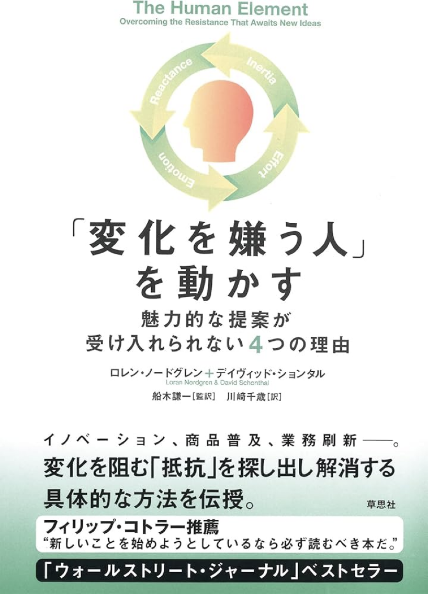
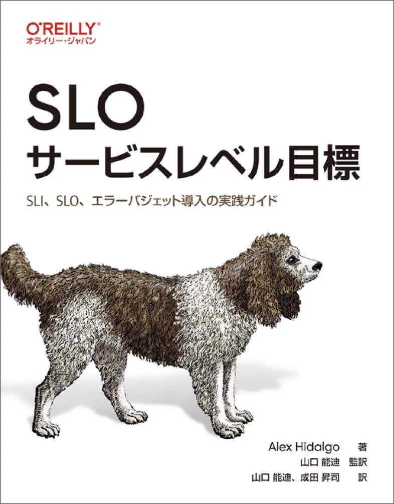
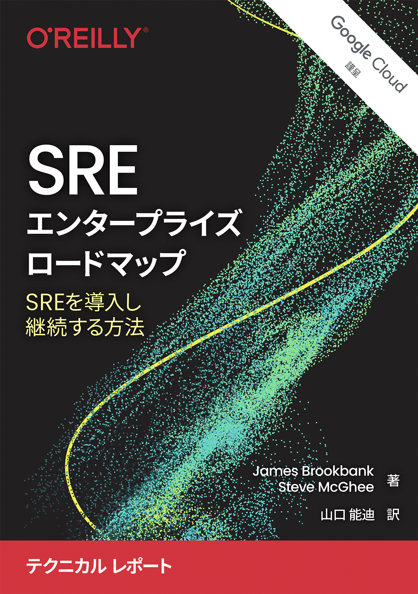

<!-- 
_backgroundColor: #0a1929
_color: white
_class: title dark
-->

# SLI/SLO・ラプソディ あるいは 組織への適用の旅

### SLI/SLOをビジネスに活かす実践的アプローチ

2025/3/21 信頼性向上の第一歩！～SLI/SLO策定までの取り組みと運用事例～ @nwiizo 15min #信頼性向上_findy

---

<!-- _backgroundColor: white -->

## nwiizo

株式会社スリーシェイクで プロのソフトウェアエンジニアをやっているものだ 
格闘技、読書、グラビアが趣味 

"<strong>信頼性は可用性ではない</strong>"を標語としています。

---

<!-- _backgroundColor: white -->

## SLI/SLO導入への心構え

参考：『HUNTER×HUNTER』25巻93ページ

導入は一人で始めるものだが、一人でやっていてもどうしようもない。技術的な側面のハードスキルも大事だが、広げるにはソフトスキルも大切。
そこで、<strong>組織への適用の旅</strong>をしていきます  

1. **既存の習慣や方法からの変更を伴う**
2. **多くのステークホルダーとの協力が不可欠**
3. **目に見える成果が出るまでに時間がかかる**

---
<!-- _backgroundColor: white -->

## SLI/SLO導入への心構え

### SLI/SLO導入は組織変革のプロジェクト

SLI/SLO導入を成功させるには、以下の3つの側面に向き合う心構えが必要です。

1. **既存の習慣や方法からの変更を伴う**
   * 変化への抵抗は自然な反応であり、適切に対処する必要がある

2. **多くのステークホルダーとの協力が不可欠**
   * 技術部門だけでなく、組織全体の理解と参画が重要

3. **目に見える成果が出るまでに時間がかかる**
    * 短期的な成果よりも長期的な価値を重視する姿勢が求められる

---

<!-- _backgroundColor: white -->

## 1. 既存の習慣や方法からの変更を伴う

---
<!-- _backgroundColor: white -->

## 変化に対する抵抗

どれだけ優れた技術も概念も導入時には抵抗が生じます。それらを認識しなけらばなりません。

1. **情性による抵抗（惰性/現状維持バイアス）**
2. **労力による抵抗（実行コスト）**
3. **感情による抵抗（否定的感情）**
4. **心理的反発（変化への抵抗）**

変化への抵抗は克服すべき「障害」ではなく、<strong>理解し対話すべき自然な反応</strong>です。各抵抗パターンに適した対応を行いましょう。

参考：「変化を嫌う人を動かす」 https://www.soshisha.com/book_wadai/books/2624.html

---

<!-- _backgroundColor: white -->

北風と太陽の寓話は、SREやSLI/SLOの導入に関する重要な教訓を示しています。既に多くの成功事例と明確なメリットがあるSREプラクティスが、なぜ多くの組織で進まないのでしょうか？ 
北風（強制的アプローチ）のように<strong>「これは業界のベストプラクティスだから導入すべき」</strong>と押し付けるほど、組織は抵抗し、コートを強く握りしめます。一方、太陽（説得と共感のアプローチ）のように、<strong>具体的な痛点からはじめ、チームの状況に寄り添いながら徐々に温めていく</strong>と、組織は自ら変化を受け入れるようになります。 
SLI/SLOの価値が明らかでも、<strong>導入方法と導入プロセス</strong>が成功の鍵を握るのです。

---

<!-- _backgroundColor: white -->

## 情性による抵抗 （惰性/現状維持バイアス）

- これは「自分が馴染みのあることにとどまろうとする欲求」として表れます
- 「今のやり方で問題ないのに、なぜ変える必要があるのか」という考えにつながります
- 既存のプロセスや方法への愛着が、新しいSREプラクティスの導入を妨げる要因となります

---

## 労力による抵抗（実行コスト）

- 変化を実行するために必要な努力やコストへの懸念です
- 新しいツールの学習、プロセスの変更、追加の作業などへの抵抗感として現れます
- 特に短期的なコストと労力が目に見えやすい一方で、長期的なメリットが見えにくいことが課題となります

---

## 感情による抵抗（否定的感情）

- 提示された変化に対する感情的な拒否反応です
- 自分の専門性や経験が否定されるのではないかという不安
- 変化によって自分の立場や影響力が失われることへの懸念

---

## 心理的反発（変化への抵抗）

- 変化を強制されることに対する本能的な反発です
- 自律性が脅かされることへの抵抗
- 「押し付けられる」ことへの反発心が生まれます

---

## 変化に対する抵抗の克服

- 変化に対する抵抗を克服するためのポイント
  - 良い部分を叫び続けてもどうしようもない
  - 様々な人にとって抵抗とはなにかを理解する
  - 段階的なアプローチが変化への抵抗を軽減します

**まずどういうところから取り組むべきか**を明確にし、その後に**具体的な施策として提案していく**ことが重要です。段階的なアプローチが変化への抵抗を軽減します。

---

<!-- _backgroundColor: white -->

## 2. 多くのステークホルダーとの協力が不可欠

---

<!-- _backgroundColor: white -->

## 部門間コラボレーションの構築

### 各部門の役割と貢献

* **エンジニアリング**：技術的実装と運用
* **プロダクト**：ユーザー体験とSLO目標値の提案
* **マーケティング**：顧客期待値とブランドポジショニング
* **財務**：コスト最適化と投資対効果分析
* **経営層**：戦略的方向性と資源配分の意思決定 

それぞれの部門が、自分の専門性を活かしながら、共通の目標に向かって協働する体制を構築します。今回は、エンジニアリング、プロダクト、経営層の3つの部門について、それぞれの抵抗について考えていきます

---
<!-- _backgroundColor: white -->
## 組織全体でのSRE実践

* **よくある誤解**
  * 「**SREは専門チームだけの仕事**」「**専門チームは不要**」などの極論
  * 「**信頼性は可用性である**」

* **バランスの取れたアプローチ**
  * **全員参加の文化**と**専門性**の両立
  * 組織の成熟度に合わせた発展的な導入
  * **信頼性を制御**するのがSREの役割

SREは技術だけでなく<strong>組織文化の変革</strong>です。「できていることと次にできること」に注目し、持続可能な文化を築きましょう。

---
<!-- _backgroundColor: white --> 
## 対話を重視したSRE

横展開には技術よりも、関係者間の<strong>共通理解と価値観の共有</strong>が重要です。

* **「信頼性は会話です」という金言**
   * **暗黙知**や**前提知識**を**言語化**していくことが**信頼性向上の出発点**
   * 技術も大切だが横展開していくには**コミュニケーションが成功の鍵**

* **共通の価値観を育てる**
   * 「作ったものは自分で運用する」責任などの組織に適応したルール
   * **失敗から学べる心理的安全性**

---
<!-- _backgroundColor: white -->
## 変化への抵抗を理解する

どんな優れた取り組みも、導入時には抵抗が生まれます。

* **主な抵抗パターン**
  * 惰性：「**今のやり方で問題ない**」
  * 労力：「**新しい方法を学ぶコストが高い**」
  * 感情：「**自分の立場が脅かされる**」
  * 心理：「**変化に対する反発**」

変化への抵抗は排除すべき「障害」ではなく、<strong>理解し対話すべき自然な反応</strong>です。

---
<!-- _backgroundColor: white -->
## 抵抗への対応：北風と太陽

SLI/SLOの価値が明らかでも、<strong>導入方法と導入プロセス</strong>が成功の鍵を握ります。

* **北風アプローチ（避けるべき）**
  * 「**業界のベストプラクティスだから**」と押し付ける
  * トップダウンで強制する

* **太陽アプローチ（推奨）**
  * **具体的な痛点から始める**
  * チームの状況に寄り添う
  * 徐々に温めて自発的な変化を促す

---
<!-- _backgroundColor: white -->
## SRE実践の主な課題

導入には技術が大切だが継続には<strong>組織文化</strong>がSRE成功の鍵です。

* **価値観のギャップ**
  * HRT（謙虚さ・尊敬・信頼）の浸透度
  * 「**失敗は学びの機会**」という文化の有無

* **信頼性の認識差**
  * 「動いていればOK」vs「**ユーザー体験の質**」
  * 短期的機能追加と長期的信頼性のバランス

---
<!-- _backgroundColor: white -->
## 各部門の抵抗：エンジニアリング

エンジニアの懸念に寄り添い、<strong>技術的価値と自律性</strong>を重視した対話が重要です。

* **エンジニアリング部門の懸念**
  * 「**既存の監視体制で十分**」
  * 「数値評価で**裁量が狭まる**」
  * 「**自律的判断より数値が優先**される」

* **効果的な対応**
  * 現場の痛点からの改善提案
  * 技術的自律性の尊重
  * **判断材料として**の指標という位置づけ

---
<!-- _backgroundColor: white -->
## 各部門の抵抗：プロダクト/ビジネス

プロダクト部門の言語で対話し、<strong>顧客価値とSREの関連</strong>を明確にします。

* **プロダクト部門の懸念**
  * 「**機能開発が遅くなる**」
  * 「技術的制約が増える」
  * 「**顧客視点より数値が優先**される」

* **効果的な対応**
  * 信頼性と**顧客満足度の関連**を示す
  * 安定性が**イノベーションを支える**例の共有
  * プロダクト判断への技術的サポート
---
<!-- _backgroundColor: white -->
## 各部門の抵抗：経営層

* **経営層の懸念**
  * 「**投資対効果(ROI)が不明確**」「**短期成果との両立が難しい**」
  * 「**技術的な詳細の判断が難しい**」「**従来のビジネス指標との整合性**」

* **効果的な対応**
  * 信頼性問題の**事業インパクトを数値化**、**コスト削減効果**と**収益保護**の具体例
  * 経営判断に役立つ**シンプルな指標**の提供、**既存KPIとの関連付け**

経営層には<strong>価値説明</strong>と<strong>長期的ROI</strong>の可視化が重要です。

---
<!-- _backgroundColor: white -->
## ビジネス価値の可視化

* **具体的な価値説明**
  * 技術改善の**事業貢献を数値**で説明
  * SLI/SLOと**ビジネスKPIの関連付け**
  * 「信頼性への投資」のROI

* **戦略的な判断**
  * 効果が見えない取り組みの見直し
  * **組織的価値創出**を重視

SRE活動の<strong>ビジネス価値</strong>を明確にすることで、持続的な支援と投資を得られます。

---

<!-- _backgroundColor: white -->
## SRE定着のためのアプローチ(1)

* **非難のないインシデントレビュー**
  * **原因ではなく改善点に焦点**を当てたインシデント分析
  * 全関係者による**多角的視点**でのポストモーテム

* **実施のポイント**
  * 「**誰が**」ではなく「**なぜ・どのように**」を重視
  * **システム改善**と**プロセス改善**の両面から検討

非難のないインシデントレビューは<strong>同じ失敗を繰り返さない文化</strong>と<strong>組織的学習</strong>の基盤になります。

---
<!-- _backgroundColor: white -->
## SRE定着のためのアプローチ(2)

* **SLI/SLO導入ワークショップ**
  * **顧客体験**を中心に据えた指標設計
  * 各部門の代表が参加する**共創セッション**

* **実施のポイント**
  * **理想の指標**と**現実的に測定可能**なものの両方を検討
  * **仲間を探す**。小さく始めて**段階的に拡大**する戦略

SLI/SLOワークショップは<strong>共通目標の設定</strong>と<strong>部門間の協力体制構築</strong>のきっかけになります。

---
<!-- _backgroundColor: white -->
## SRE定着のためのアプローチ(3)

* **技術負債削減の制度化**
  * 定期的な**改善時間の確保**（20%ルールなど）
  * **信頼性向上**活動の正式な評価への組み込み

* **実施のポイント**
  * **短期的な機能開発**と**長期的な信頼性**のバランス
  * 改善活動の**成果可視化**と**組織的認知**

技術負債削減の制度化は<strong>持続可能なエンジニアリング文化</strong>と<strong>長期的な顧客満足</strong>の基盤となります。

---

<!-- _backgroundColor: white -->

## SLI/SLOの基本原則

SLO サービスレベル目標 2023年 
https://www.oreilly.co.jp/books/9784814400348/

* **SREの実践には体系的知識が不可欠**
  * SREの理論と実践を深く理解するには<strong>体系的な学習</strong>が欠かせません。資料を読み漁っても歪な理解になりやすいです。本書はSLI/SLOについて<strong>最も包括的</strong>な一冊です。実践する前に体系的な理解を深めておくことをお勧めします。

---

<!-- _backgroundColor: white -->

## SLI/SLOの基本原則

### まずはSLIから始めよう

* SLAやSLOにこだわる前に、まず適切なSLIを確立
* システムの実際のデータに基づく正確な指標設計
* 理想的なSLI/SLOは現実の測定から導き出す
* 既存のSLAに合わせてSLIを歪めない

SLI/SLOの導入において最も重要なのは、<strong>適切な測定</strong>から始めることです。何を測定するかが、何を改善できるかを決定します。まずはサービスの健全性を正確に表す指標を見つけることに集中しましょう。

---

<!-- _backgroundColor: white -->

## SLIの設計原則

* **顧客視点に基づく選定**
  * 都合の良いデータポイントではなく、顧客価値を反映
  * 「システムが動作している」ではなく「顧客体験が良好」を測定

* **原因と結果の明確化**
  * メトリクスで変化を促すか、変化でメトリクスを動かすか
  * 測定そのものが目的化しないよう注意

効果的なSLIは<strong>顧客が実際に体験するサービス品質</strong>を反映します。内部的な指標ではなく、ユーザーにとって意味のある指標を選びましょう。例えば、単なるシステム可用性ではなく、ユーザーリクエストの成功率やレイテンシなどが有効です。

---

<!-- _backgroundColor: white -->

## SLOからSLAへの展開

* **SLI/SLOがSLAを裏付ける**
  * 証拠（SLI/SLO）が結論（SLA）を後押しする関係
  * 逆ではなく、データから適切なコミットメントを導出

* **SREリソースの効果的配分**
  * 99.9%以上のサービスにSREリソースを集中
  * 信頼性要件の低いサービスは必要に応じて段階的に対応

SLOとSLAの関係は重要です。<strong>SLOは内部目標</strong>であり、<strong>SLAは顧客との契約上の約束</strong>です。データに基づいてSLOを設定し、その実績をもとにSLAを設計することで、持続可能かつ現実的なサービス品質保証が可能になります。

---

<!-- _backgroundColor: white -->

## SLI/SLOの実行力

* **SLO違反時の対応が重要**
  * 違反検知後のプロセス変更や修正能力が鍵
  * 検知しても行動できなければ意味がない

* **信頼性向上の実行サイクル**
  * 計測 → 分析 → 改善 → 検証のサイクル確立
  * 優先度付けと意思決定のデータ基盤としての活用

SLI/SLOは<strong>単なる監視ダッシュボード</strong>ではありません。目標未達時に具体的なアクションを起こせる体制を整えることが重要です。「どう測定するか」と同じくらい「何をすべきか」を明確にしておきましょう。

---

<!-- _backgroundColor: white -->

## SLI/SLOの一般的なアンチパターン

### アンチパターン: SLO = SLA

* SLOとSLAを同一に設定する誤り
* **常にSLOはSLAより厳しく設定**
  * 例: SLO 99.95%、SLA 99.9%
* 内部目標と外部約束の区別が重要
* バッファがないとSLA違反リスク増大

### アンチパターン: SLI = OKR/KPI

* SLIを業績指標と混同する誤り
* **グッドハートの法則の罠**
  * 「測定が目標になると良い測定でなくなる」
* 指標の操作や数値至上主義への誘惑
* 顧客価値より数値を優先する危険性

効果的なSLI/SLO実践のためには、これらのアンチパターンを回避することが重要です。<strong>SLOとSLAの適切な分離</strong>、および<strong>測定と目標設定の健全な関係</strong>を維持しましょう。

---

<!-- _backgroundColor: white -->

## 3. 目に見える成果が出るまでに時間がかかる

---

<!-- _backgroundColor: white -->

## 短期決戦ができないのがSLOの難しいところ

SLI/SLOは短期的な施策ではなく<strong>長期的な投資</strong>です。「旅」として捉え、<strong>段階的な進化</strong>を目指しましょう。

* **導入初期の現実**
  * **一時的な作業量の増加**が発生する
  * すぐに見える成果より**基盤構築の段階**が先行する

* **長期視点の必要性**
  * 真の価値は**6-12ヶ月後**から明確に現れる
  * **段階的な成熟**を計画的に進める

---

<!-- _backgroundColor: white -->

## 長期的取り組みのための合意形成

SLI/SLOの持続的な実践には組織的な合意と期待値の調整が不可欠です。組織全体での<strong>長期的コミットメント</strong>がSRE成功の鍵です。短期的な成果への固執は<strong>継続的な改善</strong>の障害になりがちです。

* **ステークホルダーとの期待値調整**
  * **短期的コスト**と**長期的ベネフィット**の明確な説明
  * **段階的な目標**と**マイルストーン**の設定

* **継続的な取り組みを支える仕組み**
  * **定期的な進捗共有**と**小さな成功**の可視化
  * **組織的なコミットメント**と**経営層の支援**の確保

---

<!-- _backgroundColor: white -->

## SLI/SLOの長期的価値

* **運用負荷（Toil）の削減**
  * **自動化**と**プロアクティブな対応**による効率化
  * **繰り返し作業**から**価値創造活動**へのシフト

* **データに基づく意思決定**
  * **主観的議論**から**客観的評価**への移行
  * **リソース配分**と**優先順位付け**の最適化

SLI/SLO導入は<strong>技術的改善</strong>だけでなく<strong>組織文化の変革</strong>です。「完璧なSLO」よりも「継続的に改善されるSLO」を重視しましょう。

---

<!-- _backgroundColor: white -->

## SLI/SLOがもたらす組織的成果

SLI/SLOの最大の価値は<strong>信頼性文化</strong>の醸成です。この文化が定着すると、100%の可用性を目指さないことができるようになり、自然と<strong>顧客満足</strong>と<strong>エンジニア満足</strong>の両方が向上します。

* **ビジネスと技術の連携強化**
  * **顧客価値**と**技術活動**の明確な関連付け
  * **共通言語**による部門間コミュニケーションの向上

* **継続的改善の文化定着**
  * **定量的なフィードバック**に基づく改善サイクル
  * **学習組織**としての成長と競争力強化

---

<!-- _backgroundColor: white -->

## SREのアプローチのアンチパターン

SREエンタープライズロードマップ - Google - Site Reliability Engineering 
https://sre.google/resources/practices-and-processes/enterprise-roadmap-to-sre/

### 避けるべきアプローチ
* 前もって壮大な計画や設計を持つ
* 完成図を最初に描く
* 工期と予算を厳密に管理
* すべてを一度に実装しようとする
* 変更を後戻りと捉える

---

<!-- _backgroundColor: white -->

## まとめ

SREは旅であり、完璧を目指すのではなく継続的な前進が大切です。

* **今日から始められること**
  * **小さく始めて**徐々に拡大する
  * まずは**一つのサービス**から
  * **既存の課題**から出発する

* **成功のための心構え**
  * **完璧よりも継続**を重視する
  * **技術も情熱も**すべて大切
  * **信頼性は会話**から生まれる

---

<!-- 
_backgroundColor: #0a1929
_color: white
_class: title dark
-->

<!-- タイトルページ左上に大きなロゴを表示 -->

  

# ありがとうございました

### ご質問・ご相談はお気軽にお問い合わせください

@nwiizo | https://3-shake.com

