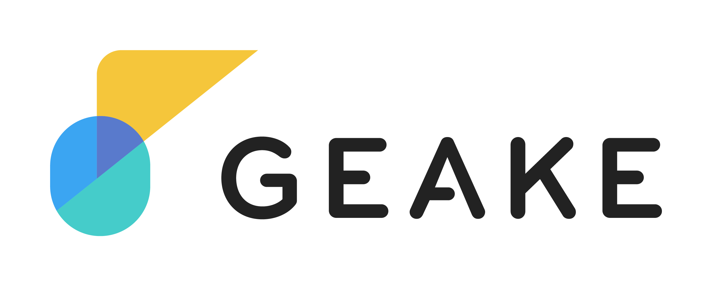

<!-- 
_backgroundColor: #0a1929
_color: white
_class: title dark
-->

# 今日からはじめる生成AI

2025/10/22 Hajime Tachibana

---

## はじめに

- 本日の勉強会の目的は **「生成AIを使ったことがない、またはなんとなくで使っている人に、 生成AIの概要と基本的な使い方を知ってもらうこと」** です。

- そのため、情報の網羅性・正確性よりも「分かりやすさ」「実践しやすさ」を優先しています。

- 技術的に不正確な内容や発言が含まれる可能性がありますので、あらかじめご了承ください。

---

## 本日のゴール

📚

理解する

生成AIとは何か、どんなことができるのかを理解する

🛠️

実践する

良いプロンプトの書き方と、上手な活用方法を学ぶ

🚀

使いこなす

明日からの業務に活かすためのイメージを持つ

 

💡「生成AIを使ってみよう！」と思ってもらえることを目指します

---

## 目次

1. 「生成AI」とは何か？
   
2. 生成AIに関する基礎知識

3. Geakeを使ってみよう

4. 生成AIを上手く使うコツ

5. まとめ

---

## 目次

1. 「生成AI」とは何か？
   
2. 生成AIに関する基礎知識

3. Geakeを使ってみよう

4. 生成AIを上手く使うコツ

5. まとめ

---

## 「AI」の全体像

「生成AI」とは何かを理解するために、まずはAI技術の全体像から解説します。

AI（人工知能）

機械学習（ML）

ディープラーニング

生成AI

---

## 「AI」の全体像

「生成AI」とは何かを理解するために、まずはAI技術の全体像から解説します。

 

✅ **AI（人工知能）**：人間の知能を必要とするタスクを実行できるシステムの総称（最も広い概念）

✅ **機械学習（ML）**：データから自動的に学習し、パターンを見つけ出す技術

✅ **ディープラーニング**：脳の神経回路を模した多層構造で複雑なパターンを抽出する技術

✅ **生成AI**：**新しいコンテンツを作成することに特化** したAIの応用分野

---

## 生成AIとは？

既存のデータを分析したり予測したりするだけでなく、新しいものを **「生み出す」** ことができるのが、 生成AIの最大の特徴です。

💡 生成AI

まったく新しいコンテンツやアイデアを「生成」することができるAIの一種

---

## 生成AIの4つの能力

生成AIには、主に **4つの能力** があります。

<strong>1. 作成（Create）</strong> 
まったく新しいコンテンツを生成する

<strong>2. 要約（Summarize）</strong> 
長い情報を簡潔にまとめる

<strong>3. 自動化（Automate）</strong> 
定型的なタスクを自動化する

<strong>4. 発見（Discover）</strong> 
必要な情報を迅速に発見する

---

## 1. 作成（Create）

文章、画像、コード、音楽など、まったく新しいコンテンツをゼロから生成します。

### 具体例

- 📝 **マーケティング**：新商品のキャッチコピーを考える
- 🎨 **デザイン**：製品デザインのコンセプト画像を生成する
- 💻 **プログラミング**：特定の機能を実現するコードを作成する
- 🎵 **音楽**：雰囲気に合ったBGMを作曲する

 

💡 <strong>あなたの「創造的パートナー」として活躍！</strong>

---

## 2. 要約（Summarize）

長いレポートや会議の議事録などを、要点を押さえた簡潔な文章にまとめます。

### 具体例

- 📄 **長文レポート**：100ページの報告書を3ページに要約
- 📰 **ニュース記事**：長いニュース記事を3行で要約
- 💬 **会議議事録**：2時間の会議内容を決定事項中心にまとめる
- 📧 **メールの山**：大量のメールから重要な情報だけを抽出

 

💡 <strong>情報過多の時代に、あなたの「時間」を取り戻す！</strong>

---

## 3. 自動化（Automate）

これまで手作業で行っていた定型的なタスクを自動化し、業務効率を向上させます。

### 具体例

- ✉️ **顧客対応**：問い合わせメールへの返信文案を自動作成
- 📊 **レポート作成**：データから定型レポートを自動生成
- 📝 **文書整理**：社内文書の分類やタグ付けを自動化
- 🔄 **データ変換**：異なる形式のデータを一括変換

 

💡 <strong>ルーティンワークから解放され、本当に大切な仕事に集中！</strong>

---

## 4. 発見（Discover）

膨大なデータの中から必要な情報を迅速に見つけ出し、適切なタイミングで提供します。

### 具体例

- 🔍 **社内ナレッジ検索**：過去のプロジェクト資料から類似事例を発見
- 👥 **専門家発見**：特定の知識を持つ社員を瞬時に特定
- 📚 **関連情報の提示**：現在の作業に関連する参考資料を提案
- 🎯 **パターン分析**：データから隠れたトレンドを発見

 

💡 <strong>組織の知識を「使える資産」に変える！</strong>

---

## さらなる特徴：マルチモーダル

最近の生成AIは**マルチモーダル**（複数のデータ形式を扱える）能力を持っています。

👤

ユーザー

⇄

🤖

生成AI

⇄

📝

テキスト

🖼️

画像

🔊

音声

💻

コード

 

複数種類のデータを同時に理解し、処理・生成できる能力を持っている
　＝ 人間が思考し、創造するプロセスにより近い形でAIと対話できるようになってきている！

---

## 第 1 章のまとめ

✅ **生成AI**：「新しいコンテンツを作る」ことに特化したAIの応用分野

✅ **生成AIの4つの能力**：作成、要約、自動化、発見

✅ **マルチモーダル**：テキストだけでなく、画像・音声・コードも扱える

 
 

💡 生成AIは、あなたの仕事を支援する「万能アシスタント」です！

---

## 目次

1. 「生成AI」とは何か？
   
2. 生成AIに関する基礎知識

3. Geakeを使ってみよう

4. 生成AIを上手く使うコツ

5. まとめ

---

## 第 2 章で学ぶこと

生成AIがどのように機能しているのか、その舞台裏にある重要な構成要素を理解します。

1. **モデル**：生成AIの「頭脳」

2. **データ**：生成AIの「賢さ」の源泉

3. **プロンプト**：生成AIとの「対話方法」

---

## 「モデル」とは？

生成AIの中核をなすのが、**「モデル」** と呼ばれる複雑なアルゴリズムの集合体です。

💡 モデル ＝ 生成AIの「頭脳」

多量のデータを学習し、新しいコンテンツを生成する能力を持つもの

特に重要な次の2つの概念について、次ページ以降で解説します。

- **基盤モデル（Foundation Model）**

- **大規模言語モデル（LLM：Large Language Model）**

---

## 基盤モデル（Foundation Model）

📚 基盤モデルとは

- 大量のデータで事前にトレーニングされた、非常に大規模なAIモデル
- 特定のタスクに特化せず、**幅広い知識と能力を持つ**汎用的な土台

### 特徴

✅ **広範な知識**：インターネット上の膨大なデータから自律的に学習  
✅ **汎用性**：様々な用途に応用可能  
✅ **自己学習**：人間が正解ラベルを付けなくても学習できる

---

## 大規模言語モデル（LLM）

💬 LLMとは

- 基盤モデルの一種
- 特に **人間の言語（テキスト）の理解と生成に特化**したモデル

### できること

✅ **文章の作成**：レポート、メール、記事など  
✅ **要約**：長文を短くまとめる  
✅ **翻訳**：多言語間の翻訳  
✅ **質問応答**：質問に対して適切な回答を生成

---

## 両者の関係性

- **基盤モデル（Foundation Model）**：特定のタスクに特化しない汎用的な土台

- **大規模言語モデル（LLM）**：基盤モデルの中でも言語能力を極めた専門家

 

💡 Gemini や ChatGPT, Claude などは、基盤モデルでもあり大規模言語モデルでもある。

---

## モデルの学習

モデルが賢くなるプロセスは **「学習」または「トレーニング」** と呼ばれます。

 

### 主な学習アプローチ

📖　教師あり学習

問題と正解のセットで学習 
例：画像認識

🔍　教師なし学習

データから自動的にパターンを発見 
基盤モデルで使用

🎮　強化学習

試行錯誤で良い行動を学習 
例：ゲームAI

---

## 学習データの重要性

⚠️ Garbage In, Garbage Out

ゴミを入れれば、ゴミしか出てこない

### 高品質なデータの条件

✅ **正確性**：データに誤りがないこと
✅ **完全性**：必要な情報が欠けていないこと
✅ **整合性**：データ間で矛盾がないこと
✅ **関連性**：課題に対して適切なデータであること

---

## 学習データの質が低いとどうなるか

質の低いデータで学習したモデルでは、重大な問題が発生する可能性があります。

❌ 不正確な回答

誤った情報や事実でない内容を生成してしまう

⚠️ バイアスの増幅

社会的な偏見や差別的な内容を増幅してしまう

 
 

💡 高品質なデータこそが、高性能で公正なAIモデルを生み出す最も重要な資源！

---

## AIとの対話方法

生成AIとやり取りするための方法が **「プロンプト」** です。

💡 プロンプト ＝ 生成AIとの「対話方法」

AIに指示を与え、望む結果を引き出すための「入力」や「命令」のこと

 

生成AIに対して **どのような指示を出すか** で、回答精度は劇的に変わります！

---

## プロンプトエンジニアリング

モデルの性能を最大限に引き出すためのプロンプト作成技術を **「プロンプトエンジニアリング」** と 呼びます。

🎯 良いプロンプトのポイント

✅ **具体的である**：何をしてほしいかを明確に指示する
✅ **形式を指定する**：箇条書き、表形式など出力形式を指定する
✅ **役割を与える**：生成AIに演じてほしい役割を与える
✅ **例を示す**：期待する出力の例を提示する

💡 プロンプトエンジニアリングは、生成AIを使いこなすための重要スキル！

---

## 良いプロンプトの例 1：レポート作成

❌ 悪い例

AI活用について書いて

✅ 良い例

あなたは経験豊富なITコンサルタントです。 
# 依頼内容 
中小企業向けに、生成AIの業務活用について説明するレポートを作成してください。 
# 形式 
• 見出しは「1. 〇〇」「2. 〇〇」の形式 
• 各セクションは200文字程度　・・・ 
# 含めてほしい内容 
1. 生成AIとは何か 
2. 中小企業にとってのメリット　・・・ 

---

## 良いプロンプトの例 2：データ分析

❌ 悪い例

この数字を分析して

✅ 良い例

あなたはデータアナリストです。 
# データ 
• 1月売上：500万円、2月：450万円、3月：600万円 
• 1月訪問者：1000人、2月：900人、3月：1200人 
# 分析してほしいこと 
1. 月ごとの売上トレンド 
2. 1人あたりの購入単価の変化　・・・ 
# 出力形式 
• 箇条書きで簡潔に　・・・ 

---

## プロンプト作成のコツ

📋 構造化する

# 役割, # 依頼内容, # 形式 など、指示内容をセクションに分ける

🎯 具体的に示す

「短く」のような抽象的な表現ではなく、「200文字程度」のように具体的に指示する

👤 役割を設定する

「あなたは〇〇です」のように、生成AIに演じてほしい役割を設定する

✨ 期待値を明示する

何を、どのように、どう出力してほしいかなど、期待する回答内容を明確に指示する

💡 最初は上手くいかなくても大丈夫。試しながら改善していきましょう！

---

## 第 2 章のまとめ

✅ **モデル**：基盤モデルと大規模言語モデルは生成AIの「頭脳」

✅ **データ**：データの質が生成AIの回答精度を決める

✅ **プロンプト**：生成AIの能力をフル活用できるかどうかはプロンプト次第

 
 

💡 この3つが理解できれば生成AIは怖くない！

---

## 目次

1. 「生成AI」とは何か？
   
2. 生成AIに関する基礎知識

3. Geakeを使ってみよう

4. 生成AIを上手く使うコツ

5. まとめ

---

## 第 3 章で学ぶこと

実際にGeakeを使いながら、生成AIの基本動作を確認します。

💡 ぜひお手元のGeakeでもやってみてください！

---

## 実践 1：シンプルな質問をする

まずはシンプルな質問から始めます。（モデルは gemini-2.5-flash を使います）

🎯 実践：シンプルな質問をしてみる

生成AIとは何ですか？初心者にもわかるように簡単に説明してください。

---

## 実践 2：プロンプトエンジニアリングを実践する

第2章で学んだ「プロンプトエンジニアリング」の知識にもとづいてプロンプトを改善してみます。

🎯 実践：プロンプトエンジニアリングを実践してみる

# 役割 
あなたは生成AIの専門家です。難しい生成AIの概念を、初心者にも分かりやすく伝えることに長けています。 
 
# 背景 
あなたはこれから生成AIに興味を持つ中学生に対して、生成AIについての授業を行う予定です。 
 
# 依頼 
上記の役割と背景を踏まえて、「生成AIとは何か？」を、中学生に分かりやすく説明してください。

---

## 実践 3：モデルを変える

実践2とまったく同じプロンプトを、別のモデル（gemini-2.5-pro）に投げてみます。

🎯 実践：モデルを変えてみる

# 役割 
あなたは生成AIの専門家です。難しい生成AIの概念を、初心者にも分かりやすく伝えることに長けています。 
 
# 背景 
あなたはこれから生成AIに興味を持つ中学生に対して、生成AIについての授業を行う予定です。 
 
# 依頼 
上記の役割と背景を踏まえて、「生成AIとは何か？」を、中学生に分かりやすく説明してください。

---

## うまくいかないときの対処法

Geakeの回答が期待通りにならない時は、以下を試してみましょう。

➕ 追加で指示を出す

・「もっと詳しく説明してください」 
・「専門用語を減らしてください」 

ℹ️ 指示を詳細化する

・より具体的な情報を追加する 
・より詳細な役割を与える 

✏️ プロンプトを改善する

「AIでプロンプトを改善」を試してみる

🆕 新しいチャットで試す

新しいスレッドに移動して、別の視点から質問してみる

💡 試行錯誤は学習のプロセス。恐れずに何度でもトライしましょう！

---

## 目次

1. 「生成AI」とは何か？
   
2. 生成AIに関する基礎知識

3. Geakeを使ってみよう

4. 生成AIを上手く使うコツ

5. まとめ

---

## 第 4 章で学ぶこと

生成AIを上手に使うための実践的なヒントと、知っておくべき注意点を理解します。

1. **プロンプトのレベルアップ**：より良い回答を得るための工夫を知る

2. **生成AIの限界**：生成AIと上手に付き合うために、その限界を知る

3. **安全な使い方**：責任を持って生成AIを利用するために守るべきことを知る

---

## プロンプトをレベルアップさせる 3 つのコツ

第3章でプロンプトエンジニアリングの基礎を学びました。
この章では、回答精度をさらに高めるためのコツを3つ紹介します。

💡

1. 例を示す

期待する出力の形式や内容の例を1〜2個示すと、AIが回答形式を正確に理解します

🎭

2. 専門的な役割を与える

「あなたは〇〇の専門家です」のように伝えることで、専門的で適切な回答が得られやすくなります

🔄

3. 対話を重ねる

最初の回答が不十分なら「もっと詳しく」「具体例を追加して」などと追加で指示を出します

---

## コツ 1：例を示す

❌ 例なし

顧客レビューの感情を分析してください。 
 
「サポートが親切でした」

どのように分析すればいいのかAIにはわからず、 回答形式がバラバラに

✅ 例あり

例を参考に顧客レビューの感情を分析してください。 
例）「商品が早く届いた」→ポジティブ 
例）「対応が遅い」→ネガティブ 
 
「サポートが親切でした」

どのように分析すればいいかをAIに示すことで、 一貫した回答形式に

💡 回答例を1〜2個示してあげるだけでも、回答の質が大きく向上します

---

## コツ 2：専門的な役割を与える

❌ 役割指定なし

データセキュリティの重要性を説明してください。

一般的で抽象的な回答になりがち

✅ 役割指定あり

あなたは情報セキュリティの専門家です。 
中小企業の経営者向けに、データセキュリティの重要性を3つのポイントで説明してください。

生成AIに専門家として振る舞わせることで、 正確性の高い回答に

💡「専門家」「プロフェッショナル」「経験豊富な〇〇」などを指定してみましょう

---

## コツ 3：対話を重ねる

1️⃣ 最初の指示

チームミーティングを効果的に実施するにはどうしたらいいですか？

2️⃣ 追加指示

リモートワークでも実践できる方法に絞って、再度提案してください。

3️⃣ 追加指示

「全員からの意見を促す」について、具体的にどのように発言を促せばよいですか？

💡 対話を重ねることで、求める回答に近づいていきます

---

## 生成AIの限界

万能そうに見える生成AIですが、もちろんできないこともあります。
ここでは、生成AIが抱える2つの限界について説明します。

1. **ハルシネーション**

2. **ナレッジカットオフ**

---

## 生成AIの限界 1：ハルシネーション

事実に基づかない情報やもっともらしい嘘を、生成AIがあたかも真実であるかのように生成してしまう
現象のことを **「ハルシネーション（幻覚）」** と言います。

💡 対策 
　・重要な情報は必ず事実確認をする 
　・複数の情報源と照合して妥当性を検証する 
　・グラウンディング（生成AIの出力を検証可能な情報源に紐付ける技術）で情報源を明示させる

 

### なぜ起こる？

AIは統計的なパターンに基づいて応答しているだけで、**真実を理解しているわけではない**ため

---

## 生成AIの限界 2：ナレッジカットオフ

特定時点以降の知識を生成AIが持っていない現象のことを **「ナレッジカットオフ」** と言います。

💡 対策 
　・いつ時点の情報に基づく回答かを意識しておく 
　・通常の検索と組み合わせて利用する 
　・DeepResearch機能を利用する

 

### なぜ起こる？

AIモデルは特定時点までのデータを使って学習されており、**それ以降の知識は学習されていない**ため

---

## 責任あるAI利用

生成AIの限界をユーザー一人ひとりが正しく理解しておくとともに、生成された結果を鵜呑みにせず、
常に批判的な視点を持って利用することが重要です。

 

### 利用者としての責任

✅ **批判的な視点**：AIの出力を鵜呑みにしない
✅ **検証の習慣**：重要な情報は必ず確認する
✅ **限界の理解**：何ができて何ができないかを知る
✅ **倫理的配慮**：バイアスや差別に注意を払う

---

## 安全に使うための心得

生成AIを安全に使うために、次のルールは必ず守ってください。

🔒

機密情報は入力しない

顧客情報、社内機密、個人情報などは絶対にAIに入力しないでください　　* GeakeはOK

✅

生成物の内容を確認する

生成AIの出力をそのまま使わず、必ず人間が内容を確認・修正してから使用してください

📋

社内ルールを守る

「生成AI利活用ガイドライン」の内容を理解し、遵守してください

---

## 第 4 章のまとめ

✅ **レベルアップする**：プロンプトエンジニアリングにはコツがある

✅ **限界を知る**：生成AIにはできないこともある

✅ **安全に使う**：ルールを守り、利用者の責任を果たしましょう

 
 

💡 生成AIの限界と利用のルールを理解した上で、安全＆便利に利用しましょう！

---

## 目次

1. 「生成AI」とは何か？
   
2. 生成AIに関する基礎知識

3. Geakeを使ってみよう

4. 生成AIを上手く使うコツ

5. まとめ

---

## 全体の振り返り

1️⃣ 第 1 章

・「AI」の全体像：生成AIはAIの応用分野 
・生成AIの4つの能力：作成、要約、自動化、発見 
・マルチモーダルの概念：画像・音声・コードも扱える

2️⃣ 第 2 章

・モデル：基盤モデル（土台）と大規模言語モデル（言語特化） 
・データ：データの質が生成AIの回答精度を決める 
・プロンプト：生成AIとやり取りするための方法

3️⃣ 第 3 章

・プロンプトエンジニアリングの例 
・モデル変更の例 
・うまくいかないときの対処法

4️⃣ 第 4 章

・プロンプトエンジニアリングのコツ：例、専門性、対話 
・生成AIの限界：ハルシネーション、ナレッジカットオフ 
・安全に使うための心得：機密保持、生成物確認、ルール遵守

💡 兎にも角にも「まずは使ってみる」から始めましょう！

---

<!-- _backgroundColor: #0a1929 -->
<!-- _color: white -->

ありがとうございました！

