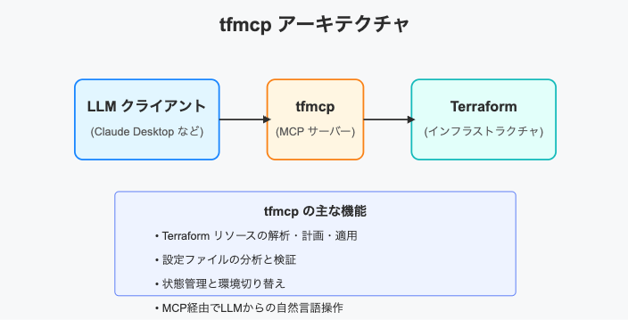

<!-- 
_backgroundColor: #0a1929
_color: white
_class: title dark
-->


<div class="title" style="text-align: left; margin-top: 100px; margin-left: 20px; padding-left: 0; max-width: 70%;">

# <span style="font-size: 1.0em;">ここはMCPの夜明けまえ</span>

</div>

<div class="author-info" style="text-align: left; padding-left: 0; text-indent: 0;">
2025/4/23 AI駆動開発実践の手引き -これが僕/私のAI（アイ）棒-</br>@nwiizo 30min #hack_at_delta
</div>

---

<!-- _backgroundColor: white -->


## nwiizo

<div class="info-box">
株式会社スリーシェイクで</br>プロのソフトウェアエンジニアをやっているものです</br>
格闘技、読書、グラビアが趣味</br>
</div>

<p style="margin-top: 30px !important;">人生を通して"<strong>運動、睡眠、読書</strong>"をちゃんとやりたい</p>

---

## about 3-shake

<div style="text-align: center; margin-top: 30px;">
  
</div>

---

## We are Hiring!!

<div style="text-align: center; margin-top: 30px;">

3-shakeは一緒にSRE界隈を盛り上げてくれる**仲間を大募集中**です！
Mobility、FinTech、通信など大規模SREを存分に経験できます
（最近社内はGenAI / GPU / Kubernetesが盛り上がってます）
是非、カジュアル面談しましょう！！！！

  
</div>

---

## アジェンダ <!-- 30分を目安に構成を最適化 -->

1. **MCPとは何か** - 基本概念と位置づけ (5分)

2. **技術アーキテクチャ** - 構成要素と通信方式 (5分)

3. **最新仕様の革新点** - Streamable HTTP、OAuth他 (8分)

4. **実装パターン** - クラウド環境・社内システム (8分)

5. **セキュリティ考慮事項** - 脆弱性と対策 (2分)

6. **まとめ：実践への第一歩** (2分)

---

## AIとシステムをつなぐ「USB規格」

<div style="display: flex; gap: 5px;">
<div style="width: 45%;">

<div style="font-size: 0.5em; text-align: left; margin-top: 5px;">
出典: https://notion.notion.site/Notion-MCP-1d0efdeead058054a339ffe6b38649e1
</div>
</div>

<div style="width: 60%;">
<ol style="font-size: 0.7em;">

### Model Context Protocol (MCP)とは

*   **定義**: LLMが外部ツール・データソースと通信する**標準規格**

* **特徴**: JSON-RPC 2.0をベースとした軽量プロトコル

* **アナロジー**: AIアプリのための「USB規格」- どのAIも同じインターフェースで外部接続

</ol>
</div>
</div>

---

## AIとシステムをつなぐ「USB規格」

<div style="display: flex; gap: 5px;">
<div style="width: 45%;">

<div style="font-size: 0.5em; text-align: left; margin-top: 5px;">
出典: https://notion.notion.site/Notion-MCP-1d0efdeead058054a339ffe6b38649e1
</div>
</div>

<div style="width: 60%;">
<ol style="font-size: 0.7em;">

### 解決する技術的課題

* **統合コスト削減**: 各LLM×各ツールの個別対応からの脱却

* **知識の拡張**: 静的なLLM知識を動的データソースで補完

* **汎用性確保**: 言語・プラットフォーム間の相互運用性実現
</ol>
</div>
</div>

---

## MCPの位置づけとコミュニティ


### オープン標準としての発展

- **Anthropic発案**: 2023年に設計・公開

- **公式ドキュメントが優秀**: GitHub上で仕様管理、コミュニティ主導


### エコシステムの急成長

- **クライアント**: Claude Desktop, VS Code, Cursor,nvim等

- **サーバー**: 200+（公式+コミュニティ）[ROADMAP](https://modelcontextprotocol.io/development/roadmap)にリポジトリの登場が明記

- **優位性**: 特定ベンダーに依存しないエコシステムが拡大中

---

## MCPアーキテクチャ概要

<div style="display: flex; gap: 5px;">
<div style="width: 45%;">

<div style="font-size: 0.5em; text-align: left; margin-top: 5px;">
出典: https://syu-m-5151.hatenablog.com/entry/2025/03/09/020057

**標準化の価値**: 単一インターフェースでAIとデータ・ツールの連携を実現
</div>

</div>

<div style="width: 60%;">
<ol style="font-size: 0.8em;">


### 3つの主要機能カテゴリ

- **Resources（リソース）**
   - 読み取り専用のデータソース
   - 例：ドキュメント、構成情報、リファレンス

- **Prompts（プロンプト）** ※任意実装
   - ツール利用に関するガイダンス文書
   - LLMへの最適な指示テンプレート

- **Tools（ツール）**
   - LLMが呼び出す「関数」
   - 例：情報検索、API呼出、データベース操作

---

## MCPアーキテクチャ - [Resources](https://modelcontextprotocol.io/docs/concepts/resources)

<div style="display: flex; gap: 5px;">
<div style="width: 45%;">

<div style="font-size: 0.5em; text-align: left; margin-top: 5px;">
出典: https://syu-m-5151.hatenablog.com/entry/2025/03/09/020057

**Resources**: LLMにコンテキストを提供する
</div>

</div>

<div style="width: 60%;">
<ol style="font-size: 0.65em;">

### 基本と構造
- **リソースはLLMの外部データアクセスを実現** - テキスト形式とバイナリ形式のデータをURIで一意に識別し、AIの会話コンテキストとして活用。**アプリケーション制御型**設計により、クライアントがリソースの使用時期と方法を決定。人間が読みやすい名前や説明でAIの理解を促進

### 実装と運用
- クライアントは**resources/list**でリソース発見、**resources/read**で内容取得、**購読機能**で更新通知を受信。動的リソースには**URIテンプレート**を提供可能。適切なセキュリティ対策と明確なリソース設計がシステムの信頼性を確保

</ol>
</div>
</div>

---

## MCPアーキテクチャ - [Prompts](https://modelcontextprotocol.io/docs/concepts/prompts)

<div style="display: flex; gap: 5px;">
<div style="width: 45%;">

<div style="font-size: 0.5em; text-align: left; margin-top: 5px;">
出典: https://syu-m-5151.hatenablog.com/entry/2025/03/09/020057

**Prompts**: LLM対話の再利用可能テンプレート
</div>

</div>
<div style="width: 60%;">
<ol style="font-size: 0.65em;">


### 基本構造と目的
- **プロンプトは標準化された対話パターンを定義** - **ユーザー制御型**の再利用可能なテンプレートとして設計され、一貫したLLM体験を提供。引数を受け取り、リソースから文脈を含め、複数の対話をチェーン化できる。各プロンプトは**名前・説明・引数**の構造で定義され、クライアントは**prompts/list**エンドポイントで発見し、**prompts/get**で使用。引数には名前、説明、必須フラグが含まれる

### 応用と実装
- **動的なコンテンツと複数ステップのワークフロー** - プロンプトはリソースからの情報を埋め込み、複数のメッセージ交換を事前定義して複雑な対話フローを作成可能。クライアントUIでは**スラッシュコマンド**や**クイックアクション**として表示され、ユーザーに直感的な操作を提供。テンプレートの更新は**notifications/prompts/list_changed**で通知される

---

## MCPアーキテクチャ - [Tools](https://modelcontextprotocol.io/docs/concepts/tools)

<div style="display: flex; gap: 5px;">
<div style="width: 45%;">

<div style="font-size: 0.5em; text-align: left; margin-top: 5px;">
出典: https://syu-m-5151.hatenablog.com/entry/2025/03/09/020057

**tools**: AIに実行力を与える
</div>

</div>

<div style="width: 60%;">
<ol style="font-size: 0.65em;">


### Toolsの基本設計と役割
- **Toolsは LLM に実世界での行動力を与える** - サーバーが公開する実行可能な機能を介して計算処理やAPI操作を実行できる。クライアントは **tools/list** で発見し、**tools/call** で実行する。各ツールは **名前、説明、入力スキーマ、アノテーション** という明確な構造で定義され、**動作の性質**（読取専用・破壊的操作・べき等性など）をAIとユーザーに伝える

### 実装パターンと応用
- サーバー側での **リクエストハンドラー実装** がToolsを活性化し、AIの指示を具体的なアクションに変換。エラー処理や進捗報告も適切に設計する。**計算ツールからAPI統合、データ処理まで無限の可能性** - システム操作、外部APIラッパー、データ変換などさまざまなパターンでAIの能力を拡張し、実世界での影響力を高める

---

## MCPアーキテクチャ - [Sampling](https://modelcontextprotocol.io/docs/concepts/sampling)

<div style="display: flex; gap: 5px;">
<div style="width: 45%;">

<div style="font-size: 0.5em; text-align: left; margin-top: 5px;">

**Sampling**: サーバーがLLMに補完を要求できるようにする。めちゃくちゃに有用そうではあるが、Clientでは実装されていないものもある。
</div>

</div>

<div style="width: 60%;">
<ol style="font-size: 0.6em;">

### 基本概念と仕組み
- **サンプリングはサーバーがLLMに必要なものをリクエストできる機能** - サーバーが**sampling/createMessage**を要求し、クライアントがレビュー、LLMから結果を取得、そして結果を返す。ユーザーが介在する設計により、セキュリティとプライバシーを確保。標準化された**メッセージフォーマット**を使用し、会話履歴、モデル設定、システムプロンプト、コンテキスト含有範囲を指定。**modelPreferences**で希望するモデル名や優先事項（コスト、速度、性能）を伝達できる

### パラメータと制御
- **テンプレート、サンプリングパラメータ、人間による監視** - 様々な設定（temperature、maxTokens、stopSequences）で出力を調整し、**ヒューマンインザループ**設計によりユーザーがプロンプトと完了を確認・修正可能。サンプリングは**エージェント的ワークフロー**を可能にし、データ分析、意思決定、構造化データ生成、複数ステップのタスク処理などの高度な機能を実現。適切なセキュリティ対策とエラー処理が重要

---

## MCPアーキテクチャ - [Roots](https://modelcontextprotocol.io/docs/concepts/roots)

<div style="display: flex; gap: 5px;">
<div style="width: 45%;">

<div style="font-size: 0.5em; text-align: left; margin-top: 5px;">

**roots**: Model Context Protocol (MCP)のルーツ：操作境界の定義
</div>

</div>

<div style="width: 60%;">
<ol style="font-size: 0.6em;">

### 基本概念と役割
- **Rootsはサーバーの操作範囲を定義する** - クライアントがサーバーに対して関連リソースとその場所を伝える手段。ファイルシステムパス（`file:///home/user/projects/myapp`）やHTTP URL（`https://api.example.com/v1`）などの有効なURIを使用
- クライアントは接続時に**roots機能**を宣言し、サーバーに**推奨ルーツのリスト**を提供。これにより**ワークスペース内のリソースが明確化**され、異なるリソースを同時に扱う際の組織化が容易に

### 実装と応用
- サーバーはrootsを尊重してリソースの**範囲特定とアクセス**に活用。厳密な制限ではなく情報提供的な役割だが、境界内での操作を優先すべき
- **プロジェクトディレクトリ、リポジトリ、APIエンドポイント**などを定義する一般的なユースケースで活用。効果的な運用には必要なリソースのみ提案し、明確な名前付けと適切な変更管理が重要


---

## [MCPの通信フロー](https://modelcontextprotocol.io/docs/concepts/architecture)

<div style="display: flex; gap: 5px;">
<div style="width: 58%;">

<div style="font-size: 0.5em; text-align: left; margin-top: 5px;">
出典: https://syu-m-5151.hatenablog.com/entry/2025/03/09/020057

**利点**: シンプルさと互換性を両立した標準的な通信プロトコル
</div>


</div>

<div style="width: 70%;">
<ol style="font-size: 0.7em;">

- **初期化フェーズ**
   - クライアントが`initialize`でケイパビリティ宣言
   - サーバーが利用可能な機能を応答

- **リソース探索**
   - `resources/list`で利用可能なリソース一覧取得
   - `resources/get`で特定リソースのデータ取得

- **ツール呼び出し**
   - `tools/list`でサーバー上のツール一覧取得
   - `tools/call`で特定ツールの実行要求

</ol>
</div>
</div>

---

## [Transports](https://modelcontextprotocol.io/docs/concepts/transports)

<div style="display: flex; gap: 5px;">
<div style="width: 58%;">

<div style="font-size: 0.5em; text-align: left; margin-top: 5px;">
現状は標準出力(stdio)で実装しておけば良さそう

</div>


</div>

<div style="width: 70%;">
<ol style="font-size: 0.62em;">

### STDIO Transport (Local Connection)

- 標準入出力を使用したプロセス間通信,ローカルツール連携に最適
- LLMアプリが子プロセスとしてMCPサーバー起動

### HTTP Transport (Remote Connection)

- **旧**: HTTP + SSE (Server-Sent Events)によるそこそこ複雑な実装

- **新**: Streamable HTTP Transport (2025-03-26)
  - 単一エンドポイント (`/message`) 
  - 柔軟性向上としてSSEが任意

---
## JSON-RPCによる通信方式 (1/2)

JSON-RPCはXMLの代わりにJSONを使用したリモートプロシージャコールの仕組みです。2006年に初めて登場し、2009年にバージョン2.0の仕様が公開されました。SOAPと比較して、シンプルさを重視した設計がその特徴です。

<div style="width: 50%;">
<ol style="font-size: 0.7em;">

### メッセージフォーマット

**リクエスト例**:
```json
{
  "jsonrpc": "2.0",
  "id": 5,
  "method": "tools/call",
  "params": {
    "name": "get_weather",
    "arguments": { "city": "Tokyo" }
  }
}
```

---

## JSON-RPCによる通信方式 (2/2)

JSON-RPCの仕様はIETFやW3Cといった標準化団体ではなく、独自のウェブサイト（jsonrpc.org）で公開・管理されています。この仕様はHTTPだけでなく、TCP/IPソケットなど様々な通信プロトコル上での利用を想定しており、基本的かつ共通の機能のみが定義されています。

<div style="width: 50%;">
<ol style="font-size: 0.7em;">


**レスポンス例**:
```json
{
  "jsonrpc": "2.0",
  "id": 5,
  "result": {
    "current": { "temp": 18, "condition": "Clear" }
  }
}
```

</ol>
</div>
</div>


---

## 2025-03-26仕様の主要革新点 (1/4)

### 1. Streamable HTTP Transport

- **シンプル化**: 単一エンドポイント(`/message`)に統合

- **柔軟性向上**: 簡単にいうと軽量になった、SSEが任意（従来は必須）

- **TypeScript SDK で実装済み** (SDKによっては未対応)

- WebSocket が必要な場合、不要な操作およびネットワークのオーバーヘッドが大量に発生するので採用は見送られた[ #206](https://github.com/modelcontextprotocol/modelcontextprotocol/pull/206)


---

## 2025-03-26仕様の主要革新点 (2/4)

### 2. ステートレスモード

- **サーバーレス対応**: AWS Lambda、Vercelなどで実装容易

- **セッション管理不要**: 状態保持せずに動作可能

- **呼び出し単純化**: 1回のHTTP POSTでMCPサーバー接続

### 従来の実装からの進化

- **従来**: セッション毎のTransportオブジェクト保持が必要

- **課題**: マルチプロセス環境では外部ストレージ必須

- **新機能**: 永続化層不要、JWT等と組み合わせて認証可能


---

## 2025-03-26仕様の主要革新点 (3/4)

### OAuth 2.1認証フレームワーク

- **認証の標準化**: OAuth 2.1による包括的な認可フロー対応
- **実装の柔軟性**: 認証は任意実装(OPTIONAL)だが推奨
- **HTTP**: OAuthベース認証、**STDIO**: 環境変数経由認証
- **関心事の分離**: プロトコル中核部分をクリーンに保持

---

## 2025-03-26仕様の主要革新点 (4/4)

### Tool annotations & その他の改善

- **ツール注釈**: 動作特性を明示するメタデータ
   - `destructiveHint` (破壊的更新の可能性)
   - `idempotentHint` (重複呼出の安全性)
   - `readOnlyHint` (環境変更なしを示す)
   - `openWorldHint` (外部エンティティとの相互作用)
   - `title` (人間が読みやすいタイトル)

- **バッチ処理**: 複数リクエストの一括送信対応が必須化
- **マルチモーダル拡張**: オーディオデータサポート
- **進捗説明**: `ProgressNotification`に`message`フィールド追加
- **タイムアウト処理**: 接続ハングやリソース枯渇防止の仕組み改善


---

## AWS MCP Servers (1/2)

<div style="display: flex; gap: 5px;">
<div style="width: 45%;">

<div style="font-size: 0.5em; text-align: left; margin-top: 5px;">
出典: https://github.com/awslabs/mcp
</div>
</div>

<div style="width: 60%;">

<ol style="font-size: 0.8em;">

### AWS Documentation MCP Server
- **AWS公式ドキュメント検索**
- サービス・API・パラメータ情報取得
- ベストプラクティス参照


### Bedrock Knowledge Bases MCP Server
- **カスタムナレッジベース連携**
- 自社ドキュメント・Wiki活用
- 独自Q&Aデータベース

</ol>

<ol style="font-size: 0.7em;">
実装を見るだけで参考になることも多い。</br>
toolのデザインや考え方が勉強になります。
</ol>
</div>
</div>

---

## AWS MCP Servers (2/2)

<div style="display: flex; gap: 5px;">
<div style="width: 45%;">

<div style="font-size: 0.5em; text-align: left; margin-top: 5px;">
出典: https://github.com/awslabs/mcp
</div>
</div>

<div style="width: 60%;">
<ol style="font-size: 0.8em;">

### CDK MCP Server
- **AWS CDKプロジェクト支援**
- コンストラクト情報参照/プロパティ・メソッド詳細

### Terraform MCP Server
- **Terraformプロバイダー情報参照**
- リソース・データソース詳細/モジュール構造解析


### Lambda MCP Server
- **任意のLambda関数をMCPツールとして実行**
- カスタムインテグレーション

---

## kubectl-ai: Kubernetes用AIアシスタント (1/2)

<div style="display: flex; gap: 5px;">
<div style="width: 45%;">

<div style="font-size: 0.5em; text-align: left; margin-top: 5px;">
出典: https://github.com/GoogleCloudPlatform/kubectl-ai
</div>
</div>

<div style="width: 60%;">
<ol style="font-size: 0.8em;">

### 概要
- **Google Cloudの大規模言語モデルを活用したkubectlプラグイン**
- **自然言語でKubernetesクラスタを操作**
- クラスタ状態を考慮した応答生成
- **MCPとしても利用可能**
- https://github.com/GoogleCloudPlatform/kubectl-ai


</ol>
</div>
</div>

---

## kubectl-ai: Kubernetes用AIアシスタント (2/2)

実用的なコマンド例：

```bash
# デプロイメント作成
kubectl ai "nginxのDeploymentを作成して、レプリカ数は3、リソース制限ありで"

# トラブルシューティング
kubectl ai "なぜPodがPendingのままなのか調査して"

# スケーリング操作
kubectl ai "payment-serviceのレプリカを3から5に増やして"
```

---

## kubectl-aiの活用パターン

```bash
# リソース最適化
kubectl ai "すべてのDeploymentのリソース使用状況を分析し、最適化案を提示して"

# セキュリティ診断
kubectl ai "クラスタ内の潜在的なセキュリティリスクを検出して"
```

- **複雑なKubernetes操作を自然言語で実行可能に**
- **現在のクラスタ状態に基づいた適切な提案**
- **特定の状況に合わせたトラブルシューティング**


---

### 各種サービスのMCP実装例

各サービスベンダーもMCP実装を進めています。人の夢は!!! 終わらねェ!!!

- [**Datadog MCP**](https://github.com/winor30/mcp-server-datadog)(非公式)
  - **監視データやログの自然言語分析**
  - インシデント検知と障害対応支援

- [**PagerDuty MCP**](https://github.com/wpfleger96/pagerduty-mcp-server)(非公式)
  - PagerDutyのAPI機能をLLMに提供
  - インシデント、サービス、チーム管理が自然言語で可能

---

##  自分でMCPサーバーを作る

### tfmcp - Terraformを操作するMCPサーバー例

<div style="display: flex; gap: 5px;">
<div style="width: 45%;">

<div style="font-size: 0.5em; text-align: left; margin-top: 5px;">
出典: https://syu-m-5151.hatenablog.com/entry/2025/03/09/020057
</div>
</div>

<div style="width: 70%;">
<ol style="font-size: 0.9em;">

### アーキテクチャと実装

```
tfmcp
├── config      - 設定管理
├── core        - コアロジック
├── mcp         - MCPプロトコル実装
├── shared      - 共通ユーティリティ
└── terraform   - Terraform連携
```

</ol>
</div>
</div>

---

## tfmcp - Terraformを操作するMCPサーバー例

<div style="display: flex; gap: 5px;">
<div style="width: 45%;">

<div style="font-size: 0.5em; text-align: left; margin-top: 5px;">
出典: https://syu-m-5151.hatenablog.com/entry/2025/03/09/020057
</div>
</div>

<div style="width: 70%;">
<ol style="font-size: 0.9em;">

### 主な機能と利点

- **使用言語**: Rust (高性能で安全な実装)

- **内部処理**: Terraform CLIをラップしてJSON-RPC化

- **通信方式**: STDIOトランスポート採用

- **主な機能**: 設定解析、計画実行、状態管理、適用実行

**実装例**: インフラ管理をLLMから自然言語で操作可能になる

</ol>
</div>
</div>

---

## tfmcp - 実装から学ぶMCPについて

<div style="display: flex; gap: 5px;">
<div style="width: 45%;">

<div style="font-size: 0.5em; text-align: left; margin-top: 5px;">
出典: https://syu-m-5151.hatenablog.com/entry/2025/03/09/020057
</div>
</div>

<div style="width: 70%;">
<ol style="font-size: 0.9em;">

### 公式SDKを使わない独自実装の価値

- **深い理解の獲得**: プロトコルの細部まで理解できる

- **カスタマイズの自由**: 自社要件に最適化した実装が可能

- **軽量な依存関係**: 必要最小限のコードで構築

<ol style="font-size: 0.8em;">
「MCPは実装してこそ理解できる。実装を通じて感覚を掴み、独自の拡張も検討できる。何ができて何ができないかを体感してほしいです」
</ol>
</div>
</div>

---


## MCPがもたらす業務変革の具体例

1. **社内知識の民主化と活性化**
   - 埋もれた資料を瞬時に発掘し、組織の「知の格差」を解消
   - 新入社員でもベテランの知見にAI経由で即アクセス可能に

2. **「煩わしい」開発タスクからの解放**
   - 「リリース手順書見てください」から「リリースして」へ
   - コードレビューの単純指摘をAIが担当し、創造的思考に集中

---

## MCPがもたらす業務変革の具体例

3. **データドリブン意思決定の加速**
   - 「このデータどう分析すれば...」から「このデータから何がわかる？」へ
   - 非エンジニアでも複雑なデータインサイトを会話感覚で引き出せる


### ビジネスインパクト

- 属人化したシステム運用知識を「全社の資産」として再定義
- 「マニュアル作成→共有→トレーニング」のサイクルを短縮し、即戦力化を実現
- 試作版MCP実装で「どこまでをカスタマイズすべきか」を実データで判断可能に
---

## セキュリティリスクと対策


### MCPのセキュリティリスク

- **サードパーティMCPサーバーのリスク**: 信頼できない「野良MCPサーバー」による危険性
- **権限の過剰付与**: 必要以上の権限によるリソース不正アクセスの可能性
- **データ漏洩のリスク**: 機密情報の外部漏洩
- **プロンプトインジェクション攻撃**: 悪意あるプロンプトによる予期しない操作

---

## セキュリティリスクと対策

### 利用・実装時のベストプラクティス

- **信頼できるソースのみ利用**: 公式リポジトリや信頼できる開発者のコードを確認
- **最小権限の原則適用**: 必要最小限の権限のみを付与
- **サンドボックス環境での実行**: 隔離環境によるアクセス制限
- **監査ログの有効化**: 実行コマンドや操作の記録と定期確認
- **機密情報のフィルタリング**: APIキーやパスワード等の検出・削除
- **ツールのセキュリティチェック**: ツールのセキュリティ特性を確認([riseandignite/mcp-shield](https://github.com/riseandignite/mcp-shield),[invariantlabs-ai/mcp-scan](https://github.com/invariantlabs-ai/mcp-scan)などがある)


---

## まとめ

1. **オープン標準のパワー**
   - ベンダーロックイン回避と互換性確保
   - OpenAIも採用し、事実上の業界標準に

2. **2025-03-26仕様の画期的進化**
   - Streamable HTTP・ステートレスモードで実装が容易に
   - OAuth認証・ツール注釈で本番環境での利用障壁を低減

3. **次のステップ**
   - 仕様が安定してきたので、実装を進めていくのも良いかも
   - 運用やセキュリティに気をつけながら既存システムとの統合を目指す

---

<!-- 
_backgroundColor: #0a1929
_color: white
_class: title dark
-->


<!-- タイトルページ左上に大きなロゴを表示 -->
<div style="position: absolute !important; top: 5px !important; left: 5px !important; z-index: 9999 !important; margin: 0 !important; padding: 0 !important;">
  
</div>

<div style="text-align: center; margin-top: 200px;">

# ありがとう<span class="highlight-yellow">ございました</span>

### ご質問・ご相談はお気軽にお問い合わせください

@nwiizo | https://3-shake.com
</div>
