<!-- 
_backgroundColor: #0a1929
_color: white
_class: title dark
-->


<div class="title" style="text-align: left; margin-top: 100px; margin-left: 20px; padding-left: 0; max-width: 70%;">

# Platform Engineering</br>on Kubernetes </span>

### Kubernetesで実現できる</br>Platform Engineering の現在地

</div>

<div class="author-info" style="text-align: left; padding-left: 0; text-indent: 0;">
2025/3/25 Kubernetesで実践する Platform Engineering - FL#88</br>@nwiizo 50min  #Forkwell_Library
</div>

---

<!-- _backgroundColor: white -->


## nwiizo

<div class="info-box">
株式会社スリーシェイクで</br>プロのソフトウェアエンジニアをやっているものだ</br>
格闘技、読書、グラビアが趣味</br>
</div>

<p style="margin-top: 30px !important;">人生を通して"<strong>運動、睡眠、読書</strong>"をちゃんとやりたい</p>

---

## about 3-shake

<div style="text-align: left; margin-left: 70px; margin-top: 20px;">
  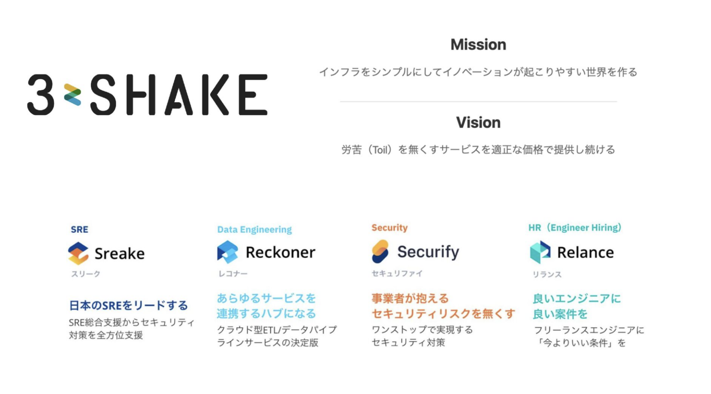
</div>

---

<!-- _backgroundColor: white -->

## <span class="highlight-blue">Platform Engineering on Kubernetes (Book)</span>

<div style="display: flex; gap: 40px;">
<div style="width: 35%;">
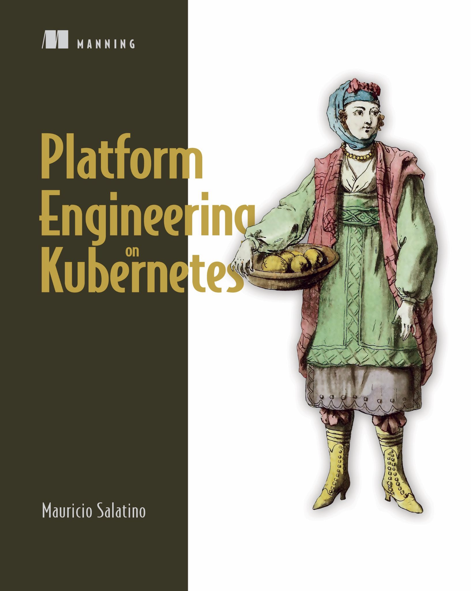
<div style="font-size: 0.5em; text-align: left; margin-top: 5px;">
Platform Engineering on Kubernetes 2023年<br>
https://www.oreilly.co.jp/books/9784873119648/
</div>
</div>

<div style="display: grid; grid-template-columns: 1fr; gap: 20px; margin-top: 30px;">
<div>

- 原書名：**Platform Engineering on Kubernetes**
- 執筆開始：**2020年2月**
- 出版：**2023年10月**
- 原著者：**Mauricio Salatino(@Salaboy)**
- 実践的なアプローチ
- プラットフォームのバックエンド、メカニズム、APIに焦点を当てる

</div>
</div>

---

<!-- _backgroundColor: white -->

## <span class="highlight-blue">原著者のコメント</span>
今回のイベントの件を伝えたところ、<br>
<div style="display: flex; gap: 20px; margin-top: 20px;">
  <div style="width: 20%;">
    
  </div>
  
  <div style="width: 75%;">
    <div style="background-color: #E9F4FF; border-radius: 15px; padding: 15px; position: relative; margin-left: 10px;">
      <div style="position: absolute; left: -20px; top: 20px; width: 0; height: 0; border-top: 10px solid transparent; border-bottom: 10px solid transparent; border-right: 20px solid #E9F4FF;"></div>
      それは素晴らしいことだ！ 本当にありがとう <br>
      KubeCon Japan 2025 の結果待ちです。(採択されてました)<br>
      もし受かったら、6月にまた東京に行きます。
    </div>
  </div>
</div>

---

<!-- _backgroundColor: white -->

## <span class="highlight-blue">原著者の旅行記</span>

<div style="display: grid; grid-template-columns: repeat(2, 1fr); gap: 20px; margin-top: 20px;">
  <div style="text-align: center;">
    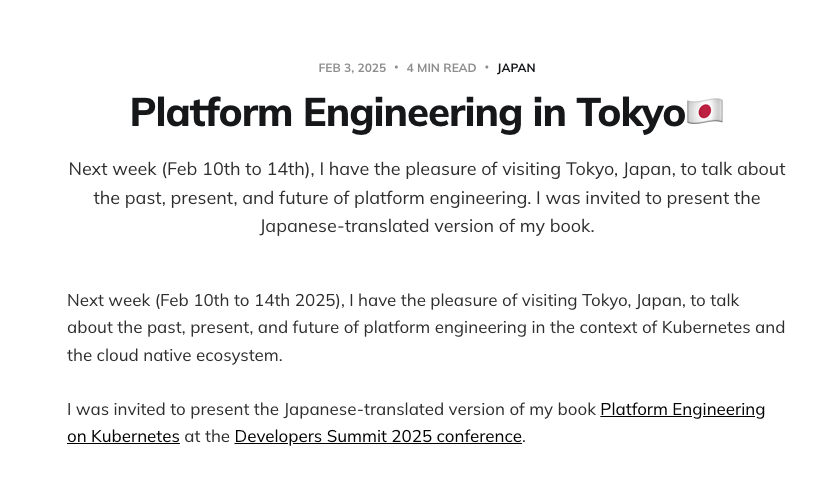
  </div>
  
  <div style="text-align: center;">
    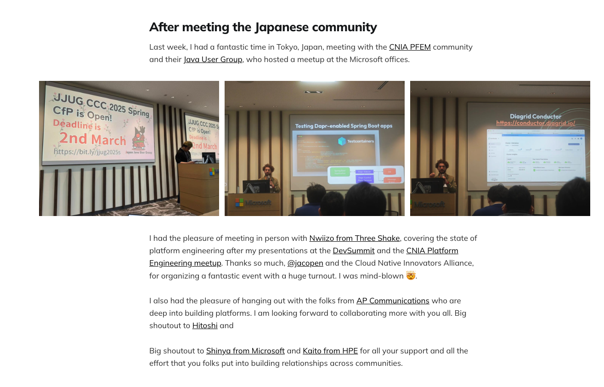
  </div>
</div>

<!-- Start of Selection -->
<div style="text-align: center;">
  原著者に様々なイベントで登壇していただきました。
  https://www.salaboy.com/2025/02/03/platform-engineering-in-tokyo/
</div>
<!-- End of Selection -->

---

<!-- _backgroundColor: white -->

# もとは2021年9月に<span class="highlight-red">異なるタイトル</span>で作成されました

<div style="display: flex; justify-content: space-between; align-items: center; margin-top: 30px;">
  <div style="text-align: center; width: 50%;">
    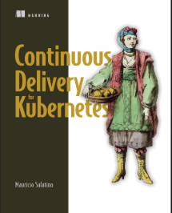</br>
    <div style="background-color:rgb(224, 64, 64); color: black; padding: 10px; border-radius: 5px; margin-top: 15px; display: inline-block;">
      <strong>The "Why"<br>なぜの部分</strong>
    </div>
  </div>
  
  <div style="width: 20%;">
    <svg xmlns="http://www.w3.org/2000/svg" viewBox="0 0 24 24" fill="#40E0D0" style="width: 100%;">
      <path d="M12 4l-1.41 1.41L16.17 11H4v2h12.17l-5.58 5.59L12 20l8-8z"/>
    </svg>
  </div>
  
  <div style="text-align: center; width: 45%;">
    
    <div style="background-color:rgb(224, 64, 64); color: black; padding: 10px; border-radius: 5px; margin-top: 15px; display: inline-block;">
      <strong>The "What"<br>何を実現するか</strong>
    </div>
  </div>
</div>


---

<!-- _backgroundColor: white -->

## <span class="highlight-blue">Kubernetesで実践する Platform Engineering</span>

<div style="display: flex; gap: 40px;">
<div style="width: 35%;">
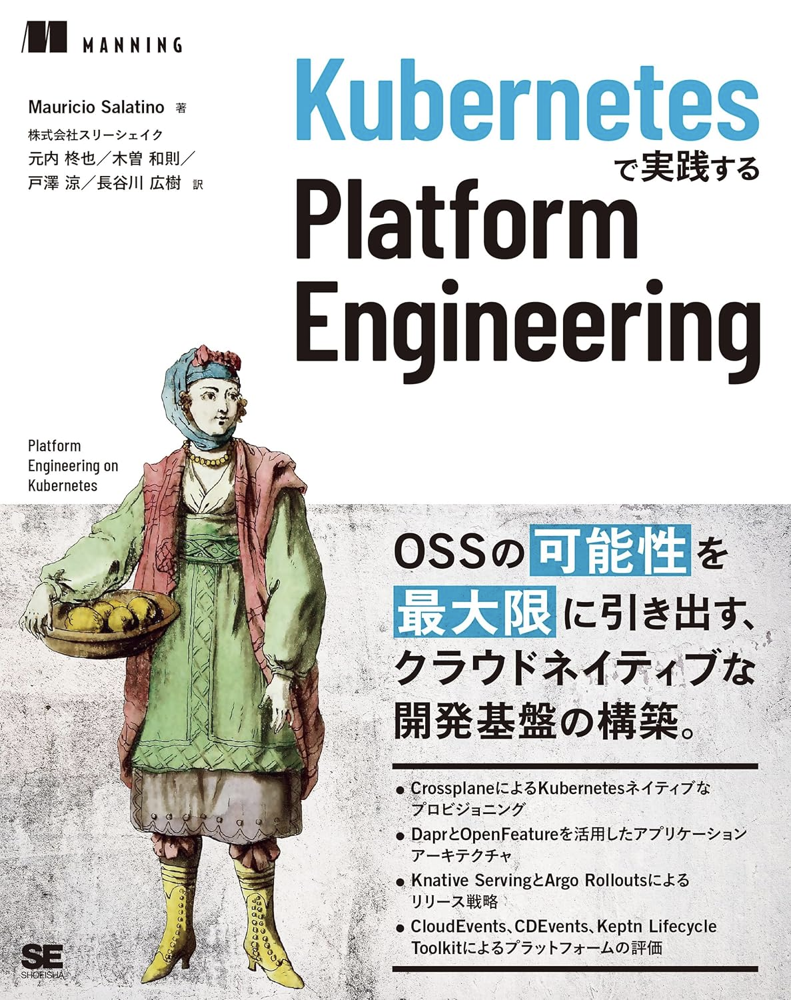
<div style="font-size: 0.5em; text-align: left; margin-top: 5px;">
Kubernetesで実践する Platform Engineering<br>
https://www.shoeisha.co.jp/book/detail/9784798188379
</div>
</div>

<div style="display: grid; grid-template-columns: 1fr; gap: 20px; margin-top: 30px;">
<div>

- 翻訳開始：**2024年7月**
- 出版：**2025年2月**
- 翻訳者チーム：株式会社スリーシェイクの4名</br>**(@nwiizo,@tozastation,@Hiroki__IT,@Kazumatcha)**
- 特徴：
  * 用語解説Tipsの追加
  * 専門用語の丁寧な解説
  * 補章の収録
  * 日本のコンテキストに合わせた説明

</div>
</div>

---

<!-- _backgroundColor: white -->

## 『Platform Engineering on Kubernetes』 の構成

<div style="display: flex; gap: 40px;">
<div style="width: 30%;">

<div style="font-size: 0.5em; text-align: left; margin-top: 5px;">
Kubernetesで実践する Platform Engineering<br>
https://www.shoeisha.co.jp/book/detail/9784798188379
</div>
</div>

<div>

### 目次
<div style="font-size: 0.7em; display: flex; justify-content: center; height: 100%;">
第1章　Kubernetes上のプラットフォーム（の台頭）<br>
第2章　クラウドネイティブアプリケーションの課題<br>
第3章　サービスパイプライン：クラウドネイティブアプリケーションの構築<br>
第4章　実行環境パイプライン：クラウドネイティブアプリケーションのデプロイ<br>
第5章　マルチクラウド（アプリケーション）インフラストラクチャー<br>
第6章　Kubernetes上にプラットフォームを構築しよう<br>
第7章　プラットフォーム機能 I：共有アプリケーションの懸念事項<br>
第8章　プラットフォーム機能 II：チームによる実験を可能にする<br>
第9章　プラットフォームの測定<br>
補章　クラウドネイティブ技術とマイクロサービスアーキテクチャーのつながり
</div>
</div>

---

<!-- _backgroundColor: white -->

## 『Platform Engineering on Kubernetes』 の構成

<div style="display: flex; gap: 40px;">
<div style="width: 35%;">

<div style="font-size: 0.5em; text-align: left; margin-top: 5px;">
Kubernetesで実践する Platform Engineering<br>
https://www.shoeisha.co.jp/book/detail/9784798188379
</div>
</div>

* **第1章**では、**プラットフォームとは何か**、**なぜそれが必要なのか**、そして**クラウドプロバイダーが提供するものとどう違うのか**を紹介する。
* **第2章**では、**Kubernetes 上で動作するクラウドネイティブで分散されたアプリケーションを構築する際の課題**を評価する。
* **第3章**では、**異なるクラウドプロバイダー上でアプリケーションを実行するためのリソースの構築、パッケージ化、デリバリーに必要な追加手順**に焦点を当てる。

---

<!-- _backgroundColor: white -->

## 『Platform Engineering on Kubernetes』 の構成

<div style="display: flex; gap: 40px;">
<div style="width: 35%;">

<div style="font-size: 0.5em; text-align: left; margin-top: 5px;">
Kubernetesで実践する Platform Engineering<br>
https://www.shoeisha.co.jp/book/detail/9784798188379
</div>
</div>

* **第4章**では、**パイプラインの概念**を中心に、**GitOps アプローチ**を用いて**複数の環境の構成**を**宣言的なアプローチ**で管理する方法を説明する。
* **第5章**では、**Crossplane**を使用して**クラウドプロバイダー間**で**アプリケーションのインフラストラクチャコンポーネント**を**プロビジョニングする**Kubernetesネイティブなアプローチについて説明する。
* **第6章**では、**開発環境の作成**に特化した、**Kubernetes 上にプラットフォームを構築**することを提案する。

---

<!-- _backgroundColor: white -->

## 『Platform Engineering on Kubernetes』 の構成

<div style="display: flex; gap: 40px;">
<div style="width: 35%;">

<div style="font-size: 0.5em; text-align: left; margin-top: 5px;">
Kubernetesで実践する Platform Engineering<br>
https://www.shoeisha.co.jp/book/detail/9784798188379
</div>
</div>

* **第7章**では、**プラットフォームチームが利用可能なリソースにどのように接続するかを決定できるアプリケーションレベルの API** で**開発チームを支援すること**に焦点を当てる。
* **第8章**では、**新しいリリースを本格的にコミットする前に実験するために使用できるリリース戦略**を示す。
* **第9章**では、**プラットフォームのデータを取り込み、プラットフォームの取り組みを評価するための重要な指標を計算する2つのアプローチ**を評価する。

---

<!-- _backgroundColor: white -->

## 現代の課題 - 複雑なソフトウェア環境の課題

<div style="display: flex; gap: 40px;">
<div style="width: 35%;">

<div style="font-size: 0.5em; text-align: left; margin-top: 5px;">
Taming Your Dragon<br>
https://learning.oreilly.com/library/view/taming-your-dragon/9798868802645/
</div>
</div>

<div>


### 1. **技術的負債の管理と計画的返済**

<div style="font-size: 0.8em;">

**継続的拡張とメンテナンス**の過程で、システム内に蓄積された技術的負債がプロジェクトの進行速度と品質に影響を及ぼしています。**長期的なシステム健全性**の確保と**イノベーション推進のための余力創出**が喫緊の課題となっています。計画的な負債返済戦略と優先順位付けの仕組みが必要です。

</div>

### 2. **組織全体での技術的負債への理解促進**

<div style="font-size: 0.8em;">

**技術的負債管理**は技術チームだけの問題ではなく、組織全体の戦略的課題として認識されるべきものです。**経営層とのコミュニケーション強化**と**トレードオフ判断の透明化**により、短期的な成果と長期的な持続可能性のバランスを取る文化の醸成が重要です。

</div>
</div>

---

<!-- _backgroundColor: white -->

## 現代の課題 - 複雑性に立ち向かう方法は？

<div style="display: flex; gap: 40px;">
<div style="width: 35%;">
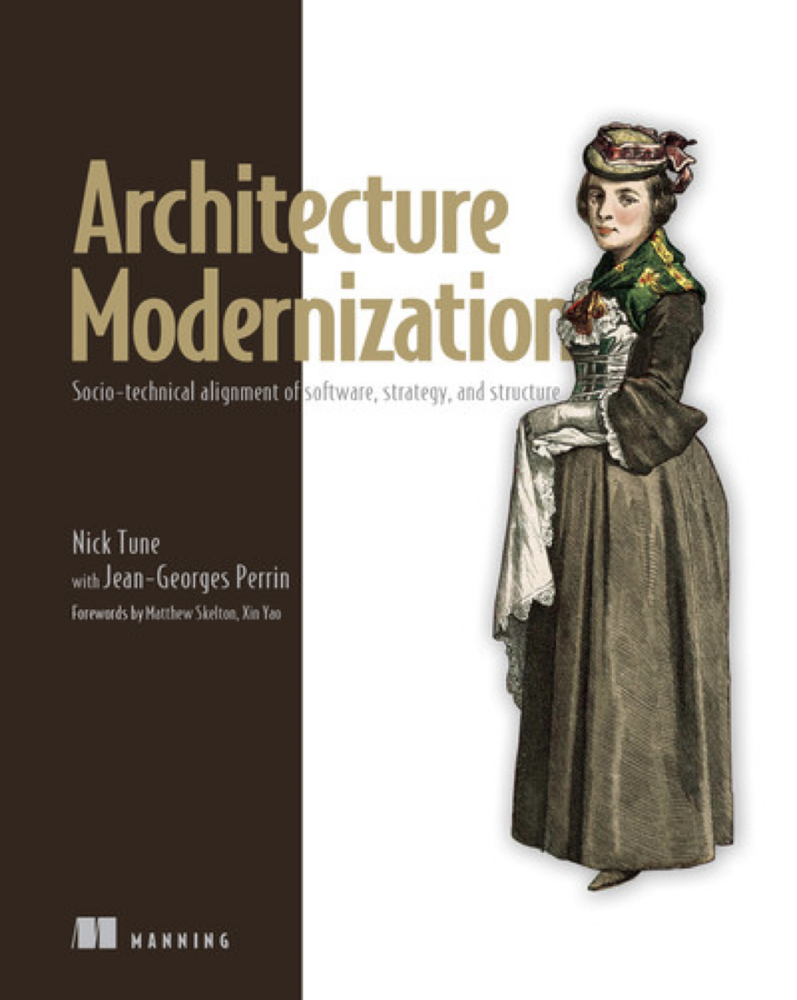
<div style="font-size: 0.5em; text-align: left; margin-top: 5px;">
Architecture Modernization<br>
https://learning.oreilly.com/library/view/architecture-modernization/9781633438156/
</div>
</div>

<div>

### 1. **アーキテクチャ現代化の必然性**

<div style="font-size: 0.8em;">

**技術負債の蓄積**により、システムの拡張性と保守性が著しく低下しており、新機能開発の遅延とサービス品質の低下を招いています。**モノリシックな構造**から脱却し、**疎結合アーキテクチャ**への移行が競争力維持のために不可欠となっています。

</div>

### 2. **組織横断的な変革アプローチ**

<div style="font-size: 0.8em;">

**独立した価値ストリーム**の実現には、技術面だけでなく**チーム編成**と**ドメイン境界**の再定義が必要です。**EventStorming**や**Team Topologies**を活用した協働的手法により、ビジネス・開発・運用の一貫性を確保することが変革成功の鍵となります。

</div>
</div>

---


<!-- _backgroundColor: white -->

## プラットフォームエンジニアリングとは

<div style="display: flex; gap: 40px;">
<div style="width: 35%;">
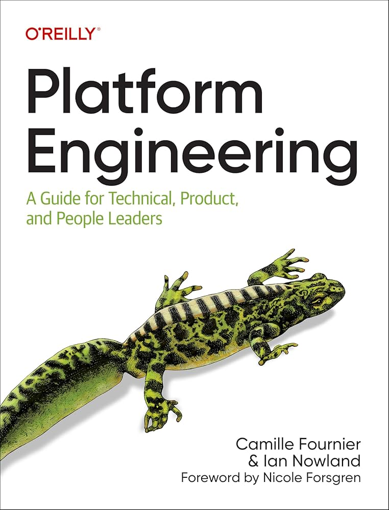
<div style="font-size: 0.5em; text-align: left; margin-top: 5px;">
Platform Engineering<br>
https://learning.oreilly.com/library/view/platform-engineering/9781098153632/
</div>
</div>

<div>

### **テクノロジースタックの複雑化**
* クラウドネイティブ時代において、テクノロジースタックの複雑さは指数関数的に増加しています。この複雑性は、単なる技術的な課題ではなく、組織としての意思決定プロセスにも大きな影響を与えています。

### **責任範囲の不明確化**
* インフラチームとアプリケーションチームの境界線が曖昧になってきており、誰が何の決定権を持つべきかという問題が浮上しています。
</div>
</div>


---

<!-- _backgroundColor: white -->

## プラットフォームエンジニアリングの柱

<div style="font-size: 0.8em;">
本書を読む前に、プラットフォームエンジニアリングについての理解しておくとより理解が深まります。
</div>

<div style="display: flex; gap: 40px;">
<div style="width: 70%;" align="center">
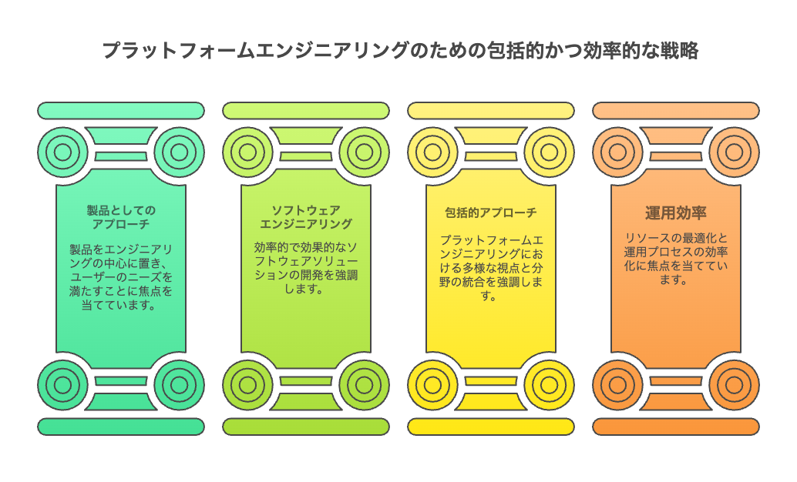
</div>
<div>

---

<!-- _backgroundColor: white -->

## プラットフォームエンジニアリングの柱 (1/4)

### 1. 製品としてのアプローチ
  <ul style="font-size: 0.95em;">
    <li>開発者を「顧客」として扱う</li>
    <li>UXデザインを重視した設計</li>
    <li>製品として一貫性のあるインターフェースを提供</li>
    <li>フィードバックループの確立</li>
    <li>継続的な改善サイクルの実装</li>
  </ul>
</div>

### 「舗装された道」の提供
* 標準的なワークフローを整備し、開発者が安全かつ効率的に進められる道筋を提供することで、日常的な作業の摩擦を減らします。


---

<!-- _backgroundColor: white -->

## プラットフォームエンジニアリングの柱 (2/4)

### 2. ソフトウェアエンジニアリング
  <ul style="font-size: 0.95em;">
    <li>プラットフォーム自体をコードとして開発</li>
    <li>適切な抽象化レイヤーの設計</li>
    <li>APIファーストの設計アプローチ</li>
    <li>GitOpsによる構成管理</li>
    <li>継続的インテグレーション/継続的デリバリー</li>
  </ul>
</div>

### 宣言的なインターフェース
* ユーザーが「何を」望むかを記述できるようにし、「どのように」実現するかはプラットフォームが処理することで、複雑さを隠蔽します。

</div>
</div>

---

<!-- _backgroundColor: white -->

## プラットフォームエンジニアリングの柱 (3/4)

### 3. 包括的アプローチ
  <ul style="font-size: 0.95em;">
    <li>幅広い開発者層のニーズに対応</li>
    <li>マルチテナンシーによる環境分離</li>
    <li>セルフサービス機能の充実</li>
    <li>様々なスキルレベルに合わせた体験設計</li>
    <li>プラットフォーム機能の透明性確保</li>
  </ul>
</div>

### ユーザー観測性
* 開発者が自分のワークロードの状態、使用リソース、パフォーマンス指標などを可視化できるようにし、問題の早期発見を促進します。

---

<!-- _backgroundColor: white -->

## プラットフォームエンジニアリングの柱 (4/4)

### 4. 運用効率
  <ul style="font-size: 0.95em;">
    <li>高い信頼性と可用性の確保</li>
    <li>包括的な可観測性の実現</li>
    <li>効率的なインシデント管理</li>
    <li>データ駆動の継続的な改善</li>
    <li>ビジネス目標との整合性確保</li>
  </ul>
</div>

### プラットフォームSLO
* プラットフォーム自体のサービスレベル目標を定義し、測定・公開することで、ユーザーからの信頼を獲得し、改善の指針とします。

---

<!-- _backgroundColor: white -->

## 実践知を学べる勉強会があります

<div style="display: flex; justify-content: space-between; align-items: center;">
  <div style="width: 48%;">
    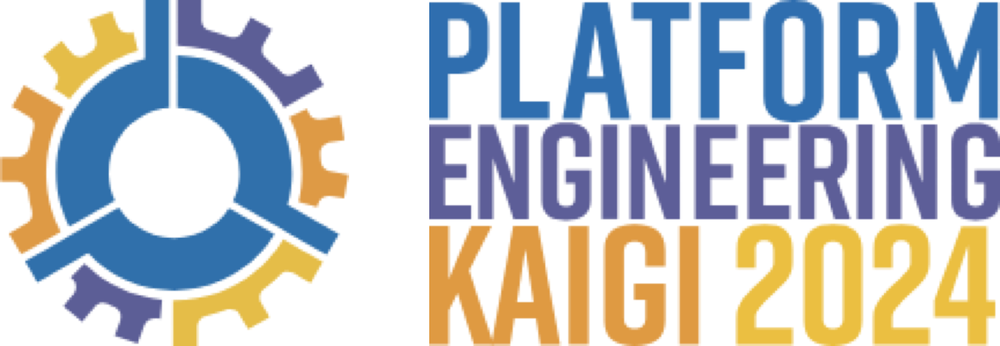
    <div style="font-size: 0.8em; text-align: center; margin-top: 10px;">
      https://www.cnia.io/pek2024/
    </div>
  </div>
  
  <div style="width: 48%;">
    
    <div style="font-size: 0.8em; text-align: center; margin-top: 10px;">
      https://platformengineering.connpass.com/
    </div>
  </div>
</div>

---

## KubernetesとPlatform Engineering

<div style="text-align: center; margin: 0 auto;">
  
</div>
<div style="font-size: 0.8em; text-align: center; margin-top: 10px;">
      Figure 1.11 Platform journey on Kubernetes
</div>

<div style="background-color: #0366d6; color: white; border-radius: 8px; padding: 15px; margin-top: 10px; font-size: 1.1em; text-align: center; font-weight: bold;">
「残念ながらKubernetes自体はプラットフォームではない。<br>これはプラットフォームを構築するための最強の基盤である。」
</div>

---

<div style="display: grid; grid-template-columns: 1fr 1fr; gap: 20px;">
<div style="background-color: #F5F5F5; border-radius: 10px; padding: 15px;">
  <h3 style="margin-top: 0;">1. サービスパイプライン (第3章)</h3>
  <ul style="font-size: 0.8em;">
    <li>コンテナ化とCI/CD</li>
    <li>Tekton / Dagger / GitHub Actions</li>
    <li>ローカル開発体験の向上</li>
  </ul>
</div>

<div style="background-color: #F5F5F5; border-radius: 10px; padding: 15px;">
  <h3 style="margin-top: 0;">2. 環境パイプライン (第4章)</h3>
  <ul style="font-size: 0.8em;">
    <li>Argo CDによるGitOps</li>
    <li>Helmによる環境構成管理</li>
    <li>宣言的なインフラストラクチャ</li>
  </ul>
</div>

<div style="background-color: #F5F5F5; border-radius: 10px; padding: 15px;">
  <h3 style="margin-top: 0;">3. マルチクラウドインフラ (第5章)</h3>
  <ul style="font-size: 0.8em;">
    <li>Crossplaneによるクラウドリソース管理</li>
    <li>XRD/Compositionによる抽象化</li>
    <li>ベンダーロックイン回避</li>
  </ul>
</div>

<div style="background-color: #F5F5F5; border-radius: 10px; padding: 15px;">
  <h3 style="margin-top: 0;">4. プラットフォーム機能 (第7-8章)</h3>
  <ul style="font-size: 0.8em;">
    <li>Daprによる共通機能の提供</li>
    <li>Knative/Argo Rolloutsによるリリース戦略</li>
    <li>セルフサービスとオブザーバビリティ</li>
  </ul>
</div>
</div>

<div style="text-align: center; margin-top: 20px; background-color: #0d1117; color: white; padding: 20px; border-radius: 8px; font-size: 1.1em; font-weight: bold;">
"開発者が本来の価値創造に集中できる環境を<br>Platform Engineeringが実現する"
</div>

---

<div style="text-align: center; font-size: 2em; margin: 50px 0; font-weight: bold;">
ここからは本書で紹介されている<br>いくつかのツールを紹介していきます。
</div>

---

<!-- _backgroundColor: white -->

## Crossplaneによるクラウドリソース管理 (1/5)

<div style="display: flex; gap: 5px;">
<div style="width: 70%;">
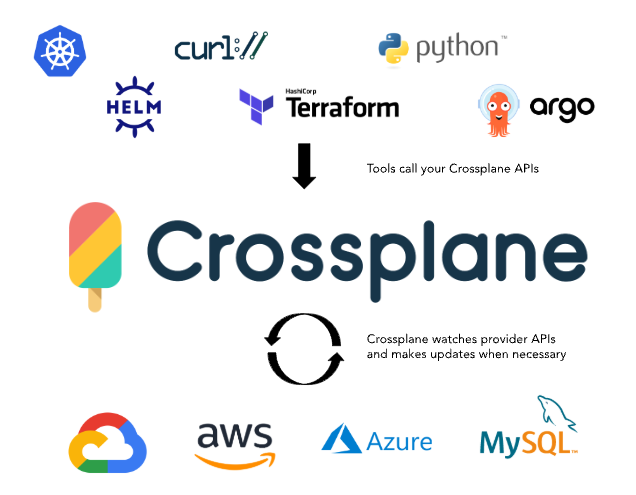
<div style="font-size: 0.5em; text-align: left; margin-top: 5px;">
Crossplane<br>
https://crossplane.io/<br>
https://blog.crossplane.io/crossplane-vs-terraform/
</div>
</div>


<div style="width: 80%;">

### Crossplaneの基本概念

* Kubernetesの拡張として動作するクラウドリソース管理ツール
* クラウドプロバイダー固有のリソースをKubernetes APIで管理
* 宣言的なリソース定義と管理
* マルチクラウド環境の一元管理

</div>

---

<!-- _backgroundColor: white -->

## Crossplaneによるクラウドリソース管理 (2/5)

<div style="text-align: center; margin: 0 auto;">
  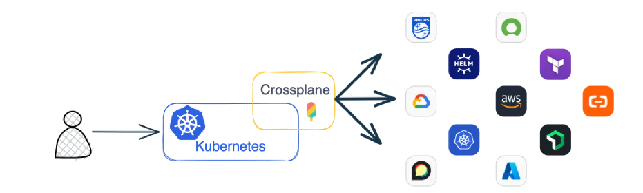
</div>
<div style="font-size: 0.8em; text-align: center; margin-top: 10px;">
     https://docs.crossplane.io/latest/getting-started/introduction/ 
</div>


<div style="margin-top: 15px; display: flex; gap: 20px;">
<div style="width: 100%; background-color: #F5F5F5; border-radius: 10px; padding: 15px;">
  <h4 style="margin-top: 0;">プロバイダー</h4>
  <p style="font-size: 0.8em;">
    AWS、GCP、Azure、Alibaba Cloudなど、各クラウドプロバイダーへの接続を提供するコンポーネント。各プロバイダーは、そのクラウドサービスのリソースを表すCRDをインストールします。
  </p>
</div>
</div>

</div>


---


## Crossplaneによるクラウドリソース管理 (3/5)


<div style="display: flex; gap: 40px;">
<div style="width: 55%;">
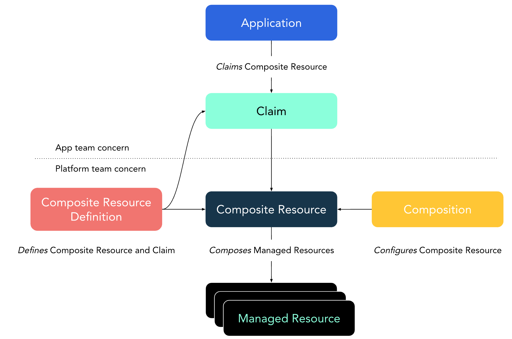
<div style="font-size: 0.5em; text-align: left; margin-top: 5px;">
Composite Resources<br>
https://docs.crossplane.io/latest/concepts/composite-resources/
</div>
</div>

<div style="width: 45%; margin-top: 15px; background-color: #F5F5F5; border-radius: 10px; padding: 15px;">
  <h4 style="margin-top: 0;">マネージドリソース</h4>
  <p style="font-size: 0.8em;">
    特定のクラウドプロバイダー内のリソース（例：RDSインスタンス、S3バケット、GCP Cloud SQLなど）を表すカスタムリソース。プロバイダーによって作成・管理されます。
  </p>
</div>
</div>

---

## Crossplaneによるクラウドリソース管理 (4/5)

<div style="display: flex; gap: 20px;">
<div style="width: 95%;">

<div style="background-color: #F5F5F5; border-radius: 10px; padding: 15px; margin-top: 15px; font-size: 0.9em;">
<p style="font-size: 0.9em;">
  <strong>複合リソース定義 (XRD)</strong>:アプリケーションチーム向けの抽象化されたAPI定義。プラットフォームチームによって設計され、実際のクラウドリソースの詳細を隠蔽します。
</p>

```yaml
apiVersion: apiextensions.crossplane.io/v1
kind: CompositeResourceDefinition
metadata:
  name: xpostgresqlinstances.database.example.org
spec:
  group: database.example.org
  names:
    kind: XPostgreSQLInstance
    plural: xpostgresqlinstances
  versions:
    - name: v1alpha1
      served: true
      referenceable: true
```

</div>

---

## Crossplaneによるクラウドリソース管理 (5/5)

<div style="display: flex; gap: 20px; align-items: flex-start;">
<div style="width: 50%;">
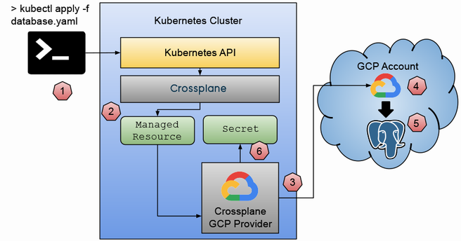
<div style="font-size: 0.5em; text-align: left; margin-top: 5px;">
Figure 5.10 Lifecycle of managed resources with Crossplane
</div>
</div>

<div style="width: 50%;">
<div style="background-color: #E9F4FF; border-radius: 10px; padding: 10px; font-size: 0.8em;">
<h4 style="margin-top: 0; text-align: center;">書籍の実装例</h4>
<p style="font-style: italic; margin: 5px 0 0 0; font-size: 0.85em;">
「プラットフォームチームはXRDを設計し、アプリケーションチームは簡素化されたAPIを利用します。これにより、クラウドプロバイダー間の移行が容易になり、ベンダーロックインを回避できます。」
</p>
</div>

<div style="background-color: #E9F4FF; border-radius: 10px; padding: 10px; margin-top: 15px; font-size: 0.8em; text-align: center;">
<p style="font-style: italic; margin: 0;">「第5章では、Crossplaneを活用してクラウドプロバイダーを抽象化し、<br>アプリケーションチームに一貫したインフラAPIを提供する方法が詳しく解説されています」</p>
</div>
</div>
</div>

---

## vclusterによるマルチテナンシー (1/4)

<div style="display: flex; gap: 20px; align-items: center;">
<div style="width: 45%;">
  
  <div style="font-size: 0.8em; text-align: center; margin-top: 10px;">
  https://www.vcluster.com/docs/v0.19/architecture/overview/
  </div>
</div>

<div style="width: 55%;">
  <h3>vclusterとは</h3>
  <ul style="font-size: 0.95em;">
    <li>単一のKubernetesクラスター内に仮想クラスターを作成するツール</li>
    <li>完全な分離された環境を軽量に提供</li>
    <li>コスト効率の高いマルチテナンシー実現手段</li>
  </ul>

  <div style="margin-top: 15px;">
  <div style="background-color: #F5F5F5; border-radius: 10px; padding: 15px;">
    <h4 style="margin-top: 0;">仮想クラスターの仕組み</h4>
    <p style="font-size: 0.7em;">
      仮想コントロールプレーン（API Server、Controller Manager、etcd）がNamespace内にPodとして実行されます。
    </p>
  </div>
  </div>
</div>
</div>


---

## vclusterによるマルチテナンシー (2/4)


<div style="display: flex; gap: 20px; align-items: center;">
<div style="width: 45%;">
  
  <div style="font-size: 0.8em; text-align: center; margin-top: 10px;">
  https://www.vcluster.com/docs/v0.19/architecture/overview/
  </div>
</div>

<div style="width: 55%;">

### vclusterの主な特徴
<ul style="font-size: 0.8em;">
  <li>開発チームごとの独立した環境を容易に提供</li>
  <li>実際のワークロードはホストクラスターのNamespaceにマッピング</li>
  <li>リソース使用量の効率化と最適化</li>
</ul>

---

## vclusterによるマルチテナンシー (3/4)

<div style="display: flex; gap: 20px; align-items: center;">
<div style="width: 45%;">
  
  <div style="font-size: 0.8em; text-align: center; margin-top: 10px;">
  https://www.vcluster.com/docs/v0.19/architecture/overview/
  </div>
</div>

<div style="width: 55%;">

### vclusterの主な特徴

<div style="margin-top: 15px; background-color: #F5F5F5; border-radius: 10px; padding: 15px;">

```yaml
apiVersion: platform.dev/v1alpha1
kind: Environment
metadata:
  name: team-a-dev-env
spec:
  compositionSelector:
    matchLabels:
      type: development
    parameters:
      installInfra: true
```
</div>
</div>

---

## vclusterによるマルチテナンシー (4/4)

<div style="display: flex; gap: 20px; align-items: center;">
<div style="width: 45%;">
  
  <div style="font-size: 0.8em; text-align: center; margin-top: 10px;">
  Figure 6.14 vcluster provides isolation at the Kubernetes (K8s) API server
  </div>
</div>

<div style="width: 65%;">
<div style="background-color: #F5F5F5; border-radius: 10px; padding: 15px;">
  <h4 style="margin-top: 0;">管理者権限の委譲</h4>
  <p style="font-size: 0.8em;">
    vclusterでは、各チームに管理者権限を安全に委譲できるため、チームの自律性が高まります。これにより、プラットフォームチームの負担も軽減されます。
  </p>
</div>

<div style="background-color: #E9F4FF; border-radius: 10px; padding: 10px; margin-top: 15px; font-size: 0.8em; text-align: center;">
<p style="font-style: italic; margin: 0;">「第6章では、vclusterを使用して開発者に柔軟かつ隔離された環境を提供しながら、<br>基盤となるインフラを効率的に管理する方法が詳細に解説されています」</p>
</div>
</div>


---

## Argo Rolloutsによる高度なデプロイ戦略 (1/4)

<div style="display: flex; gap: 20px; align-items: center;">
<div style="width: 45%;">
  
  <div style="font-size: 0.7em; text-align: center; margin-top: 10px;">
  https://argoproj.github.io/argo-rollouts/architecture/
  </div>
</div>

<div style="width: 55%;">
<h3>Argo Rolloutsとは</h3>
<ul style="font-size: 0.8em;">
  <li>Kubernetesネイティブなプログレッシブデリバリー</li>
  <li>詳細なロールアウト制御と自動化</li>
  <li>blue/greenデプロイメントの実装</li>
  <li>メトリクスに基づく自動昇格/ロールバック</li>
</ul>


---

## Argo Rolloutsによる高度なデプロイ戦略 (2/4)

<div style="display: flex; gap: 20px; align-items: center;">
<div style="width: 45%;">
  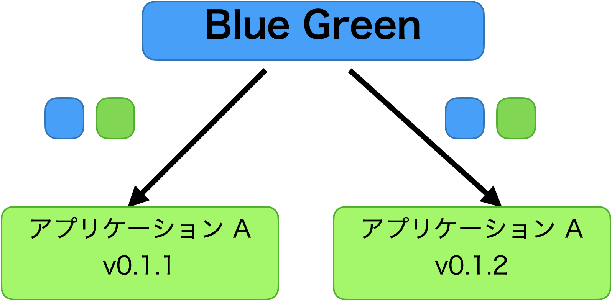
  <div style="font-size: 0.5em; text-align: center; margin-top: 10px;">
  Site Reliability Engineering on Kubernetes
  https://speakerdeck.com/nwiizo/site-reliability-engineering-on-kubernetes
  </div>
</div>

<div style="width: 55%;">
<div style="margin-top: 15px; background-color: #F5F5F5; border-radius: 10px; padding: 15px;">
  <h4 style="margin-top: 0;">書籍でのブルー/グリーン実装</h4>
  
```yaml
apiVersion: argoproj.io/v1alpha1
kind: Rollout
metadata:
  name: frontend
spec:
  strategy:
    blueGreen:
      activeService: frontend-active
      previewService: frontend-preview
      autoPromotionEnabled: false
```
</div>
</div>

---

## Argo Rolloutsによる高度なデプロイ戦略 (3/4)

<div style="display: flex; gap: 20px; align-items: center;">
<div style="width: 45%;">
  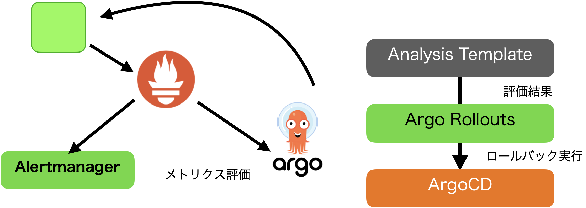
  <div style="font-size: 0.5em; text-align: center; margin-top: 10px;">
  Site Reliability Engineering on Kubernetes
  https://speakerdeck.com/nwiizo/site-reliability-engineering-on-kubernetes
  </div>
</div>

<div style="width: 55%;">
<div style="background-color: #F5F5F5; border-radius: 10px; padding: 15px; margin-top: 0px;">
  <h4 style="margin-top: 0;">Analysis Runs</h4>
  <p style="font-size: 0.8em;">
    メトリクスベースの分析を自動化し、新バージョンのパフォーマンスや安定性を評価して、自動的に昇格またはロールバックを判断します。
  </p>
</div>

<div style="background-color: #E9F4FF; border-radius: 10px; padding: 10px; margin-top: 15px; font-size: 0.8em; text-align: center;">
<p style="font-style: italic; margin: 0;">「第8章では、Argo Rolloutsを使用した高度なデプロイパターンを通じて、<br>新機能のリスクを最小化しながら安全に本番環境に導入する方法が示されています」</p>
</div>
</div>
</div>
</div>

---

## Argo Rolloutsによる高度なデプロイ戦略 (4/4)

<div style="display: grid; grid-template-columns: 1fr 1fr; gap: 20px;">
<div style="background-color: #F5F5F5; border-radius: 10px; padding: 15px;">
  <h3 style="margin-top: 0; text-align: center;">カナリアリリース</h3>
  <ul style="font-size: 0.85em;">
    <li>トラフィックの一部（例：5%）を新バージョンに転送</li>
    <li>段階的にトラフィック比率を増加</li>
    <li>問題が検出された場合は元のバージョンに戻す</li>
    <li>リアルユーザーでの検証に最適</li>
  </ul>
  <p style="font-size: 0.8em; font-style: italic; margin-top: 10px; text-align: center;">
    Knative ServingやArgo Rolloutsで実現可能
  </p>
</div>

<div style="background-color: #F5F5F5; border-radius: 10px; padding: 15px;">
  <h3 style="margin-top: 0; text-align: center;">ブルー/グリーンデプロイメント</h3>
  <ul style="font-size: 0.85em;">
    <li>新旧2つの環境を並行して維持</li>
    <li>新環境（グリーン）でテストを実施</li>
    <li>問題がなければトラフィックを一度に切り替え</li>
    <li>即時ロールバックが可能</li>
  </ul>
  <p style="font-size: 0.8em; font-style: italic; margin-top: 10px; text-align: center;">
    Argo Rolloutsで実装可能
  </p>
</div>

---

<div style="display: grid; grid-template-columns: 1fr 1fr; gap: 20px;">
<div style="background-color: #F5F5F5; border-radius: 10px; padding: 15px;">
  <h3 style="margin-top: 0; text-align: center;">A/Bテスト</h3>
  <ul style="font-size: 0.85em;">
    <li>ユーザー属性に基づくトラフィック振り分け</li>
    <li>異なるバージョン間のパフォーマンス比較</li>
    <li>データ駆動の意思決定</li>
    <li>UXやビジネス指標の最適化</li>
  </ul>
  <p style="font-size: 0.8em; font-style: italic; margin-top: 10px; text-align: center;">
    Istioとの組み合わせで実現可能
  </p>
</div>

<div style="background-color: #F5F5F5; border-radius: 10px; padding: 15px;">
  <h3 style="margin-top: 0; text-align: center;">フィーチャーフラグ</h3>
  <ul style="font-size: 0.85em;">
    <li>コード内の機能を動的に有効/無効化</li>
    <li>開発とリリースの分離</li>
    <li>特定のユーザーグループへの機能提供</li>
    <li>段階的なロールアウト</li>
  </ul>
  <p style="font-size: 0.8em; font-style: italic; margin-top: 10px; text-align: center;">
    OpenFeatureで標準化可能
  </p>
</div>
</div>

<div style="background-color: #E9F4FF; border-radius: 10px; padding: 10px; margin-top: 15px; font-size: 0.8em; text-align: center;">
<p style="margin: 0;">「第8章では、これらのリリース戦略をKubernetes上で実装する方法が詳細に解説されています」</p>
</div>

---

## CloudEventsによるプラットフォーム評価 (1/3)

<div style="display: flex; gap: 20px;">
<div style="width: 80%;">

### プラットフォームの測定と評価 (第9章)
<ul style="font-size: 0.95em;">
  <li>「測定できないものは改善できない」という原則に基づく評価</li>
  <li>DevOps Research and Assessment (DORA)メトリクスの活用</li>
  <li>客観的なデータに基づく改善サイクルの確立</li>
  <li>プラットフォームの価値を定量的に示す指標</li>
</ul>
</div>

<div style="width: 20%;">
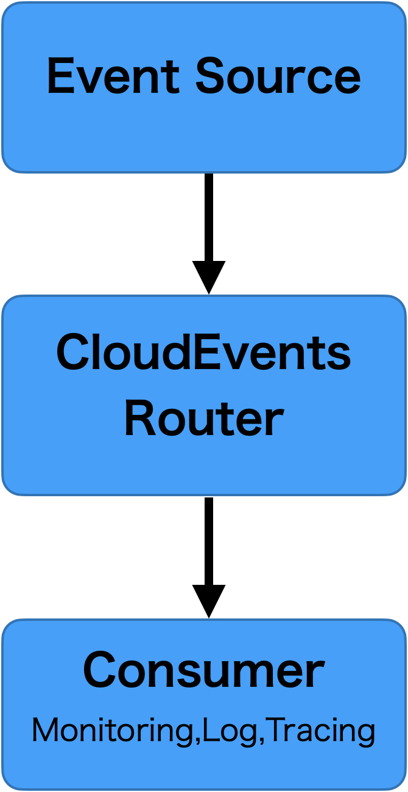
</div>
</div>

---

## DORAメトリクスによるプラットフォーム評価 (2/3)

<div style="display: flex; gap: 20px;">
<div style="width: 50%;">
<div style="margin-top: 15px; background-color: #F5F5F5; border-radius: 10px; padding: 12px;">
  <h4 style="margin-top: 0;">デプロイ頻度</h4>
  <p style="font-size: 0.8em;">
    組織が本番環境に変更をデプロイする頻度。高頻度のデプロイは、小さな変更を迅速に提供する能力を示します。
  </p>
</div>

<div style="margin-top: 10px; background-color: #F5F5F5; border-radius: 10px; padding: 12px;">
  <h4 style="margin-top: 0;">リードタイム</h4>
  <p style="font-size: 0.8em;">
    コミットから本番デプロイまでの時間。短いリードタイムは、効率的なパイプラインと自動化の証拠です。
  </p>
</div>
</div>

<div style="width: 50%;">

<div style="margin-top: 10px; background-color: #F5F5F5; border-radius: 10px; padding: 12px;">
  <h4 style="margin-top: 0;">変更失敗率</h4>
  <p style="font-size: 0.8em;">
    本番環境へのデプロイが失敗または問題を引き起こす割合。低い失敗率は、品質保証プロセスの有効性を示します。
  </p>
</div>

<div style="margin-top: 10px; background-color: #F5F5F5; border-radius: 10px; padding: 12px;">
  <h4 style="margin-top: 0;">サービス復旧時間</h4>
  <p style="font-size: 0.8em;">
    障害発生から復旧までの平均時間。短い復旧時間は、効果的なモニタリングと緊急対応プロセスを反映しています。
  </p>
</div>
</div>
</div>

---

## CloudEventsによるプラットフォーム評価 (3/3)

<div style="text-align: center; margin: 0 auto;">
  
</div>
<div style="font-size: 0.8em; text-align: center; margin-top: 10px;">
     https://v1.keptn.sh/ より引用
</div>

<div style="background-color: #E9F4FF; border-radius: 10px; padding: 10px; margin-top: 15px; font-size: 0.8em; text-align: center;">
<p style="font-style: italic; margin: 0;">「第9章では、DORAメトリクスを実装し、プラットフォームの成功を客観的に測定するための<br>具体的な方法が示されています」</p>
</div>

---

## Platform Engineering実践のための要諦

<div style="display: flex; gap: 20px; align-items: center;">
<div style="width: 25%;">
  
  <div style="font-size: 0.5em; text-align: center; margin-top: 10px;">
  戦略の要諦
  https://bookplus.nikkei.com/atcl/catalog/23/10/13/01057/
  </div>
</div>

<div style="width: 70%; margin-left: auto;">
  <ol style="font-size: 0.9em;">
    <li><strong>開発者の痛点に正面から向き合う</strong> </br> - 理想論ではなく実際の課題を特定</li>
    <li><strong>既存のツールと知見を最大限活用する</strong> </br> - ゼロから構築せず統合と抽象化に注力</li>
    <li><strong>スコープクリープを避け核心部分に集中</strong> </br> - 「素晴らしい機能」の誘惑に負けない</li>
    <li><strong>現場と密に連携し実践的なフィードバックを得る</strong> </br> - 理論よりも実際の使用体験を重視</li>
  </ol>
</div>
</div>


---

<!-- _backgroundColor: white -->

## <span class="highlight-blue">プラットフォームの進化段階/成熟度</span>


<div style="text-align: center; margin: 0 auto;">
  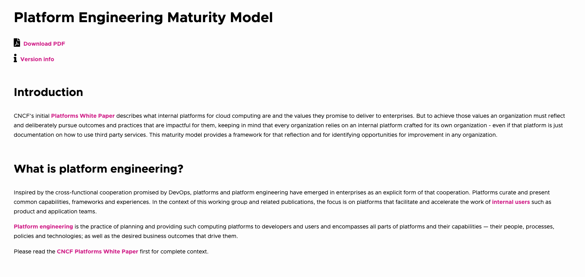
</div>
<div style="font-size: 0.8em; text-align: center; margin-top: 10px;">
     https://tag-app-delivery.cncf.io/whitepapers/platform-eng-maturity-model/ より引用
</div>


<div style="display: grid; grid-template-columns: 1fr 1fr 1fr; gap: 15px; width: 100%;">
<div style="background-color: #E9F4FF; border-radius: 8px; padding: 12px;">
  <h4 style="margin-top: 0; font-size: 0.9em;">初期段階</h4>
  <ul style="font-size: 0.7em;">
    <li>基本的な自動化</li>
    <li>ドキュメントの整備</li>
    <li>標準化されたデプロイ</li>
  </ul>
</div>

<div style="background-color: #E9F4FF; border-radius: 8px; padding: 12px;">
  <h4 style="margin-top: 0; font-size: 0.9em;">成長段階</h4>
  <ul style="font-size: 0.7em;">
    <li>セルフサービスポータル</li>
    <li>環境自動プロビジョニング</li>
    <li>統合オブザーバビリティ</li>
  </ul>
</div>

<div style="background-color: #E9F4FF; border-radius: 8px; padding: 12px;">
  <h4 style="margin-top: 0; font-size: 0.9em;">成熟段階</h4>
  <ul style="font-size: 0.7em;">
    <li>完全な自動化と抽象化</li>
    <li>プラットフォームAPI</li>
    <li>開発者体験の最適化</li>
  </ul>
</div>
</div>

---
<!-- _backgroundColor: white -->

## <span style="color: #38BDFF;">さいごに</span>

<div style="background-color: rgba(9, 71, 113, 0.5); padding: 20px; border-radius: 15px; margin-top: 20px;">
<ul style="color: white; font-size: 1em; line-height: 1.5;">
  <li><strong>プラットフォームは完成を目指す静的なものではなく常に進化する動的なもの</strong></li>
  <li><strong>開発者体験の最適化を最優先にすることが大切で忘れると死にゆく</strong></li>
  <li><strong>理論より実践、完璧より前進</strong></li>
</ul>
</div>

<div style="display: grid; grid-template-columns: 2fr 1fr; gap: 20px; margin: 20px 0;">
  <div style="background-color: rgba(56, 139, 253, 0.1); border: 1px solid #58A6FF; padding: 15px; border-radius: 10px;">
    <h3 style="color: #58A6FF; font-size: 0.9em;">📚 今日から始めること</h3>
    <ul style="color: black; font-size: 0.7em;">
      <li>書籍を手に入れ、理解する</li>
      <li>GitHubのサンプルコードを実行(salaboy/platforms-on-k8s)<br> 『一日で学ぶクラウドネイティブ技術実践ハンズオン』もオススメです</li>
      <li>机上の空論ではなく小さなPoCでの実験を計画</li>
    </ul>
  </div>
  
  <div style="background-color: rgba(56, 139, 253, 0.1); border: 1px solid #58A6FF; padding: 15px; border-radius: 10px;">
    <h3 style="color: #58A6FF; font-size: 0.9em;">🌐 コミュニティに参加</h3>
    <ul style="color: black; font-size: 0.7em;">
      <li>Platform Engineering Meetup</li>
      <li>Platform Engineering Kaigi</li>
      <li>Cloud Native Days</li>
    </ul>
  </div>
</div>

---

## 参考資料

- [Kubernetesで実践する Platform Engineering](https://www.shoeisha.co.jp/book/detail/9784798188379)
- [Platform Engineering on Kubernetes](https://www.oreilly.co.jp/books/9784873119648/)
- [Crossplane](https://crossplane.io/)
- [vCluster](https://www.vcluster.com/)
- [Argo Rollouts](https://argoproj.github.io/argo-rollouts/)
- [CNCF Platform Engineering Maturity Model](https://tag-app-delivery.cncf.io/whitepapers/platform-eng-maturity-model/)
- [CloudEvents](https://cloudevents.io/)

---

## 参考資料

- [DORA Metrics](https://cloud.google.com/blog/products/devops-sre/using-the-four-keys-to-measure-your-devops-performance)
- [Tekton](https://tekton.dev/)
- [Knative](https://knative.dev/)
- [Platform Engineering Meetup](https://platformengineering.connpass.com/)
- [Salaboy's Blog - Platform Engineering in Tokyo](https://www.salaboy.com/2025/02/03/platform-engineering-in-tokyo/)
- [Dapr](https://dapr.io/)
- [OpenFeature](https://openfeature.dev/)
- [一日で学ぶクラウドネイティブ技術実践ハンズオン](https://book.impress.co.jp/books/1122101063)

---

<!-- 
_backgroundColor: #0a1929
_color: white
_class: title dark
-->


<!-- タイトルページ左上に大きなロゴを表示 -->
<div style="position: absolute !important; top: 5px !important; left: 5px !important; z-index: 9999 !important; margin: 0 !important; padding: 0 !important;">
  
</div>

<div style="text-align: center; margin-top: 200px;">

# ありがとう<span class="highlight-yellow">ございました</span>

### ご質問・ご相談はお気軽にお問い合わせください

@nwiizo | https://3-shake.com
</div>
